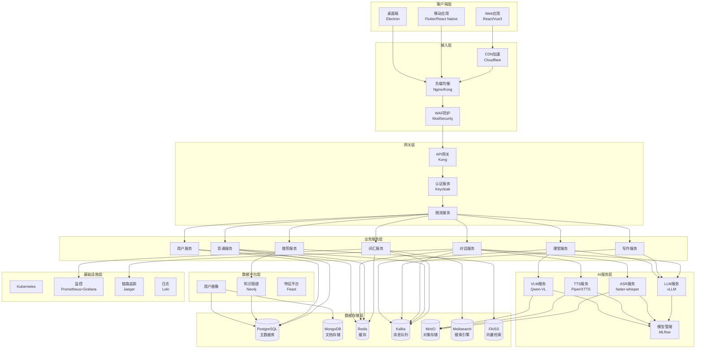
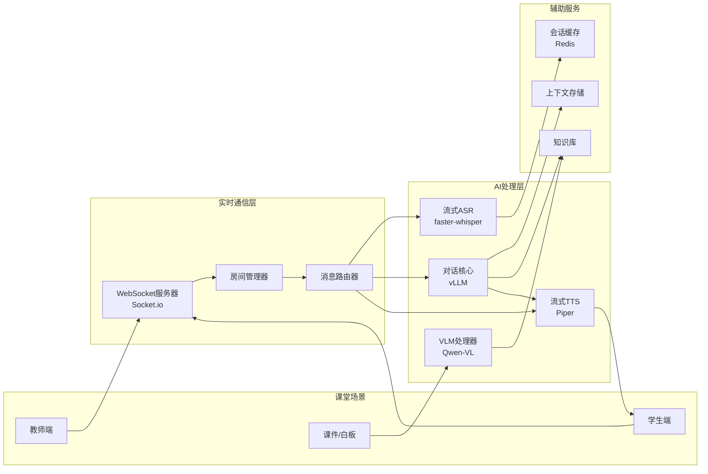
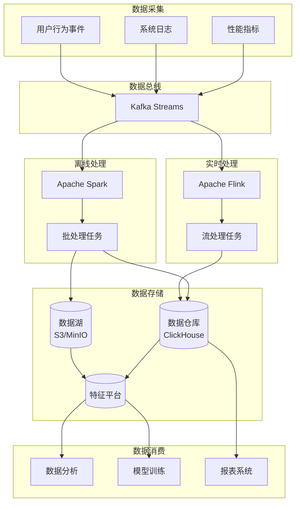
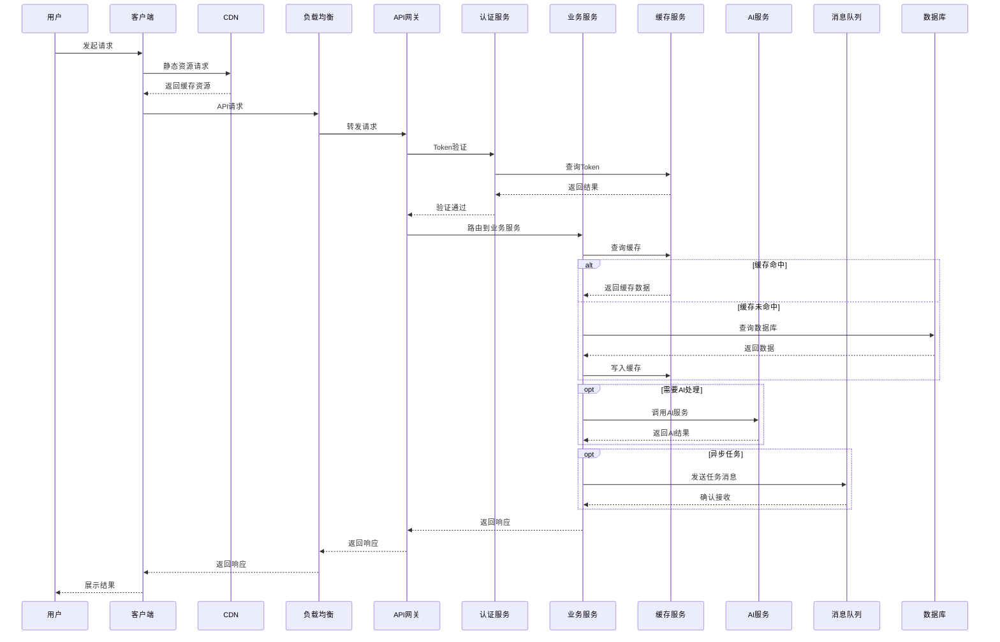
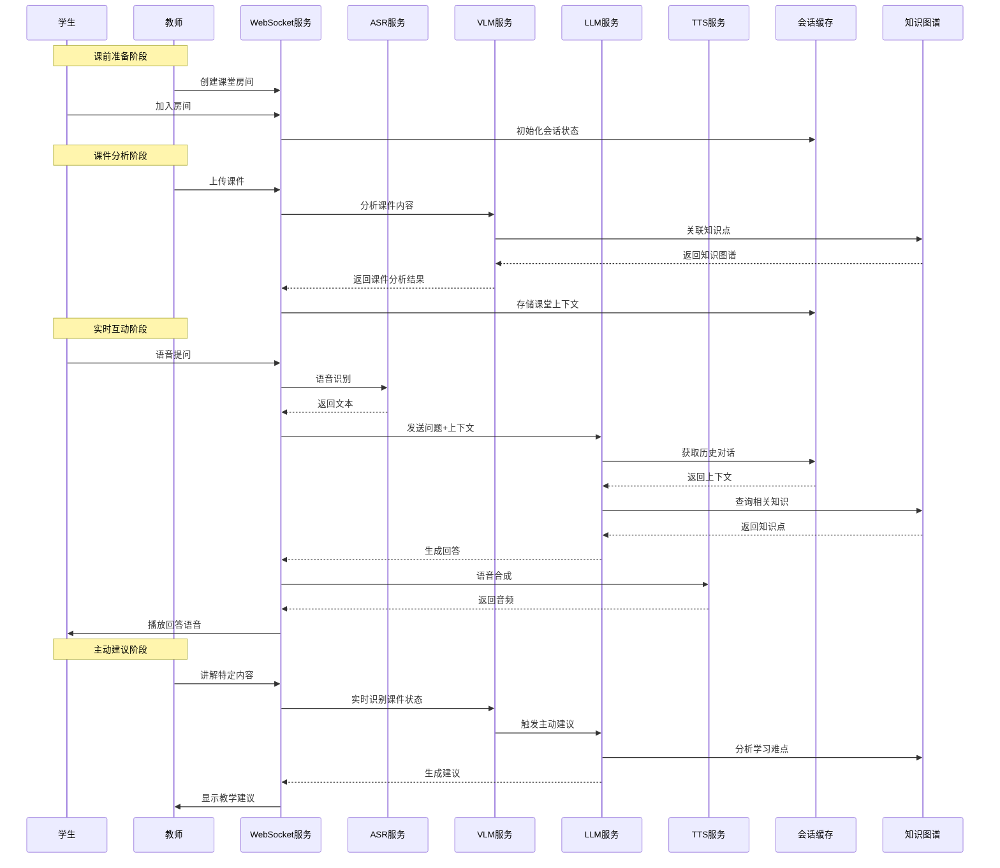
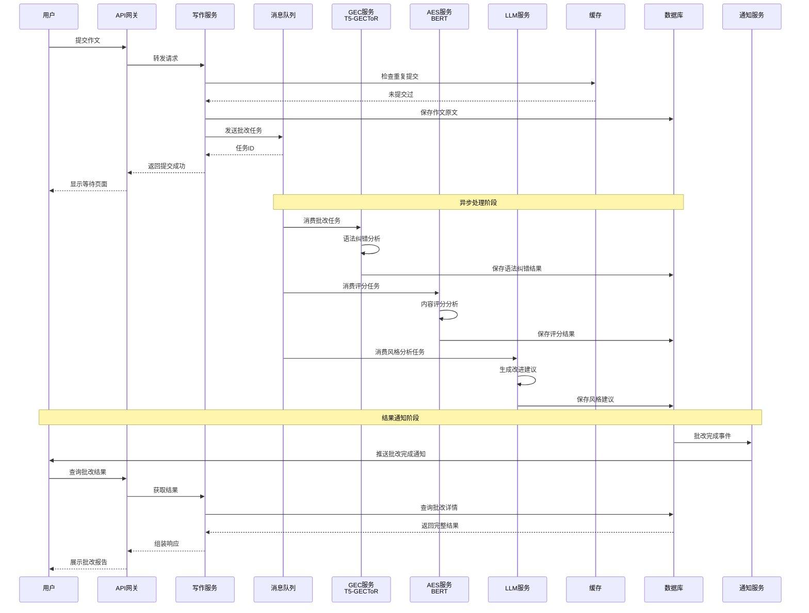
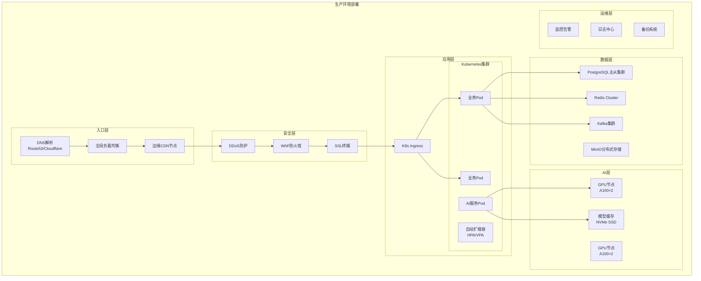

# AI外语学习系统技术架构文档

**版本**: v1.0  
**日期**: 2026年3月23日  
**状态**: 架构设计阶段

---

## 目录

1. [架构概述](#1-架构概述)
2. [核心服务模块详解](#2-核心服务模块详解)
3. [服务架构图](#3-服务架构图)
4. [数据流图](#4-数据流图)
5. [技术选型对比表](#5-技术选型对比表)
6. [部署架构建议](#6-部署架构建议)
7. [性能指标与SLA](#7-性能指标与sla)
8. [附录](#8-附录)

---

## 1. 架构概述

### 1.1 设计原则

- **高可用性**: 核心服务多实例部署，故障自动切换
- **可扩展性**: 微服务架构，支持水平扩展
- **低延迟**: 边缘计算+缓存策略，端到端延迟<300ms
- **数据驱动**: 全链路数据采集，支持实时分析
- **安全合规**: 数据加密、隐私保护、权限隔离

### 1.2 技术栈总览

| 层级 | 核心技术 | 备选方案 |
|------|----------|----------|
| **前端** | React/Vue3 + TypeScript | Next.js |
| **API网关** | Kong / Nginx | Traefik |
| **业务服务** | FastAPI (Python) | Node.js/NestJS |
| **AI推理** | vLLM + ONNX Runtime | TensorRT, Triton |
| **数据存储** | PostgreSQL + MongoDB + Redis | MySQL, TiDB |
| **搜索引擎** | Meilisearch | Typesense, ES |
| **消息队列** | Apache Kafka | RabbitMQ, NATS |
| **容器编排** | Kubernetes | Docker Swarm |

---

## 2. 核心服务模块详解

### 2.1 数据库服务 (Database Service)

#### 功能职责
- 存储单词、作文、对话记录、用户行为数据、账号数据等
- 支持事务性操作和数据一致性保障
- 提供多租户数据隔离

#### 推荐开源技术栈

| 组件 | 技术选型 | 用途 |
|------|----------|------|
| **主数据库** | PostgreSQL 16 | 结构化数据存储 |
| **文档数据库** | MongoDB 7.0 | 非结构化内容存储 |
| **时序数据库** | TimescaleDB | 学习行为时间序列数据 |
| **图数据库** | Neo4j Community | 知识图谱存储 |

#### 依赖关系
```
被依赖: 所有业务服务
依赖: 缓存服务(Redis)、监控服务
```

#### 性能指标要求
| 指标 | 目标值 | 说明 |
|------|--------|------|
| 读QPS | >10,000 | 主从分离后 |
| 写QPS | >2,000 | 批量写入优化 |
| 查询延迟 | P99 < 50ms | 简单查询 |
| 连接数 | >500 | 连接池配置 |

#### 部署建议
- **主从架构**: 1主2从，读写分离
- **分库分表**: 按用户ID哈希分片
- **备份策略**: 每日全量+实时增量
- **监控**: pg_stat_statements慢查询分析

---

### 2.2 检索引擎服务 (Search Engine Service)

#### 功能职责
- 模糊、快速查找数据库内容
- 支持多语言分词和拼音搜索
- 实时索引更新和搜索建议

#### 推荐开源技术栈

| 组件 | 技术选型 | 特点 |
|------|----------|------|
| **主搜索引擎** | Meilisearch 1.6 | 快速部署、中文友好 |
| **备选方案** | Typesense 0.25 | 全内存、高性能 |
| **向量检索** | FAISS | 语义相似度搜索 |

#### 依赖关系
```
被依赖: 词汇查询服务、内容推荐服务
依赖: 数据库服务(PostgreSQL)、文件存储服务
```

#### 性能指标要求
| 指标 | 目标值 | 说明 |
|------|--------|------|
| 搜索延迟 | P99 < 30ms | 端到端 |
| 索引更新延迟 | < 1s | 实时同步 |
| 并发搜索 | >5,000 QPS | 集群部署 |
| 召回率 | >95% | 模糊匹配 |

#### 部署建议
- **集群模式**: 3节点集群，数据分片
- **内存配置**: 数据量×1.5倍内存
- **同步策略**: CDC实时同步数据库变更

---

### 2.3 LLM服务 (Large Language Model Service)

#### 功能职责
- 词库生成
- 场景对话核心
- 场景提示词生成
- 综合评价作文
- 用户画像总结
- 课堂实时主动/被动互动

#### 推荐开源技术栈

| 组件 | 技术选型 | 用途 |
|------|----------|------|
| **推理引擎** | vLLM 0.3+ | 高吞吐LLM推理 |
| **本地部署** | Ollama | 开发测试环境 |
| **模型编排** | LangChain / LangGraph | 复杂工作流管理 |
| **基础模型** | Qwen2.5-72B / Llama3-70B | 中文优化 |

#### 依赖关系
```
被依赖: 对话服务、作文批改服务、课堂助教服务
依赖: 模型服务管理、缓存服务、向量数据库
```

#### 性能指标要求
| 指标 | 目标值 | 说明 |
|------|--------|------|
| 首Token延迟 | < 500ms | TTFT |
| 吞吐率 | >50 tokens/s | 输出速度 |
| 并发请求 | >100 | 批处理优化 |
| 显存占用 | < 40GB | 单实例 |

#### 部署建议
- **GPU配置**: A100 40GB × 2 (推理)
- **量化方案**: AWQ/GPTQ 4-bit量化
- **缓存策略**: Prefix Caching + KV Cache
- **弹性伸缩**: 基于队列长度自动扩缩容

---

### 2.4 ASR服务 (Automatic Speech Recognition Service)

#### 功能职责
- 流式识别语音指令
- 实时对话转录
- 多语言口音适配

#### 推荐开源技术栈

| 组件 | 技术选型 | 特点 |
|------|----------|------|
| **主ASR引擎** | faster-whisper | Whisper优化版，速度提升4倍 |
| **流式识别** | Whisper.cpp | C++实现，极低延迟 |
| **轻量备选** | Vosk | CPU友好，离线运行 |
| **VAD检测** | Silero VAD | 语音活动检测 |

#### 依赖关系
```
被依赖: 对话服务、课堂助教服务
依赖: 文件存储服务(音频缓存)、消息队列
```

#### 性能指标要求
| 指标 | 目标值 | 说明 |
|------|--------|------|
| 识别延迟 | < 200ms | 流式识别 |
| 准确率(WER) | < 15% | 标准普通话 |
| 并发路数 | >100 | 单GPU |
| 支持语言 | 99种 | Whisper多语言 |

#### 部署建议
- **GPU加速**: CUDA优化，TensorRT加速
- **边缘部署**: 课堂场景就近部署
- **模型选择**: large-v3(质量) / base(速度)
- **热词优化**: 自定义词汇表提升专业术语识别

---

### 2.5 TTS服务 (Text-to-Speech Service)

#### 功能职责
- 自然互动时以语音形式输出
- 多语言语音合成
- 情感风格控制

#### 推荐开源技术栈

| 组件 | 技术选型 | 特点 |
|------|----------|------|
| **快速TTS** | Piper | 实时合成，20+语言 |
| **高质量TTS** | XTTS v2 | 声音克隆，情感丰富 |
| **轻量备选** | MeloTTS | 中文优化，速度快 |
| **语音克隆** | Coqui TTS | 少样本克隆 |

#### 依赖关系
```
被依赖: 对话服务、课堂助教服务
依赖: 缓存服务(音频缓存)、文件存储服务
```

#### 性能指标要求
| 指标 | 目标值 | 说明 |
|------|--------|------|
| 首包延迟 | < 100ms | 流式合成 |
| 实时率(RTF) | < 0.1 | 合成速度 |
| MOS评分 | > 4.0 | 自然度 |
| 并发路数 | >50 | 单GPU |

#### 部署建议
- **混合策略**: Piper(实时) + XTTS(高质量)
- **音频缓存**: 常用语句预合成缓存
- **语音定制**: 支持教师/AI角色声音克隆

---

### 2.6 VLM视觉模块 (Vision Language Model Service)

#### 功能职责
- 课堂实时交互时识别教师课件状态
- 识别相应知识点
- 提供主动建议

#### 推荐开源技术栈

| 组件 | 技术选型 | 特点 |
|------|----------|------|
| **多模态模型** | Qwen-VL / LLaVA | 图文理解 |
| **OCR引擎** | PaddleOCR | 中文文档识别 |
| **版面分析** | LayoutLMv3 | 文档结构解析 |
| **目标检测** | YOLOv8 | 课件元素检测 |

#### 依赖关系
```
被依赖: 课堂助教服务
依赖: LLM服务、文件存储服务(图片缓存)
```

#### 性能指标要求
| 指标 | 目标值 | 说明 |
|------|--------|------|
| 图像理解延迟 | < 1s | 单次推理 |
| OCR准确率 | > 95% | 印刷体 |
| 并发处理 | >20 | 单GPU |
| 支持格式 | PDF/PPT/图片 | 多格式 |

#### 部署建议
- **模型量化**: INT8量化减少显存
- **批量处理**: 课件预分析，非实时
- **缓存策略**: 课件内容分析结果缓存

---

### 2.7 缓存服务 (Cache Service)

#### 功能职责
- 热数据缓存（高频查询词汇、用户会话状态）
- 分布式缓存策略
- 缓存一致性保障

#### 推荐开源技术栈

| 组件 | 技术选型 | 用途 |
|------|----------|------|
| **分布式缓存** | Redis Cluster 7.2 | 主缓存层 |
| **本地缓存** | Caffeine (Java) / LRU Cache (Python) | 应用层缓存 |
| **CDN缓存** | Cloudflare / 阿里云CDN | 静态资源 |
| **缓存代理** | Varnish | HTTP缓存加速 |

#### 依赖关系
```
被依赖: 所有业务服务
依赖: 无(基础设施层)
```

#### 性能指标要求
| 指标 | 目标值 | 说明 |
|------|--------|------|
| 读延迟 | < 1ms | 内存读取 |
| 写延迟 | < 2ms | 持久化配置 |
| 命中率 | > 85% | 缓存效率 |
| 可用性 | 99.99% | 集群模式 |

#### 部署建议
- **集群架构**: 6节点(3主3从)，自动故障转移
- **持久化**: RDB+AOF混合持久化
- **内存策略**: allkeys-lru，最大内存限制
- **监控**: 缓存命中率、驱逐率实时监控

---

### 2.8 消息队列服务 (Message Queue Service)

#### 功能职责
- 异步任务处理（作文批改、用户行为分析）
- 削峰填谷（课堂高峰期流量）
- 服务解耦

#### 推荐开源技术栈

| 组件 | 技术选型 | 特点 |
|------|----------|------|
| **流处理平台** | Apache Kafka 3.6 | 高吞吐、持久化 |
| **任务队列** | Celery + Redis | 异步任务处理 |
| **轻量队列** | NATS | 低延迟、云原生 |
| **延迟队列** | Redis Sorted Set | 定时任务 |

#### 依赖关系
```
被依赖: 所有需要异步处理的服务
依赖: 缓存服务(Redis作为后端)
```

#### 性能指标要求
| 指标 | 目标值 | 说明 |
|------|--------|------|
| 吞吐率 | >100MB/s | 写入速度 |
| 延迟 | P99 < 10ms | 端到端 |
| 消息持久化 | 7天 | 保留策略 |
| 分区数 | >100 | 并行消费 |

#### 部署建议
- **集群规模**: 3 Broker + 3 ZooKeeper
- **副本因子**: 3副本，保证数据安全
- **分区策略**: 按用户ID分区，保证顺序性
- **监控**: 消费者延迟、堆积量告警

---

### 2.9 文件存储服务 (File Storage Service)

#### 功能职责
- 用户语音录音存储
- 课件图片/文档存储
- 用户头像等静态资源

#### 推荐开源技术栈

| 组件 | 技术选型 | 用途 |
|------|----------|------|
| **对象存储** | MinIO | S3兼容，私有部署 |
| **云存储** | 阿里云OSS / AWS S3 | 生产环境 |
| **文件系统** | Ceph | 大规模分布式存储 |
| **图片处理** | imgproxy | 动态缩略图 |

#### 依赖关系
```
被依赖: ASR服务、TTS服务、VLM服务、用户服务
依赖: CDN服务(加速分发)
```

#### 性能指标要求
| 指标 | 目标值 | 说明 |
|------|--------|------|
| 上传速度 | >10MB/s | 单连接 |
| 下载速度 | >50MB/s | CDN加速后 |
| 可用性 | 99.99% | 多副本 |
| 存储成本 | < ¥0.12/GB/月 | 标准存储 |

#### 部署建议
- **存储分层**: 热数据SSD + 冷数据HDD
- **生命周期**: 30天后转低频存储
- **CDN集成**: 静态资源全球加速
- **备份策略**: 跨地域3副本

---

### 2.10 实时通信服务 (Real-time Communication Service)

#### 功能职责
- WebSocket连接管理
- 课堂实时互动消息分发
- 多端同步

#### 推荐开源技术栈

| 组件 | 技术选型 | 特点 |
|------|----------|------|
| **WebSocket框架** | Socket.io 4.x | 自动降级、房间管理 |
| **实时网关** | Centrifugo | Go实现，高性能 |
| **信令服务** | Mediasoup | WebRTC SFU |
| **Pub/Sub** | Redis Pub/Sub | 消息广播 |

#### 依赖关系
```
被依赖: 课堂助教服务、对话服务
依赖: 缓存服务(状态同步)、消息队列
```

#### 性能指标要求
| 指标 | 目标值 | 说明 |
|------|--------|------|
| 并发连接 | >100,000 | 单节点 |
| 消息延迟 | < 50ms | 端到端 |
| 消息投递率 | 99.99% | 可靠性 |
| 重连时间 | < 3s | 断线恢复 |

#### 部署建议
- **负载均衡**: 基于用户ID的粘性会话
- **水平扩展**: 多节点+Redis适配器
- **心跳机制**: 30s心跳检测连接状态
- **限流策略**: 单用户100msg/s防刷

---

### 2.11 推荐引擎服务 (Recommendation Engine Service)

#### 功能职责
- 个性化内容推荐
- 学习路径规划
- 相似用户发现

#### 推荐开源技术栈

| 组件 | 技术选型 | 特点 |
|------|----------|------|
| **推荐框架** | LightFM | 混合推荐，冷启动友好 |
| **协同过滤** | Surprise | 经典算法库 |
| **向量检索** | FAISS | 相似度搜索 |
| **特征存储** | Feast | 特征平台 |

#### 依赖关系
```
被依赖: 词汇服务、背诵服务、对话服务
依赖: 用户画像服务、知识图谱服务、数据库服务
```

#### 性能指标要求
| 指标 | 目标值 | 说明 |
|------|--------|------|
| 推荐延迟 | < 100ms | 实时推荐 |
| 召回率 | > 20% | 推荐转化 |
| 多样性 | > 0.5 | 覆盖度指标 |
| 模型更新 | 每小时 | 在线学习 |

#### 部署建议
- **离线+在线**: 离线训练模型，在线实时召回
- **A/B测试**: 多策略并行实验
- **冷启动**: 基于知识图谱的内容推荐
- **解释性**: 推荐结果可解释

---

### 2.12 知识图谱服务 (Knowledge Graph Service)

#### 功能职责
- 词汇关系图谱
- 知识点关联
- 学习前置依赖分析

#### 推荐开源技术栈

| 组件 | 技术选型 | 特点 |
|------|----------|------|
| **图数据库** | Neo4j Community | 原生图存储 |
| **图计算** | NetworkX | Python图算法 |
| **知识抽取** | spaCy + LLM | 实体关系抽取 |
| **图可视化** | D3.js / Cytoscape.js | 前端展示 |

#### 依赖关系
```
被依赖: 推荐引擎服务、学习路径服务、用户画像服务
依赖: 数据库服务、LLM服务(知识抽取)
```

#### 性能指标要求
| 指标 | 目标值 | 说明 |
|------|--------|------|
| 查询延迟 | < 50ms | 3跳以内查询 |
| 图谱规模 | >100万节点 | 词汇+知识点 |
| 更新频率 | 每周 | 增量更新 |
| 路径计算 | < 200ms | 学习路径规划 |

#### 部署建议
- **数据模型**: 词汇-知识点-能力三维图谱
- **推理规则**: Cypher查询+自定义算法
- **可视化**: 交互式图谱探索
- **版本管理**: 图谱变更历史记录

---

### 2.13 监控与日志服务 (Monitoring & Logging Service)

#### 功能职责
- 系统性能监控
- 业务指标监控
- 错误追踪与告警

#### 推荐开源技术栈

| 组件 | 技术选型 | 用途 |
|------|----------|------|
| **指标采集** | Prometheus | 时序数据存储 |
| **可视化** | Grafana | 监控大盘 |
| **日志收集** | Loki | 轻量级日志聚合 |
| **链路追踪** | Jaeger | 分布式追踪 |
| **告警通知** | Alertmanager | 多渠道告警 |
| **错误追踪** | Sentry | 错误监控 |

#### 依赖关系
```
被依赖: 运维团队、开发团队
依赖: 所有服务(埋点数据)
```

#### 性能指标要求
| 指标 | 目标值 | 说明 |
|------|--------|------|
| 数据采集延迟 | < 15s | 准实时监控 |
| 日志查询延迟 | < 3s | 全文检索 |
| 告警延迟 | < 30s | 触发到通知 |
| 数据保留 | 30天 | 指标数据 |

#### 部署建议
- **采集策略**: Pull模式，服务发现自动配置
- **日志分级**: ERROR/WARN/INFO/DEBUG分级存储
- **告警分级**: P0(立即)/P1(5分钟)/P2(30分钟)
- **大盘定制**: 业务+技术双维度监控

---

### 2.14 安全与认证服务 (Security & Authentication Service)

#### 功能职责
- 用户身份认证（JWT/OAuth2）
- API限流与防护
- 数据加密与隐私保护

#### 推荐开源技术栈

| 组件 | 技术选型 | 特点 |
|------|----------|------|
| **认证框架** | Keycloak | 开源IAM平台 |
| **API网关** | Kong | 认证+限流+日志 |
| **WAF** | ModSecurity | Web应用防火墙 |
| **加密库** | cryptography (Python) | 数据加密 |
| **审计日志** | Auditd | 操作审计 |

#### 依赖关系
```
被依赖: 所有业务服务(统一认证)
依赖: 数据库服务(用户凭证存储)、缓存服务(Token缓存)
```

#### 性能指标要求
| 指标 | 目标值 | 说明 |
|------|--------|------|
| 认证延迟 | < 20ms | Token校验 |
| 并发认证 | >5,000 QPS | 登录高峰 |
| Token有效期 | 2小时 | Access Token |
| 限流阈值 | 100/min | 单IP |

#### 部署建议
- **JWT策略**: RS256非对称加密，定期轮换密钥
- **OAuth2支持**: 微信/QQ/Apple等第三方登录
- **MFA支持**: TOTP二次验证
- **安全扫描**: 定期依赖漏洞扫描

---

### 2.15 模型服务管理 (Model Service Management)

#### 功能职责
- 模型版本管理
- A/B测试支持
- 模型热更新

#### 推荐开源技术栈

| 组件 | 技术选型 | 特点 |
|------|----------|------|
| **模型仓库** | MLflow | 模型版本管理 |
| **模型服务** | BentoML | 模型打包部署 |
| **A/B测试** | StatsForecast | 实验分析 |
| **模型监控** | Evidently AI | 数据漂移检测 |
| **特征存储** | Feast | 特征共享 |

#### 依赖关系
```
被依赖: LLM服务、ASR服务、TTS服务、推荐引擎服务
依赖: 文件存储服务(模型文件)、数据库服务(元数据)
```

#### 性能指标要求
| 指标 | 目标值 | 说明 |
|------|--------|------|
| 模型加载时间 | < 30s | 热更新 |
| 版本切换延迟 | < 5s | 灰度发布 |
| 模型存储 | 多版本保留 | 最近5个版本 |
| 推理监控 | 100%覆盖 | 输入输出监控 |

#### 部署建议
- **模型版本**: 语义化版本管理(v1.2.3)
- **金丝雀发布**: 5%→20%→100%渐进发布
- **模型回滚**: 一键回滚到上一版本
- **推理缓存**: 相同输入结果缓存

---

## 3. 服务架构图

### 3.1 整体架构图



### 3.2 课堂实时交互架构



### 3.3 数据流架构



---

## 4. 数据流图

### 4.1 用户请求流转图



### 4.2 课堂实时交互数据流



### 4.3 作文批改数据流



---

## 5. 技术选型对比表

### 5.1 数据库选型对比

| 特性 | PostgreSQL | MySQL | TiDB | MongoDB |
|------|------------|-------|------|---------|
| **ACID事务** | ✅ 完整支持 | ✅ 完整支持 | ✅ 完整支持 | ✅ 4.0+支持 |
| **JSON支持** | ✅ JSONB | ✅ JSON | ✅ | ✅ 原生支持 |
| **全文搜索** | ✅ 内置 | 需插件 | ✅ | ✅ 文本索引 |
| **扩展性** | 垂直扩展 | 垂直扩展 | 水平扩展 | 水平扩展 |
| **GIS支持** | ✅ PostGIS | 有限 | ✅ | 有限 |
| **适用场景** | 复杂查询 | Web应用 | 海量数据 | 非结构化数据 |
| **推荐度** | ⭐⭐⭐⭐⭐ | ⭐⭐⭐⭐ | ⭐⭐⭐⭐ | ⭐⭐⭐⭐⭐ |

### 5.2 缓存选型对比

| 特性 | Redis | Memcached | Caffeine | Varnish |
|------|-------|-----------|----------|---------|
| **数据结构** | 丰富 | 简单 | 简单 | HTTP |
| **持久化** | ✅ RDB+AOF | ❌ | ❌ | ❌ |
| **集群** | ✅ Redis Cluster | ✅ | ❌ | ✅ |
| **内存效率** | 中 | 高 | 高 | 高 |
| **适用场景** | 通用缓存 | 简单KV | 本地缓存 | HTTP缓存 |
| **推荐度** | ⭐⭐⭐⭐⭐ | ⭐⭐⭐ | ⭐⭐⭐⭐ | ⭐⭐⭐⭐ |

### 5.3 消息队列选型对比

| 特性 | Kafka | RabbitMQ | NATS | Pulsar |
|------|-------|----------|------|--------|
| **吞吐量** | 极高(百万级) | 高(万级) | 高 | 极高 |
| **延迟** | 低(ms级) | 极低(μs级) | 极低 | 低 |
| **持久化** | ✅ | ✅ | 可选 | ✅ |
| **流处理** | ✅ Kafka Streams | ❌ | ✅ JetStream | ✅ |
| **多租户** | ✅ | ✅ | ✅ | ✅ 原生 |
| **运维复杂度** | 高 | 中 | 低 | 高 |
| **推荐度** | ⭐⭐⭐⭐⭐ | ⭐⭐⭐⭐ | ⭐⭐⭐⭐ | ⭐⭐⭐⭐ |

### 5.4 AI推理引擎对比

| 特性 | vLLM | Triton | ONNX Runtime | TensorRT |
|------|------|--------|--------------|----------|
| **LLM优化** | ⭐⭐⭐⭐⭐ | ⭐⭐⭐⭐ | ⭐⭐⭐ | ⭐⭐⭐⭐ |
| **PagedAttention** | ✅ | ❌ | ❌ | ❌ |
| **多模型支持** | LLM为主 | 全类型 | 全类型 | 全类型 |
| **批处理** | 连续批处理 | 动态批处理 | 静态批处理 | 优化批处理 |
| **量化支持** | AWQ/GPTQ | 多种 | INT8/FP16 | INT8/FP16 |
| **部署难度** | 中 | 高 | 低 | 中 |
| **推荐度** | ⭐⭐⭐⭐⭐ | ⭐⭐⭐⭐ | ⭐⭐⭐⭐ | ⭐⭐⭐⭐ |

### 5.5 ASR引擎对比

| 特性 | faster-whisper | Whisper.cpp | Vosk | NVIDIA Riva |
|------|----------------|-------------|------|-------------|
| **准确率** | ⭐⭐⭐⭐⭐ | ⭐⭐⭐⭐⭐ | ⭐⭐⭐⭐ | ⭐⭐⭐⭐⭐ |
| **速度** | ⭐⭐⭐⭐ | ⭐⭐⭐⭐⭐ | ⭐⭐⭐⭐⭐ | ⭐⭐⭐⭐⭐ |
| **模型大小** | 大-小可选 | 大-小可选 | 小 | 中 |
| **GPU加速** | ✅ CUDA | ✅ Metal/CUDA | ❌ | ✅ |
| **流式识别** | ✅ | ✅ | ✅ | ✅ |
| **多语言** | 99种 | 99种 | 有限 | 多语言 |
| **离线运行** | ✅ | ✅ | ✅ | ❌ |
| **推荐度** | ⭐⭐⭐⭐⭐ | ⭐⭐⭐⭐ | ⭐⭐⭐⭐ | ⭐⭐⭐⭐ |

### 5.6 TTS引擎对比

| 特性 | Piper | XTTS v2 | Coqui TTS | MeloTTS |
|------|-------|---------|-----------|---------|
| **速度** | ⭐⭐⭐⭐⭐ | ⭐⭐⭐ | ⭐⭐⭐ | ⭐⭐⭐⭐ |
| **质量** | ⭐⭐⭐⭐ | ⭐⭐⭐⭐⭐ | ⭐⭐⭐⭐ | ⭐⭐⭐⭐ |
| **语音克隆** | ❌ | ✅ 优秀 | ✅ | ❌ |
| **多语言** | 20+ | 17 | 110+ | 中文优化 |
| **情感控制** | 基础 | 丰富 | 中等 | 基础 |
| **模型大小** | 50-100MB | 400MB+ | 100MB-1GB | 100MB |
| **推荐度** | ⭐⭐⭐⭐⭐ | ⭐⭐⭐⭐ | ⭐⭐⭐⭐ | ⭐⭐⭐⭐ |

---

## 6. 部署架构建议

### 6.1 开发环境部署

```yaml
# docker-compose.dev.yml
version: '3.8'
services:
  postgres:
    image: postgres:16-alpine
    environment:
      POSTGRES_DB: aifll_dev
      POSTGRES_USER: dev
      POSTGRES_PASSWORD: dev123
    ports:
      - "5432:5432"
    volumes:
      - postgres_data:/var/lib/postgresql/data

  redis:
    image: redis:7-alpine
    ports:
      - "6379:6379"

  meilisearch:
    image: getmeili/meilisearch:v1.6
    ports:
      - "7700:7700"
    environment:
      MEILI_MASTER_KEY: dev_key

  minio:
    image: minio/minio:latest
    command: server /data --console-address ":9001"
    ports:
      - "9000:9000"
      - "9001:9001"
    environment:
      MINIO_ROOT_USER: minio
      MINIO_ROOT_PASSWORD: minio123

  ollama:
    image: ollama/ollama:latest
    ports:
      - "11434:11434"
    volumes:
      - ollama_data:/root/.ollama

volumes:
  postgres_data:
  ollama_data:
```

### 6.2 生产环境部署架构



### 6.3 资源规划建议

| 服务类型 | 开发环境 | 测试环境 | 生产环境(初期) | 生产环境(规模化) |
|----------|----------|----------|----------------|------------------|
| **Web服务** | 1核2G×1 | 2核4G×2 | 4核8G×3 | 4核8G×10+ |
| **API服务** | 2核4G×1 | 4核8G×2 | 8核16G×3 | 8核16G×10+ |
| **AI推理** | 8核16G×1 | 16核32G×1 | A100×2 | A100×8+ |
| **PostgreSQL** | 2核4G×1 | 4核8G×2 | 8核32G×3 | 16核64G×5+ |
| **Redis** | 1核2G×1 | 2核4G×3 | 4核16G×6 | 8核32G×9+ |
| **Kafka** | 2核4G×1 | 4核8G×3 | 8核16G×3 | 16核32G×5+ |
| **存储** | 100GB | 500GB | 5TB | 50TB+ |

---

## 7. 性能指标与SLA

### 7.1 系统整体SLA

| 指标 | 目标值 | 测量方法 |
|------|--------|----------|
| **系统可用性** | 99.95% | 全年停机<4.38小时 |
| **API成功率** | 99.9% | 排除客户端错误 |
| **P99延迟** | < 500ms | 端到端API响应 |
| **数据持久性** | 99.9999999% | 11个9 |

### 7.2 各服务SLA明细

| 服务 | 可用性 | P99延迟 | 并发能力 | 备注 |
|------|--------|---------|----------|------|
| **认证服务** | 99.99% | 20ms | 5,000 QPS | 核心依赖 |
| **词汇查询** | 99.95% | 50ms | 10,000 QPS | 缓存优先 |
| **对话服务** | 99.9% | 1s | 500并发 | AI推理 |
| **课堂服务** | 99.99% | 100ms | 100,000 WS | 实时通信 |
| **作文批改** | 99.5% | 30s | 100/min | 异步处理 |
| **文件存储** | 99.99% | 100ms | 1GB/s | CDN加速 |

### 7.3 性能优化策略

#### 7.3.1 数据库优化
- **读写分离**: 主库写，从库读，延迟<100ms
- **连接池**: HikariCP/max_connections=200
- **查询优化**: 慢查询日志分析，索引优化
- **分库分表**: 按用户ID哈希分片

#### 7.3.2 缓存优化
- **多级缓存**: 本地Caffeine + 分布式Redis
- **缓存预热**: 启动时加载热点数据
- **缓存穿透**: 布隆过滤器防护
- **缓存雪崩**: 随机过期时间

#### 7.3.3 AI推理优化
- **模型量化**: INT8/INT4量化，显存减少75%
- **批处理**: 动态批处理提升吞吐
- **KV Cache**: 复用计算结果
- **模型蒸馏**: 小模型替代大模型

---

## 8. 附录

### 8.1 术语表

| 术语 | 英文全称 | 说明 |
|------|----------|------|
| **ASR** | Automatic Speech Recognition | 自动语音识别 |
| **TTS** | Text-to-Speech | 文本转语音 |
| **LLM** | Large Language Model | 大语言模型 |
| **VLM** | Vision Language Model | 视觉语言模型 |
| **SLA** | Service Level Agreement | 服务等级协议 |
| **QPS** | Queries Per Second | 每秒查询数 |
| **TTFT** | Time To First Token | 首Token时间 |
| **WER** | Word Error Rate | 词错误率 |
| **RTF** | Real-Time Factor | 实时率 |
| **MOS** | Mean Opinion Score | 平均意见得分 |

### 8.2 参考资源

- [Meilisearch Documentation](https://www.meilisearch.com/docs)
- [vLLM Documentation](https://docs.vllm.ai/)
- [faster-whisper GitHub](https://github.com/SYSTRAN/faster-whisper)
- [Piper TTS GitHub](https://github.com/rhasspy/piper)
- [LangChain Documentation](https://python.langchain.com/)
- [Kubernetes Documentation](https://kubernetes.io/docs/)
- [PostgreSQL Documentation](https://www.postgresql.org/docs/)
- [Redis Documentation](https://redis.io/documentation)

### 8.3 版本历史

| 版本 | 日期 | 修改内容 | 作者 |
|------|------|----------|------|
| v1.0 | 2026-03-23 | 初始版本，完整架构设计 | AI Assistant |

---

**文档结束**

*本文档基于AI外语学习项目需求编写，后续将根据实际开发情况进行迭代更新。*
