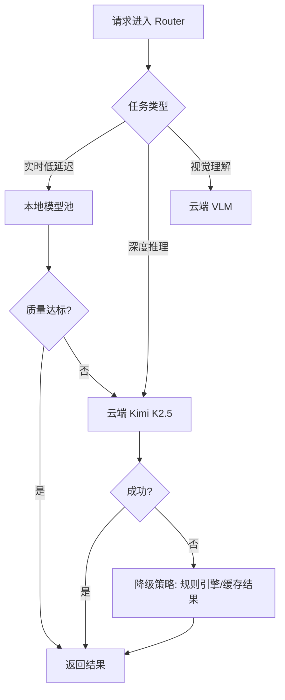
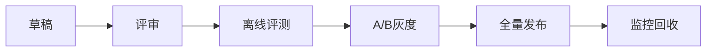
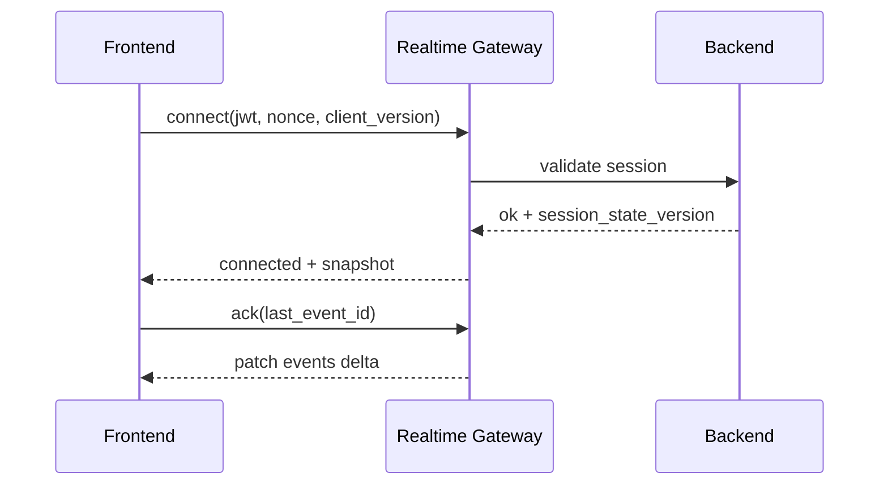
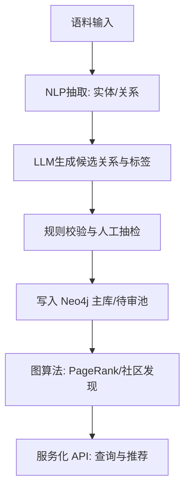
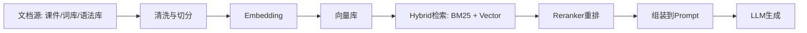
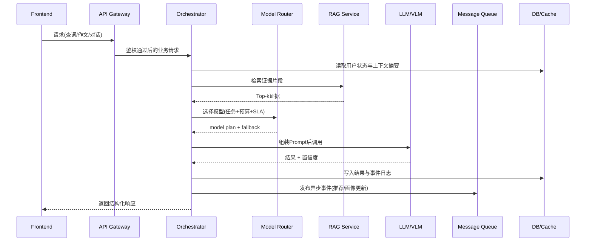

# AI外语学习系统 - 细化架构设计

## 一、单词模块详细架构

### 1.1 功能拆解

```
┌─────────────────────────────────────────────────────────────────────────────┐
│                              单词模块                                        │
├─────────────────────────────────────────────────────────────────────────────┤
│                                                                             │
│  ┌──────────────────┐    ┌──────────────────┐    ┌──────────────────┐      │
│  │    查词功能      │    │   词库生成        │    │   推荐复习        │      │
│  │                  │    │                  │    │                  │      │
│  │ • 模糊搜索       │    │ • LLM生成词汇    │    │ • 能力分析       │      │
│  │ • 同根词联想     │◄──►│ • 自动标签归类   │    │ • 薄弱点识别     │      │
│  │ • 同/反义词      │    │ • 知识图谱关联   │◄──►│ • 个性化推荐     │      │
│  │ • 标签筛选       │    │                  │    │                  │      │
│  └────────┬─────────┘    └────────┬─────────┘    └────────┬─────────┘      │
│           │                       │                       │                │
│           └───────────────────────┼───────────────────────┘                │
│                                   │                                        │
│                                   ▼                                        │
│                    ┌────────────────────────────┐                         │
│                    │      Elasticsearch         │                         │
│                    │  (模糊匹配 + 语义搜索)      │                         │
│                    └────────────────────────────┘                         │
│                                                                             │
└─────────────────────────────────────────────────────────────────────────────┘
```

### 1.2 查词流程

```
用户输入查询词
       │
       ▼
┌─────────────────┐
│  输入预处理      │
│ • 拼写纠错      │
│ • 词干提取      │
│ • 语言检测      │
└────────┬────────┘
         │
         ▼
┌─────────────────┐     未命中    ┌─────────────────┐
│  Redis缓存检查   │ ───────────► │ Elasticsearch   │
│                 │              │ 模糊搜索        │
│ 缓存命中?       │ ◄─────────── │ • 同根词匹配    │
└────────┬────────┘     命中      │ • 同义词扩展    │
         │                        │ • 反义词联想    │
         │ 命中                   │ • 编辑距离匹配  │
         ▼                        └────────┬────────┘
┌─────────────────┐                        │
│  返回缓存结果    │                        ▼
└─────────────────┘              ┌─────────────────┐
                                 │  知识图谱查询    │
                                 │  (Neo4j)        │
                                 │ • 词汇关系网络  │
                                 │ • 标签关联      │
                                 └────────┬────────┘
                                          │
                                          ▼
                                 ┌─────────────────┐
                                 │  PostgreSQL     │
                                 │  查询详细信息    │
                                 │ - 拼写问题: [列表]    │  
                                 │ • 释义/例句     │
                                 │ • 发音数据      │
                                 │ • 难度分级      │
                                 └────────┬────────┘
                                          │
                                          ▼
                                 ┌─────────────────┐
                                 │  结果聚合排序    │
                                 │ • 相关性评分    │
                                 │ • 个性化加权    │
                                 └────────┬────────┘
                                          │
                                          ▼
                                 ┌─────────────────┐
                                 │  写入Redis缓存   │
                                 │  返回给用户      │
                                 └─────────────────┘
```

### 1.3 词库生成与标签归类

```
┌─────────────────────────────────────────────────────────────────┐
│                     词库生成引擎                                 │
├─────────────────────────────────────────────────────────────────┤
│                                                                 │
│  输入: 主题/场景/难度要求                                        │
│    │                                                            │
│    ▼                                                            │
│  ┌─────────────────────────────────────────────────────────┐   │
│  │              LLM词库生成 (Kimi API)                      │   │
│  │                                                         │   │
│  │  Prompt: "生成[商务英语]场景下的高频词汇列表，            │   │
│  │          难度[中级]，包含单词、音标、释义、例句"         │   │
│  │                                                         │   │
│  │  输出: [{word, phonetic, meaning, example, category}]   │   │
│  └─────────────────────────────────────────────────────────┘   │
│    │                                                            │
│    ▼                                                            │
│  ┌─────────────────────────────────────────────────────────┐   │
│  │              自动标签归类系统                            │   │
│  │                                                         │   │
│  │  ┌─────────────┐  ┌─────────────┐  ┌─────────────┐      │   │
│  │  │  主题标签   │  │  难度标签    │  │  词性标签   │      │   │
│  │  │ • 商务      │  │ • 初级      │  │ • 名词       │      │   │
│  │  │ • 旅游      │  │ • 中级      │  │ • 动词       │      │   │
│  │  │ • 学术      │  │ • 高级      │  │ • 形容词     │      │   │
│  │  └─────────────┘  └─────────────┘  └─────────────┘      │   │
│  │                                                         │   │
│  │  LLM标签生成 + 规则校验 + NLP分类模型                    │   │
│  └─────────────────────────────────────────────────────────┘   │
│    │                                                            │
│    ▼                                                            │
│  ┌─────────────────────────────────────────────────────────┐   │
│  │              知识图谱关联 (Neo4j)                        │   │
│  │                                                         │   │
│  │  • 同根词关联 (LLM提取 + 词根词缀规则验证)               │   │
│  │  • 同义词关联 (LLM提取 + WordNet/语义相似度校验)         │   │
│  │  • 反义词关联 (LLM提取 + 对立语义规则校验)               │   │
│  │  • 搭配词关联 (LLM提取 + 语料频次阈值校验)               │   │
│  └─────────────────────────────────────────────────────────┘   │
│    │                                                            │
│    ▼                                                            │
│  存储到PostgreSQL + 同步到Elasticsearch                         │
│                                                                 │
└─────────────────────────────────────────────────────────────────┘
```

### 1.4 推荐复习/学习算法

```
┌─────────────────────────────────────────────────────────────────────────────┐
│                          词汇推荐引擎                                        │
├─────────────────────────────────────────────────────────────────────────────┤
│                                                                             │
│  数据源                                                                      │
│  ┌──────────────┐  ┌──────────────┐  ┌──────────────┐  ┌──────────────┐    │
│  │  对话记录     │  │  作文内容     │  │  查词历史     │  │  测试结果     │    │
│  │  (ASR文本)   │  │  (写作文本)   │  │  (搜索日志)   │  │  (词汇测试)   │    │
│  └──────┬───────┘  └──────┬───────┘  └──────┬───────┘  └──────┬───────┘    │
│         │                 │                 │                 │            │
│         └─────────────────┴─────────────────┴─────────────────┘            │
│                                   │                                        │
│                                   ▼                                        │
│  ┌─────────────────────────────────────────────────────────────────────┐  │
│  │                      表达能力分析引擎                                │  │
│  │                                                                     │  │
│  │  ┌─────────────────┐  ┌─────────────────┐  ┌─────────────────┐     │  │
│  │  │   词汇丰富度     │  │   语法准确性     │  │   表达地道性     │     │  │
│  │  │  • 高级词汇使用  │  │  • 语法错误检测  │  │  • 搭配准确性    │     │  │
│  │  │  • 同义替换能力  │  │  • 句法复杂度    │  │  • 习惯用法      │     │  │
│  │  │  • 词汇多样性    │  │  • 时态语态      │  │  • 语域恰当性    │     │  │
│  │  └────────┬────────┘  └────────┬────────┘  └────────┬────────┘     │  │
│  │           │                    │                    │              │  │
│  │           └────────────────────┼────────────────────┘              │  │
│  │                                ▼                                   │  │
│  │  ┌─────────────────────────────────────────────────────────────┐  │  │
│  │  │                    薄弱点识别                                │  │  │
│  │  │  • 高频使用的基础词汇 → 推荐高级同义词                      │  │  │
│  │  │  • 反复出现的语法错误 → 推荐相关语法点                      │  │  │
│  │  │  • 中式表达习惯 → 推荐地道表达方式                          │  │  │
│  │  │  • 词汇搭配错误 → 推荐正确搭配                              │  │  │
│  │  └─────────────────────────────────────────────────────────────┘  │  │
│  └─────────────────────────────────────────────────────────────────────┘  │
│                                   │                                        │
│                                   ▼                                        │
│  ┌─────────────────────────────────────────────────────────────────────┐  │
│  │                      个性化推荐算法                                  │  │
│  │                                                                     │  │
│  │  输入: 薄弱点 + 用户画像 + 当前学习进度                              │  │
│  │                                                                     │  │
│  │  ┌─────────────────────────────────────────────────────────────┐   │  │
│  │  │  LightFM矩阵分解 + FAISS向量检索                            │   │  │
│  │  │                                                             │   │  │
│  │  │  用户特征: [学习水平, 目标场景, 薄弱标签, 时间偏好]          │   │  │
│  │  │  词汇特征: [难度, 主题标签, 词性, 关联度]                    │   │  │
│  │  │                                                             │   │  │
│  │  │  推荐分数 = 协同过滤分 × 0.4 + 内容相似分 × 0.3 +           │   │  │
│  │  │           薄弱点匹配分 × 0.3                                 │   │  │
│  │  └─────────────────────────────────────────────────────────────┘   │  │
│  │                                                                     │  │
│  │  输出: Top-N 推荐词汇列表 + 推荐理由                                │  │
│  └─────────────────────────────────────────────────────────────────────┘  │
│                                                                             │
└─────────────────────────────────────────────────────────────────────────────┘
```

---

## 二、作文模块详细架构

### 2.1 多阶段分析流程

```
┌─────────────────────────────────────────────────────────────────────────────┐
│                              作文批改流程                                    │
├─────────────────────────────────────────────────────────────────────────────┤
│                                                                             │
│  阶段1: 预处理 + OCR + 可靠语料库检查                                         │
│  ═══════════════════════════════════                                        │
│                                                                             │
│  用户提交作文 ──► ┌─────────────────┐                                       │
│                   │   文本预处理     │                                       │
│                   │ • 编码规范化     │                                       │
│                   │ • 分段分句       │                                       │
│                   │ • 语言检测       │                                       │
│                   └────────┬────────┘                                       │
│                            │                                                │
│                            ▼                                                │
│                   ┌─────────────────┐                                       │
│                   │   OCR文本提取    │                                       │
│                   │  (PaddleOCR)    │                                       │
│                   │                 │                                       │
│                   │ • 图片转文本     │                                       │
│                   │ • 段落顺序还原   │                                       │
│                   │ • 噪声字符清理   │                                       │
│                   └────────┬────────┘                                       │
│                            │                                                │
│                            ▼                                                │
│                   ┌─────────────────┐                                       │
│                   │  可靠语料库API   │                                       │
│                   │  (LanguageTool/  │                                       │
│                   │   Grammarly API) │                                       │
│                   │                 │                                       │
│                   │ • 拼写错误检测   │                                       │
│                   │ • 基础语法检查   │                                       │
│                   │ • 标点符号规范   │                                       │
│                   │ • 常见搭配检查   │                                       │
│                   └────────┬────────┘                                       │
│                            │                                                │
│                            ▼                                                │
│                   ┌─────────────────┐                                       │
│                   │  GEC语法纠错     │                                       │
│                   │  (T5-GECToR)     │                                       │
│                   │                 │                                       │
│                   │ • 深层语法错误   │                                       │
│                   │ • 句法结构问题   │                                       │
│                   │ • 时态语态错误   │                                       │
│                   └────────┬────────┘                                       │
│                            │                                                │
│                            ▼                                                │
│  阶段2: LLM综合分析与逻辑判断                                                 │
│  ═══════════════════════════════════                                        │
│                                                                             │
│                   ┌─────────────────┐                                       │
│                   │  作文结构化解析  │                                       │
│                   │ • 论点提取      │                                       │
│                   │ • 论据识别      │                                       │
│                   │ • 结构分析      │                                       │
│                   │ • 逻辑链梳理    │                                       │
│                   └────────┬────────┘                                       │
│                            │                                                │
│                            ▼                                                │
│                   ┌─────────────────────────────────────────┐              │
│                   │         LLM综合分析 (Kimi API)           │              │
│                   │                                         │              │
│                   │  Prompt: "作为资深英语教师，请对以下作文 │              │
│                   │  进行深入分析：                          │              │
│                   │                                         │              │
│                   │  1. 内容理解：主题把握、观点深度、论证充分性│             │
│                   │  2. 逻辑结构：段落组织、过渡衔接、整体连贯性│             │
│                   │  3. 语言表达：词汇运用、句式多样、修辞手法  │             │
│                   │  4. 创新思维：独特见解、批判性思维         │              │
│                   │                                         │              │
│                   │  前置分析结果：                          │              │
│                   │  - OCR文本: [clean_text]                 │              │
│                   │  - 语法错误: [列表]                      │              │
│                   │  - 拼写问题: [列表]                      │              │
│                   │  - 基础评分: [分数]"                     │              │
│                   │                                         │              │
│                   └─────────────────────────────────────────┘              │
│                            │                                                │
│                            ▼                                                │
│  阶段3: 评分与格式化输出                                                      │
│  ═══════════════════════════════════                                        │
│                                                                             │
│                   ┌─────────────────┐                                       │
│                   │  多维度评分      │                                       │
│                   │                 │                                       │
│                   │  内容(30%): ████████░░ 8/10                          │
│                   │  结构(25%): ███████░░░ 7/10                          │
│                   │  语言(25%): ████████░░ 8/10                          │
│                   │  语法(20%): ██████░░░░ 6/10                          │
│                   │  ─────────────────────                               │
│                   │  总分: 7.25/10                                       │
│                   │  等级: B+                                            │
│                   └────────┬────────┘                                       │
│                            │                                                │
│                            ▼                                                │
│                   ┌─────────────────┐                                       │
│                   │  算法匹配前端展示 │                                       │
│                   │                 │                                       │
│                   │  ┌───────────┐  ┌───────────┐  ┌───────────┐          │
│                   │  │ 错误标注  │  │ 改进建议  │  │ 范文对比  │          │
│                   │  │  (高亮)   │  │  (分类)   │  │  (示例)   │          │
│                   │  └───────────┘  └───────────┘  └───────────┘          │
│                   │                                                 │      │
│                   │  ┌───────────┐  ┌───────────┐  ┌───────────┐          │
│                   │  │ 能力雷达  │  │ 进步曲线  │  │ 推荐练习  │          │
│                   │  │  (图表)   │  │  (趋势)   │  │  (链接)   │          │
│                   │  └───────────┘  └───────────┘  └───────────┘          │
│                   └─────────────────┘                                       │
│                                                                             │
└─────────────────────────────────────────────────────────────────────────────┘
```

### 2.1.1 作文OCR前置（节省VLM Token）

- 默认链路：`OCR -> 语料库/语法检测 -> LLM综合批改`。
- 原则：作文批改优先走文本链路，不走VLM图片理解。
- 回退：OCR低置信度时提示重拍或手动校对，不默认切VLM。

### 2.2 作文评分算法

```
┌─────────────────────────────────────────────────────────────────┐
│                      作文评分算法                                │
├─────────────────────────────────────────────────────────────────┤
│                                                                 │
│  输入: 作文文本 + 阶段1分析结果 + LLM深度分析                    │
│                                                                 │
│  ┌─────────────────────────────────────────────────────────┐   │
│  │                    多维度评分模型                        │   │
│  │                                                         │   │
│  │  ┌─────────────────────────────────────────────────┐   │   │
│  │  │  维度1: 内容 (Content) - 权重30%                │   │   │
│  │  │  • 主题契合度 (BERT分类)        得分 × 0.10     │   │   │
│  │  │  • 观点深度 (LLM评估)           得分 × 0.10     │   │   │
│  │  │  • 论证充分性 (论据数量/质量)    得分 × 0.10    │   │   │
│  │  └─────────────────────────────────────────────────┘   │   │
│  │                                                         │   │
│  │  ┌─────────────────────────────────────────────────┐   │   │
│  │  │  维度2: 结构 (Structure) - 权重25%              │   │   │
│  │  │  • 段落组织 (规则引擎)          得分 × 0.08     │   │   │
│  │  │  • 过渡衔接 (连接词检测)         得分 × 0.08    │   │   │
│  │  │  • 整体连贯性 (LLM评估)         得分 × 0.09     │   │   │
│  │  └─────────────────────────────────────────────────┘   │   │
│  │                                                         │   │
│  │  ┌─────────────────────────────────────────────────┐   │   │
│  │  │  维度3: 语言 (Language) - 权重25%               │   │   │
│  │  │  • 词汇丰富度 (TTR/高级词比例)   得分 × 0.08    │   │   │
│  │  │  • 句式多样性 (句长变化/从句使用) 得分 × 0.09   │   │   │
│  │  │  • 修辞手法 (比喻/排比检测)      得分 × 0.08    │   │   │
│  │  └─────────────────────────────────────────────────┘   │   │
│  │                                                         │   │
│  │  ┌─────────────────────────────────────────────────┐   │   │
│  │  │  维度4: 语法 (Grammar) - 权重20%                │   │   │
│  │  │  • 语法错误密度 (GEC结果)        得分 × 0.10    │   │   │
│  │  │  • 拼写准确性 (拼写检查)         得分 × 0.05    │   │   │
│  │  │  • 标点规范 (规则检查)          得分 × 0.05     │   │   │
│  │  └─────────────────────────────────────────────────┘   │   │
│  │                                                         │   │
│  │  总分 = Σ(维度得分 × 权重)                              │   │
│  │                                                         │   │
│  │  等级映射:                                              │   │
│  │  9-10: A+ (优秀)  8-9: A (良好)  7-8: B+ (中等偏上)     │   │
│  │  6-7: B (中等)   5-6: C (及格)  <5: D (需改进)         │   │
│  │                                                         │   │
│  └─────────────────────────────────────────────────────────┘   │
│                                                                 │
└─────────────────────────────────────────────────────────────────┘
```

---

## 三、对话模块详细架构

### 3.1 双LLM架构设计

```
┌─────────────────────────────────────────────────────────────────────────────┐
│                          对话系统架构                                        │
├─────────────────────────────────────────────────────────────────────────────┤
│                                                                             │
│   阶段1: Prompt Engineering (小LLM)                                         │
│   ═══════════════════════════════════                                       │
│                                                                             │
│   用户输入场景                                                              │
│   "我想练习餐厅点餐"                                                         │
│       │                                                                     │
│       ▼                                                                     │
│   ┌─────────────────────────────────────────────────────────────────────┐  │
│   │                    场景Reasoning扩写引擎                             │  │
│   │                    (轻量级LLM - 9B模型)                              │  │
│   │                                                                     │  │
│   │  Prompt Engineering:                                                │  │
│   │  ─────────────────                                                  │  │
│   │  你是一个专业的英语对话场景设计专家。                                  │  │
│   │  请将用户的简单场景描述扩展为详细的对话设定：                          │  │
│   │                                                                     │  │
│   │  输入: {user_scene}                                                  │  │
│   │                                                                     │  │
│   │  请输出JSON格式：                                                    │  │
│   │  {                                                                  │  │
│   │    "scene_name": "餐厅点餐",                                          │  │
│   │    "setting": {                                                     │  │
│   │      "location": "美式休闲餐厅",                                      │  │
│   │      "time": "晚餐时段",                                              │  │
│   │      "roles": ["顾客(用户)", "服务员"],                               │  │
│   │      "atmosphere": "轻松友好"                                        │  │
│   │    },                                                               │  │
│   │    "learning_objectives": [                                          │  │
│   │      "掌握点餐常用表达",                                              │  │
│   │      "学会询问推荐和特殊要求",                                        │  │
│   │      "练习礼貌用语和支付方式表达"                                     │  │
│   │    ],                                                               │  │
│   │    "key_vocabulary": ["appetizer", "entree", "beverage", ...],       │  │
│   │    "difficulty_level": "intermediate",                               │  │
│   │    "estimated_duration": "10-15分钟",                                │  │
│   │    "opening_line": "Hi, welcome to our restaurant! ..."              │  │
│   │  }                                                                  │  │
│   │                                                                     │  │
│   └─────────────────────────────────────────────────────────────────────┘  │
│       │                                                                     │
│       ▼                                                                     │
│   生成详细对话Prompt                                                         │
│                                                                             │
│   阶段2: 对话执行 (大LLM)                                                    │
│   ═══════════════════════════════════                                       │
│                                                                             │
│       │                                                                     │
│       ▼                                                                     │
│   ┌─────────────────────────────────────────────────────────────────────┐  │
│   │                    对话LLM (Kimi API)                                │  │
│   │                                                                     │  │
│   │  System Prompt = 阶段1生成的场景设定                                 │  │
│   │                                                                     │  │
│   │  "你是一位友好的餐厅服务员。场景设定如下：                           │  │
│   │   {scene_setting}                                                   │  │
│   │                                                                     │  │
│   │   你的任务：                                                        │  │
│   │   1. 扮演服务员角色，引导用户完成点餐流程                            │  │
│   │   2. 使用自然、地道的英语表达                                        │  │
│   │   3. 根据用户的英语水平调整语速和用词                                │  │
│   │   4. 如果用户表达有困难，给予适当的提示和帮助                        │  │
│   │   5. 在对话中自然地使用目标词汇和表达                                │  │
│   │   6. 对话结束后，给予建设性的反馈和建议"                             │  │
│   │                                                                     │  │
│   │  User Message: {用户语音输入(经ASR转换)}                             │  │
│   │                                                                     │  │
│   │  输出: AI回复文本                                                    │  │
│   │                                                                     │  │
│   └─────────────────────────────────────────────────────────────────────┘  │
│       │                                                                     │
│       ▼                                                                     │
│   TTS语音输出                                                                │
│                                                                             │
└─────────────────────────────────────────────────────────────────────────────┘
```

### 3.2 Prompt Engineering优化策略

```
┌─────────────────────────────────────────────────────────────────┐
│                  Prompt Engineering优化                        │
├─────────────────────────────────────────────────────────────────┤
│                                                                 │
│  1. 场景扩写Prompt模板                                          │
│  ═══════════════════════                                        │
│                                                                 │
│  基础模板 (通用场景)                                             │
│  ─────────────────                                              │
│  你是一个专业的英语对话场景设计专家。                             │
│  请将用户的简单场景描述扩展为详细的对话设定。                     │
│                                                                 │
│  输入场景: {user_input}                                         │
│                                                                 │
│  请从以下维度进行扩展：                                          │
│  1. 场景名称和背景设定                                            │
│  2. 参与角色和关系                                                │
│  3. 学习目标（3-5个具体目标） (根据用户以往对话记录展现的问题和学习安排) │
│  4. 核心词汇和表达（10-15个）                                     │
│  5. 难度等级评估                                                  │
│  6. 往期对话要点（如可用）                                        │
│  7. 开场白设计                                                    │
│  8. 可能的对话分支和转折                                          │
│                                                                 │
│  输出格式：严格的JSON，便于程序解析                               │
│                                                                 │
│  ─────────────────────────────────────────────────────────────  │
│                                                                 │
│  2. 场景特定优化 (示例：商务会议)                                 │
│  ═════════════════════════════════                                │
│                                                                 │
│  针对商务场景增加：                                               │
│  • 正式程度设定 (正式/半正式/非正式)                              │
│  • 商务礼仪要点                                                   │
│  • 专业术语列表                                                   │
│  • 文化差异提示                                                   │
│                                                                 │
│  针对旅游场景增加：                                               │
│  • 应急表达用语                                                   │
│  • 当地文化背景                                                   │
│  • 实用信息获取 (问路、购物等)                                    │
│                                                                 │
│  ─────────────────────────────────────────────────────────────  │
│                                                                 │
│  3. 动态难度调整                                                 │
│  ═══════════════════════                                        │
│                                                                 │
│  根据用户历史表现动态调整：                                       │
│  • 初级：简单句、基础词汇、慢语速                                 │
│  • 中级：复合句、常用表达、正常语速                               │
│  • 高级：复杂句、地道表达、自然语速                               │
│                                                                 │
└─────────────────────────────────────────────────────────────────┘
```

---

## 四、教师端模块详细架构

### 4.1 数据分析与总结

```
┌─────────────────────────────────────────────────────────────────────────────┐
│                          教师端数据分析                                      │
├─────────────────────────────────────────────────────────────────────────────┤
│                                                                             │
│  数据来源                                                                   │
│  ┌──────────────┐  ┌──────────────┐  ┌──────────────┐  ┌──────────────┐    │
│  │   学习行为   │  │   对话记录    │  │   作文数据   │  │   测试成绩    │    │
│  │   数据       │  │   数据       │   │   数据       │  │   数据        │    │
│  └──────┬───────┘  └──────┬───────┘  └──────┬───────┘  └──────┬───────┘    │
│         │                 │                 │                 │            │
│         └─────────────────┴─────────────────┴─────────────────┘            │
│                                   │                                        │
│                                   ▼                                        │
│  ┌─────────────────────────────────────────────────────────────────────┐  │
│  │                      用户画像聚合引擎                                │  │
│  │                                                                     │  │
│  │  输入: 原始学习数据                                                  │  │
│  │                                                                     │  │
│  │  处理流程：                                                          │  │
│  │  ┌─────────────┐  ┌─────────────┐  ┌─────────────┐                 │  │
│  │  │  数据清洗   │──►│  特征工程   │──►│  画像建模   │                 │  │
│  │  │             │  │             │  │  (DKT+规则) │                 │  │
│  │  └─────────────┘  └─────────────┘  └──────┬──────┘                 │  │
│  │                                           │                        │  │
│  │                                           ▼                        │  │
│  │  输出: 用户画像向量                                                  │  │
│  │  {                                                                  │  │
│  │    "user_id": "U12345",                                             │  │
│  │    "overall_level": "B1",                                           │  │
│  │    "skill_levels": {                                                │  │
│  │      "listening": 0.75,                                             │  │
│  │      "speaking": 0.68,                                              │  │
│  │      "reading": 0.82,                                               │  │
│  │      "writing": 0.70                                                │  │
│  │    },                                                               │  │
│  │    "weak_areas": ["past_tense", "business_vocabulary"],             │  │
│  │    "strong_areas": ["daily_conversation", "reading_comprehension"], │  │
│  │    "learning_style": "visual",                                      │  │
│  │    "engagement_score": 0.85                                         │  │
│  │  }                                                                  │  │
│  │                                                                     │  │
│  └─────────────────────────────────────────────────────────────────────┘  │
│                                   │                                        │
│                                   ▼                                        │
│  ┌─────────────────────────────────────────────────────────────────────┐  │
│  │                      横向总结 (班级/群体层面)                        │  │
│  │                                                                     │  │
│  │  ┌─────────────────────────────────────────────────────────────┐   │  │
│  │  │  班级整体能力分布                                            │   │  │
│  │  │                                                             │   │  │
│  │  │  听力:  ████████████████████░░░░░░░░  平均: 72分            │   │  │
│  │  │  口语:  █████████████████░░░░░░░░░░░  平均: 65分 ⚠️         │   │  │
│  │  │  阅读:  █████████████████████░░░░░░░  平均: 78分            │   │  │
│  │  │  写作:  ██████████████████░░░░░░░░░░  平均: 70分            │   │  │
│  │  │                                                             │   │  │
│  │  │  共性薄弱点:                                                │   │  │
│  │  │  1. 过去时态使用 (67%学生存在问题)                           │   │  │
│  │  │  2. 商务词汇量不足 (54%学生)                                 │   │  │
│  │  │  3. 连读和弱读 (口语普遍问题)                                │   │  │
│  │  │                                                             │   │  │
│  │  │  建议教学重点:                                              │   │  │
│  │  │  • 增加过去时态专项练习                                      │   │  │
│  │  │  • 引入商务英语词汇模块                                      │   │  │
│  │  │  • 加强语音训练                                              │   │  │
│  │  └─────────────────────────────────────────────────────────────┘   │  │
│  │                                                                     │  │
│  │  ┌─────────────────────────────────────────────────────────────┐   │  │
│  │  │  学习活跃度分析                                              │   │  │
│  │  │                                                             │   │  │
│  │  │  高活跃用户: 15人 (30%)  │  平均学习时长: 45分钟/天         │   │  │
│  │  │  中等用户: 25人 (50%)    │  平均学习时长: 20分钟/天         │   │  │
│  │  │  低活跃用户: 10人 (20%)  │  平均学习时长: 5分钟/天 ⚠️       │   │  │
│  │  │                                                             │   │  │
│  │  │  流失风险用户: 3人 (需关注)                                  │   │  │
│  │  └─────────────────────────────────────────────────────────────┘   │  │
│  │                                                                     │  │
│  └─────────────────────────────────────────────────────────────────────┘  │
│                                   │                                        │
│                                   ▼                                        │
│  ┌─────────────────────────────────────────────────────────────────────┐  │
│  │                      纵向总结 (个人进步追踪)                         │  │
│  │                                                                     │  │
│  │  学生: 张三                                                          │  │
│  │                                                                     │  │
│  │  ┌─────────────────────────────────────────────────────────────┐   │  │
│  │  │  能力进步曲线 (近3个月)                                      │   │  │
│  │  │                                                             │   │  │
│  │  │  总分:  65 ────────► 72 ────────► 78  (+13分) ✅            │   │  │
│  │  │  听力:  70 ────────► 75 ────────► 80  (+10分)               │   │  │
│  │  │  口语:  58 ────────► 65 ────────► 70  (+12分) ✅            │   │  │
│  │  │  阅读:  72 ────────► 78 ────────► 82  (+10分)               │   │  │
│  │  │  写作:  60 ────────► 68 ────────► 75  (+15分) ✅            │   │  │
│  │  │                                                             │   │  │
│  │  │  显著进步领域: 写作 (+15分), 口语 (+12分)                    │   │  │
│  │  │  仍需加强: 语法准确性                                        │   │  │
│  │  └─────────────────────────────────────────────────────────────┘   │  │
│  │                                                                     │  │
│  │  ┌─────────────────────────────────────────────────────────────┐   │  │
│  │  │  学习习惯分析                                                │   │  │
│  │  │                                                             │   │  │
│  │  │  最佳学习时段: 晚上8-10点                                    │   │  │
│  │  │  偏好内容类型: 场景对话 > 词汇 > 作文                        │   │  │
│  │  │  平均专注时长: 25分钟                                        │   │  │
│  │  │  复习完成率: 85% (优秀)                                      │   │  │
│  │  │                                                             │   │  │
│  │  │  个性化建议:                                                │   │  │
│  │  │  • 利用晚间高效时段安排难点学习                              │   │  │
│  │  │  • 增加语法专项练习，目标：写作突破80分                      │   │  │
│  │  └─────────────────────────────────────────────────────────────┘   │  │
│  │                                                                     │  │
│  └─────────────────────────────────────────────────────────────────────┘  │
│                                                                             │
└─────────────────────────────────────────────────────────────────────────────┘
```

---

## 五、实时助教模块详细架构

> **⚠️ 开发优先级: P0 (最后开发)**
> 
> **🎯 项目定位: 核心亮点与最高技术难度模块**
> 
> 实时助教系统是本项目的**最具创新性的功能**，也是**技术实现难度最高**的部分。
> 建议在完成单词、作文、对话等核心学习模块后再投入开发。
> 
> **难点说明:**
> - 多模态实时融合 (屏幕+语音+行为)
> - 超低延迟要求 (<500ms端到端)
> - 智能时机判断 (不打断教学节奏)
> - 前端超轻量模型部署 (WebGL/ONNX)
> - Token成本控制 (五级筛选机制)

### 5.1 整体架构

```
┌─────────────────────────────────────────────────────────────────────────────┐
│                    实时助教系统 (教师端个人助手)                             │
├─────────────────────────────────────────────────────────────────────────────┤
│                                                                             │
│  【架构说明】                                                                │
│  • 运行位置: 仅部署在教师端，完全独立于学生端                                 │
│  • 用户交互: 助教与教师互动，返回信息以语音形式输出给教师                     │
│  • AI服务: 无论简单/复杂场景，一律使用 Kimi API (K2.5统一处理多模态+文本)    │
│  • 架构模式: 前后端分离，前端采集 → 后端调用Kimi API → TTS语音输出            │
│                                                                             │
│   ┌─────────────────────────────────────────────────────────────────────┐  │
│   │                    教师端前端 (Frontend)                             │  │
│   │                                                                     │  │
│   │  ┌───────────────┐  ┌───────────────┐  ┌───────────────┐           │  │
│   │  │  屏幕视频采集  │  │  麦克风采集    │  │  音频播放      │           │  │
│   │  │  (WebRTC)     │  │  (Web Audio)  │  │  (TTS输出)     │           │  │
│   │  │               │  │               │  │               │           │  │
│   │  │ • 捕获课件画面│  │ • 教师语音流  │  │ • 接收合成音频│           │  │
│   │  │ • 编码H.264  │  │ • 降噪处理    │  │ • 本地播放    │           │  │
│   │  │ • 5fps采样   │  │ • 16kHz单声道 │  │ • 教师收听    │           │  │
│   │  └───────┬───────┘  └───────┬───────┘  └───────┬───────┘           │  │
│   │          │                  │                  │                    │  │
│   │          └──────────────────┼──────────────────┘                    │  │
│   │                             │                                       │  │
│   │                             ▼                                       │  │
│   │          ┌─────────────────────────────────────┐                   │  │
│   │          │      WebSocket实时传输 (到后端)      │                   │  │
│   │          │  • 视频帧压缩 (JPEG/WebP)            │                   │  │
│   │          │  • 音频流 (Opus 24kbps)              │                   │  │
│   │          │  • 控制信令                          │                   │  │
│   │          └─────────────────────────────────────┘                   │  │
│   │                                                                     │  │
│   └─────────────────────────────────────────────────────────────────────┘  │
│                                    │                                        │
│                                    │ HTTP/WebSocket                         │
│                                    ▼                                        │
│   ┌─────────────────────────────────────────────────────────────────────┐  │
│   │                    后端服务 (教师端本地/远程)                        │  │
│   │                                                                     │  │
│   │  ┌─────────────────────────────────────────────────────────────┐   │  │
│   │  │              屏幕变化检测模块 (节省Token)                    │   │  │
│   │  │                                                             │   │  │
│   │  │  目标: 仅在屏幕内容发生显著变化时触发Kimi API，降低成本      │   │  │
│   │  │                                                             │   │  │
│   │  │  方案1: 图像哈希对比 (快速预筛选)                            │   │  │
│   │  │  • 计算感知哈希 (pHash/dHash)                                │   │  │
│   │  │  • 汉明距离 > 阈值 → 进入精细检测                            │   │  │
│   │  │                                                             │   │  │
│   │  │  方案2: 分辨率下采样 (推荐)                                  │   │  │
│   │  │  • 完整屏幕内容传输（保留鼠标轨迹）                          │   │  │
│   │  │  • 下采样至720P (1280×720) 或 480P (854×480)                 │   │  │
│   │  │  • 鼠标轨迹用于识别教师圈出的重点内容                        │   │  │
│   │  │                                                             │   │  │
│   │  │  方案3: 内容感知检测 (OCR文本对比)                           │   │  │
│   │  │  • OCR提取文本内容                                           │   │  │
│   │  │  • 文本相似度对比 (编辑距离)                                 │   │  │
│   │  │  • 文本变化 > 阈值 → 调用Kimi API                            │   │  │
│   │  │                                                             │   │  │
│   │  │  推荐实现: 方案1 → 方案2 → 方案3 三级筛选                    │   │  │
│   │  └─────────────────────────────────────────────────────────────┘   │  │
│   │                              │                                      │  │
│   │                              │ 屏幕/语音变化触发                    │  │
│   │                              ▼                                      │  │
│   │  ┌─────────────────────────────────────────────────────────────┐   │  │
│   │  │              多模态融合处理流程                              │   │  │
│   │  │                                                             │   │  │
│   │  │  输入1: 屏幕截图 (来自前端视频流)                            │   │  │
│   │  │  输入2: ASR识别的教师语音文本 (faster-whisper)               │   │  │
│   │  │  输入3: 历史上下文 (本地Redis)                               │   │  │
│   │  │                                                             │   │  │
│   │  │  ┌─────────────────────────────────────────────────────┐    │   │  │
│   │  │  │              Kimi API 调用 (统一入口)                │    │   │  │
│   │  │  │                                                     │    │   │  │
│   │  │  │  • 模型: Kimi K2.5 (统一多模态模型)                │    │   │  │
│   │  │  │  • 输入: 课件截图 + 教师语音转写 + 历史上下文        │    │   │  │
│   │  │  │  • 输出: 结构化助教建议                             │    │   │  │
│   │  │  │                                                     │    │   │  │
│   │  │  │  Prompt: "你是一位英语教学助教，基于当前课件内容     │    │   │  │
│   │  │  │  和教师讲解，为教师提供实时教学建议：                │    │   │  │
│   │  │  │  1. 当前知识点的补充说明                            │    │   │  │
│   │  │  │  2. 学生可能产生的疑问及解答思路                    │    │   │  │
│   │  │  │  3. 相关例句或拓展知识                              │    │   │  │
│   │  │  │  4. 教学技巧提示"                                   │    │   │  │
│   │  │  │                                                     │    │   │  │
│   │  │  └─────────────────────────────────────────────────────┘    │   │  │
│   │  └─────────────────────────────────────────────────────────────┘   │  │
│   │                              │                                      │  │
│   │                              │ Kimi API返回助教建议                  │  │
│   │                              ▼                                      │  │
│   │  ┌─────────────────────────────────────────────────────────────┐   │  │
│   │  │              语音合成与播放 (返回给教师)                     │   │  │
│   │  │                                                             │   │  │
│   │  │  ┌─────────────┐  ┌─────────────┐                          │   │  │
│   │  │  │  本地XTTS   │  │  WebSocket  │                          │   │  │
│   │  │  │ • 语音合成  │──►│ • 推送到    │                          │   │  │
│   │  │  │ • 流式输出  │  │   教师前端  │                          │   │  │
│   │  │  └─────────────┘  └─────────────┘                          │   │  │
│   │  │                                                             │   │  │
│   │  │  【注意】所有输出仅返回给教师，学生端无感知                 │   │  │
│   │  └─────────────────────────────────────────────────────────────┘   │  │
│   │                                                                     │  │
│   └─────────────────────────────────────────────────────────────────────┘  │
│                                                                             │
└─────────────────────────────────────────────────────────────────────────────┘
```

### 5.3 屏幕变化检测算法详解 (边侧实现)

```python
# 屏幕变化检测核心算法 - 运行在边侧服务器

import cv2
import numpy as np
from PIL import Image
import imagehash

class ScreenChangeDetector:
    """
    屏幕变化检测器 - 支持分辨率下采样
    
    设计考虑:
    - 保留完整屏幕内容（包括鼠标轨迹，教师可能用鼠标圈重点）
    - 通过下采样降低带宽，而非ROI裁剪
    - 支持多档分辨率: 1080P(原图) / 720P(推荐) / 480P(低带宽)
    """
    
    # 预定义分辨率档位
    RESOLUTIONS = {
        '1080p': (1920, 1080),  # 原图，高质量
        '720p': (1280, 720),    # 推荐，平衡质量与带宽
        '480p': (854, 480),     # 低带宽，快速预览
    }
    
    def __init__(self, 
                 hash_threshold=10,      # 哈希差异阈值
                 pixel_threshold=0.05,    # 像素变化比例阈值 (5%)
                 target_resolution='720p', # 目标分辨率档位
                 cooldown_seconds=3):     # 冷却时间 (避免频繁触发)
        self.hash_threshold = hash_threshold
        self.pixel_threshold = pixel_threshold
        self.target_resolution = self.RESOLUTIONS.get(target_resolution, (1280, 720))
        self.cooldown_seconds = cooldown_seconds
        self.last_capture = None
        self.last_hash = None
        self.last_trigger_time = 0
        
    def detect_change(self, current_frame, target_resolution=(1280, 720)) -> dict:
        """
        检测屏幕是否发生显著变化（支持分辨率下采样）
        
        Args:
            current_frame: 当前帧 (BGR格式)
            target_resolution: 下采样目标分辨率 (宽, 高)，默认720P
            
        Returns:
            {
                'changed': bool,           # 是否发生变化
                'confidence': float,       # 变化置信度
                'change_type': str,        # 变化类型: 'content'|'ui'|'none'
                'resized_frame': np.array  # 下采样后的帧（用于传输）
            }
        """
        current_time = time.time()
        
        # 冷却检查
        if current_time - self.last_trigger_time < self.cooldown_seconds:
            return {'changed': False, 'reason': 'cooldown'}
        
        # 分辨率下采样（保留完整内容，包括鼠标轨迹）
        resized_frame = cv2.resize(current_frame, target_resolution, interpolation=cv2.INTER_AREA)
        
        # 首次捕获
        if self.last_capture is None:
            self.last_capture = resized_frame
            self.last_hash = self._compute_hash(resized_frame)
            return {
                'changed': True, 
                'confidence': 1.0, 
                'change_type': 'initial',
                'resized_frame': resized_frame
            }
        
        # 1. 快速哈希检测（在下采样后的帧上进行）
        current_hash = self._compute_hash(resized_frame)
        hash_diff = self.last_hash - current_hash
        
        if hash_diff < self.hash_threshold:
            # 哈希相似，快速返回
            return {
                'changed': False, 
                'confidence': 0.0, 
                'change_type': 'none',
                'resized_frame': resized_frame
            }
        
        # 2. 全帧像素级检测（在下采样后的帧上进行）
        # 保留鼠标轨迹，检测整体变化
        diff_ratio = self._compute_pixel_diff(self.last_capture, resized_frame)
        
        # 3. 综合判断
        if diff_ratio > self.pixel_threshold:
            self.last_trigger_time = current_time
            self.last_capture = resized_frame
            self.last_hash = current_hash
            
            return {
                'changed': True,
                'confidence': diff_ratio,
                'change_type': 'content',
                'hash_diff': hash_diff,
                'resized_frame': resized_frame  # 下采样后的帧可直接用于传输
            }
        
        return {
            'changed': False, 
            'confidence': 0.0, 
            'change_type': 'ui_noise',
            'resized_frame': resized_frame
        }
    
    def _compute_hash(self, image) -> imagehash.ImageHash:
        """计算感知哈希"""
        pil_image = Image.fromarray(cv2.cvtColor(image, cv2.COLOR_BGR2RGB))
        return imagehash.phash(pil_image)
    
    def _extract_roi(self, image, x1, y1, x2, y2, w, h):
        """提取感兴趣区域"""
        x1, y1 = int(x1 * w), int(y1 * h)
        x2, y2 = int(x2 * w), int(y2 * h)
        return image[y1:y2, x1:x2]
    
    def _compute_pixel_diff(self, img1, img2) -> float:
        """计算像素差异比例"""
        if img1.shape != img2.shape:
            return 1.0
        
        # 转为灰度图
        gray1 = cv2.cvtColor(img1, cv2.COLOR_BGR2GRAY)
        gray2 = cv2.cvtColor(img2, cv2.COLOR_BGR2GRAY)
        
        # 计算绝对差异
        diff = cv2.absdiff(gray1, gray2)
        
        # 二值化 (忽略微小变化)
        _, thresh = cv2.threshold(diff, 30, 255, cv2.THRESH_BINARY)
        
        # 计算变化像素比例
        changed_pixels = np.count_nonzero(thresh)
        total_pixels = thresh.size
        
        return changed_pixels / total_pixels


# 使用示例
detector = ScreenChangeDetector(
    hash_threshold=10,
    pixel_threshold=0.05,
    target_resolution='720p',  # 下采样至720P，保留完整内容包括鼠标轨迹
    cooldown_seconds=3
)

# 在实时循环中
while True:
    screenshot = capture_screen()  # 捕获屏幕 (1080P)
    result = detector.detect_change(screenshot)
    
    if result['changed']:
        print(f"屏幕发生变化，置信度: {result['confidence']:.2f}")
        # 使用下采样后的帧进行VLM分析（包含鼠标轨迹）
        resized_frame = result['resized_frame']
        analyze_with_vlm(resized_frame)  # 传输720P而非原图，节省带宽
```

### 5.2 Token节省策略 (三级筛选触发Kimi API)

#### 5.2.1 架构说明

实时助教系统**统一使用 Kimi API** 进行AI推理，本地仅做预处理和筛选：

| 层级 | 处理方式 | 职责 |
|------|----------|------|
| **前端** | 教师端浏览器/Electron | 屏幕采集、麦克风采集、音频播放 |
| **后端** | 本地服务 | 视频解码、三级筛选、调用Kimi API、TTS合成 |
| **AI推理** | **Kimi API统一处理** | 无论简单/复杂场景，一律使用Kimi K2.5 |
| **输出** | 语音返回教师 | 仅教师收听，学生端无感知 |

#### 5.2.2 五级智能筛选流程 (最大化利用教师端PC算力)

```
┌─────────────────────────────────────────────────────────────────────────────┐
│                 智能筛选与注意力引导策略 (实时助教专用)                        │
├─────────────────────────────────────────────────────────────────────────────┤
│                                                                             │
│  核心思想: 充分利用教师端PC算力，前端做超轻量预处理，后端做智能决策             │
│                                                                             │
│  ┌─────────────────────────────────────────────────────────────────────┐   │
│  │                     五级筛选与注意力引导流程                         │   │
│  │                                                                     │   │
│  │  【前端 - 教师端PC】                                                │   │
│  │   ┌─────────────────────────────────────────────────────────────┐  │   │
│  │   │  L0: 输入事件捕获 (零成本)                                    │  │   │
│  │   │  • 键盘事件: PageUp/PageDown/方向键 → 翻页检测                │  │   │
│  │   │  • 鼠标事件: 按下+移动轨迹 → 框选行为检测                      │  │   │
│  │   │  • 滚轮事件: 滚动方向/速度 → 浏览行为检测                     │  │   │
│  │   └─────────────────────────────────────────────────────────────┘  │   │
│  │                              │                                     │   │
│  │                              ▼                                     │   │
│  │   ┌─────────────────────────────────────────────────────────────┐  │   │
│  │   │  L1: 超轻量行为识别模型 (WebGL/ONNX Runtime)                  │  │   │
│  │   │  • 模型: MobileNetV3-SSD (3MB) 或 YOLOv8n (6MB)              │  │   │
│  │   │  • 输入: 鼠标轨迹 + 屏幕区域                                  │  │   │
│  │   │  • 输出: 框选区域坐标 [x1,y1,x2,y2] + 置信度                  │  │   │
│  │   │  • 延迟: < 10ms (WebGL加速)                                  │  │   │
│  │   │  • 过滤: 95%无意义移动 (随机晃动、UI点击)                      │  │   │
│  │   └─────────────────────────────────────────────────────────────┘  │   │
│  │                              │                                     │   │
│  │                              ▼                                     │   │
│  │   ┌─────────────────────────────────────────────────────────────┐  │   │
│  │   │  L2: 屏幕内容哈希去重 (CPU 5ms)                               │  │   │
│  │   │  • 感知哈希 (pHash) 快速对比                                  │  │   │
│  │   │  • 相似帧过滤 (动画、过渡效果)                                │  │   │
│  │   │  • 分辨率下采样: 1080P→720P (保留鼠标轨迹)                    │  │   │
│  │   └─────────────────────────────────────────────────────────────┘  │   │
│  │                              │                                     │   │
│  │                              ▼                                     │   │
│  │   【后端 - 本地服务】                                               │   │
│  │   ┌─────────────────────────────────────────────────────────────┐  │   │
│  │   │  L3: 注意力Mask生成与语义分析 (CPU 20ms)                      │  │   │
│  │   │  • 框选区域 → 半透明高亮Mask (引导VLM注意力)                   │  │   │
│  │   │  • OCR提取框选区域内文本                                      │  │   │
│  │   │  • 翻页事件 → 课件段落定位                                    │  │   │
│  │   │  • 生成结构化Prompt: "教师框选了[区域内容]，可能关注..."        │  │   │
│  │   └─────────────────────────────────────────────────────────────┘  │   │
│  │                              │                                     │   │
│  │                              ▼                                     │   │
│  │   ┌─────────────────────────────────────────────────────────────┐  │   │
│  │   │  L4: 智能触发决策引擎                                         │  │   │
│  │   │  • 高优先级: 框选行为 + 语音停顿 → 立即触发VLM                 │  │   │
│  │   │  • 中优先级: 翻页 → 延迟触发                                  │  │   │
│  │   │  • 低优先级: 仅翻页/仅语音 → 本地规则兜底                      │  │   │
│  │   │  • 忽略: 快速翻页、随机晃动、UI操作                            │  │   │
│  │   └─────────────────────────────────────────────────────────────┘  │   │
│  │                              │                                     │   │
│  │                              ▼                                     │   │
│  │   ┌─────────────────────────────────────────────────────────────┐  │   │
│  │   │              Kimi API 调用 (精准触发)                        │  │   │
│  │   │  • 输入: 720P截图 + 注意力Mask + ASR文本 + 结构化上下文       │  │   │
│  │   │  • Prompt: "教师框选了以下区域（高亮部分），请分析..."       │  │   │
│  │   │  • 输出: 精准助教建议                                        │  │   │
│  │   └─────────────────────────────────────────────────────────────┘  │   │
│  │                              │                                     │   │
│  │                              ▼                                     │   │
│  │   ┌─────────────────────────────────────────────────────────────┐  │   │
│  │   │              XTTS语音合成 → 教师本地播放                     │  │   │
│  │   └─────────────────────────────────────────────────────────────┘  │   │
│  │                                                                     │   │
│  └─────────────────────────────────────────────────────────────────────┘   │
│                                                                             │
│  效果对比:                                                                   │
│  ┌─────────────────┬─────────────────┬─────────────────┬─────────────────┐ │
│  │     场景        │   优化前Token    │   三级筛选后     │   五级筛选后     │ │
│  ├─────────────────┼─────────────────┼─────────────────┼─────────────────┤ │
│  │  45分钟课程     │   ~500次请求     │   ~30次请求      │   ~15次请求      │ │
│  │  (频繁翻页)     │   ~$2.50        │   ~$0.15        │   ~$0.075       │ │
│  ├─────────────────┼─────────────────┼─────────────────┼─────────────────┤ │
│  │  45分钟课程     │   ~500次请求     │   ~15次请求      │   ~8次请求       │ │
│  │  (正常讲解)     │   ~$2.50        │   ~$0.075       │   ~$0.04        │ │
│  └─────────────────┴─────────────────┴─────────────────┴─────────────────┘ │
│                                                                             │
│  关键提升:                                                                   │
│  1. 框选行为识别: 精准捕捉教师意图，避免无效截图分析                          │
│  2. 注意力Mask: 引导VLM关注重点区域，提升回答质量                             │
│  3. 翻页联动: 结合课件结构，理解上下文语境                                    │
│                                                                             │
│  综合节省: 97%+ Token成本，响应延迟 < 500ms                                  │
│                                                                             │
└─────────────────────────────────────────────────────────────────────────────┘
```

#### 5.2.3 注意力Mask生成示例

```
原始屏幕 (720P):
┌────────────────────────────────────────┐
│  PPT标题: 英语语法 - 时态讲解           │
│                                        │
│  ┌────────────────────────────────┐   │
│  │  现在完成时                     │   │
│  │  • 结构: have/has + done       │   │
│  │  • 用法1: 过去动作影响现在      │   │
│  │  • 用法2: 从过去持续到现在的动作│   │
│  └────────────────────────────────┘   │
│                                        │
│  [教师鼠标框选了"用法1"区域]            │
│       ↓                                │
│       ↓                                │
│       ↓                                │
└────────────────────────────────────────┘

生成注意力Mask (半透明高亮):
┌────────────────────────────────────────┐
│  ████████████████████████████████████  │  ← 正常亮度 (背景)
│  ████████████████████████████████████  │
│  ████████████████████████████████████  │
│  ████████████  ▓▓▓▓▓▓▓▓▓▓▓▓  ████████  │  ← 高亮区域 (框选内容)
│  ████████████  ▓ 用法1 ▓▓▓▓  ████████  │     ▓ = 70%透明度叠加
│  ████████████  ▓▓▓▓▓▓▓▓▓▓▓▓  ████████  │
│  ████████████████████████████████████  │
│  ████████████████████████████████████  │
└────────────────────────────────────────┘

VLM输入:
{
  "image": "720P截图 + Mask叠加",
  "context": "教师在讲解现在完成时，框选了'用法1: 过去动作影响现在'",
  "question": "请解释这个用法的典型例句和学生易错点"
}
```

#### 5.2.4 前端超轻量行为识别实现

```typescript
// 教师端前端 - 超轻量行为识别 (TypeScript + ONNX Runtime Web)

import * as ort from 'onnxruntime-web';

interface MouseEvent {
  x: number;
  y: number;
  timestamp: number;
  type: 'move' | 'down' | 'up';
}

interface BehaviorResult {
  type: 'lasso' | 'click' | 'scroll' | 'none';
  region?: { x1: number; y1: number; x2: number; y2: number };
  confidence: number;
}

class TeacherBehaviorDetector {
  private mouseTrail: MouseEvent[] = [];
  private isMouseDown = false;
  private session: ort.InferenceSession | null = null;
  private readonly TRAIL_MAX_LENGTH = 100;
  private readonly LASSO_THRESHOLD = 0.7;
  
  // 超轻量模型配置
  private readonly MODEL_CONFIG = {
    name: 'yolov8n-mouse-gesture',
    size: '6MB',
    inputShape: [1, 3, 224, 224],
    classes: ['lasso', 'point', 'random']
  };

  async init() {
    // 加载ONNX模型 (WebGL加速)
    this.session = await ort.InferenceSession.create(
      '/models/yolov8n-mouse-gesture.onnx',
      { executionProviders: ['webgl'] }
    );
  }

  // 捕获鼠标事件
  onMouseEvent(event: MouseEvent) {
    if (event.type === 'down') {
      this.isMouseDown = true;
      this.mouseTrail = [event];
    } else if (event.type === 'up') {
      this.isMouseDown = false;
      // 鼠标释放时分析轨迹
      const result = this.analyzeTrail();
      if (result.type === 'lasso' && result.confidence > this.LASSO_THRESHOLD) {
        this.onLassoDetected(result.region!);
      }
      this.mouseTrail = [];
    } else if (event.type === 'move' && this.isMouseDown) {
      this.mouseTrail.push(event);
      // 限制轨迹长度
      if (this.mouseTrail.length > this.TRAIL_MAX_LENGTH) {
        this.mouseTrail.shift();
      }
    }
  }

  // 分析鼠标轨迹
  private analyzeTrail(): BehaviorResult {
    if (this.mouseTrail.length < 10) {
      return { type: 'click', confidence: 1.0 };
    }

    // 方法1: 规则引擎快速判断
    const ruleResult = this.ruleBasedDetection();
    if (ruleResult.confidence > 0.9) {
      return ruleResult;
    }

    // 方法2: 神经网络精确识别 (WebGL加速 < 10ms)
    return this.modelBasedDetection();
  }

  // 基于规则的快速检测
  private ruleBasedDetection(): BehaviorResult {
    const trail = this.mouseTrail;
    const start = trail[0];
    const end = trail[trail.length - 1];
    
    // 计算轨迹特征
    const duration = end.timestamp - start.timestamp;
    const distance = Math.sqrt(
      Math.pow(end.x - start.x, 2) + Math.pow(end.y - start.y, 2)
    );
    const area = this.calculateBoundingBoxArea(trail);
    
    // 框选特征: 持续时间>300ms, 形成闭合区域, 面积>1000px²
    if (duration > 300 && area > 1000) {
      const region = this.getBoundingBox(trail);
      return { type: 'lasso', region, confidence: 0.85 };
    }
    
    return { type: 'none', confidence: 0.5 };
  }

  // 基于模型的精确检测
  private async modelBasedDetection(): Promise<BehaviorResult> {
    if (!this.session) return { type: 'none', confidence: 0 };

    // 生成轨迹热力图
    const heatmap = this.generateHeatmap(this.mouseTrail);
    
    // 准备输入张量
    const tensor = new ort.Tensor('float32', heatmap, this.MODEL_CONFIG.inputShape);
    
    // 推理 (WebGL加速)
    const startTime = performance.now();
    const results = await this.session.run({ input: tensor });
    const latency = performance.now() - startTime;
    
    // 解析结果
    const output = results.output.data as Float32Array;
    const [lassoProb, pointProb, randomProb] = [output[0], output[1], output[2]];
    
    if (lassoProb > this.LASSO_THRESHOLD) {
      const region = this.getBoundingBox(this.mouseTrail);
      return { 
        type: 'lasso', 
        region, 
        confidence: lassoProb 
      };
    }
    
    return { type: 'none', confidence: randomProb };
  }

  // 生成轨迹热力图 (224x224)
  private generateHeatmap(trail: MouseEvent[]): Float32Array {
    const size = 224;
    const heatmap = new Float32Array(3 * size * size).fill(0);
    
    // 归一化坐标
    const screenW = window.innerWidth;
    const screenH = window.innerHeight;
    
    trail.forEach((point, index) => {
      const x = Math.floor((point.x / screenW) * size);
      const y = Math.floor((point.y / screenH) * size);
      const intensity = index / trail.length; // 时间衰减
      
      // 绘制高斯点
      this.drawGaussian(heatmap, x, y, intensity, size);
    });
    
    return heatmap;
  }

  // 绘制高斯分布点
  private drawGaussian(
    heatmap: Float32Array, 
    cx: number, cy: number, 
    intensity: number, size: number
  ) {
    const radius = 5;
    for (let dy = -radius; dy <= radius; dy++) {
      for (let dx = -radius; dx <= radius; dx++) {
        const x = cx + dx;
        const y = cy + dy;
        if (x >= 0 && x < size && y >= 0 && y < size) {
          const dist = Math.sqrt(dx * dx + dy * dy);
          const value = intensity * Math.exp(-(dist * dist) / (2 * radius * radius));
          const idx = y * size + x;
          heatmap[idx] = Math.max(heatmap[idx], value);
        }
      }
    }
  }

  // 计算包围盒面积
  private calculateBoundingBoxArea(trail: MouseEvent[]): number {
    const box = this.getBoundingBox(trail);
    return (box.x2 - box.x1) * (box.y2 - box.y1);
  }

  // 获取包围盒
  private getBoundingBox(trail: MouseEvent[]) {
    const xs = trail.map(p => p.x);
    const ys = trail.map(p => p.y);
    return {
      x1: Math.min(...xs),
      y1: Math.min(...ys),
      x2: Math.max(...xs),
      y2: Math.max(...ys)
    };
  }

  // 框选检测到时的回调
  private onLassoDetected(region: { x1: number; y1: number; x2: number; y2: number }) {
    // 1. 生成半透明Mask
    const mask = this.generateAttentionMask(region);
    
    // 2. 捕获屏幕区域
    const screenshot = this.captureScreen();
    
    // 3. 发送到后端
    this.sendToBackend({
      type: 'lasso_detected',
      region,
      mask,
      screenshot,
      timestamp: Date.now()
    });
  }

  // 生成注意力Mask (Canvas绘制)
  private generateAttentionMask(
    region: { x1: number; y1: number; x2: number; y2: number }
  ): string {
    const canvas = document.createElement('canvas');
    canvas.width = 1280;
    canvas.height = 720;
    const ctx = canvas.getContext('2d')!;
    
    // 半透明黑色遮罩
    ctx.fillStyle = 'rgba(0, 0, 0, 0.5)';
    ctx.fillRect(0, 0, canvas.width, canvas.height);
    
    // 清除高亮区域 (使用destination-out)
    ctx.globalCompositeOperation = 'destination-out';
    ctx.fillStyle = 'rgba(255, 255, 255, 1)';
    ctx.fillRect(region.x1, region.y1, region.x2 - region.x1, region.y2 - region.y1);
    
    // 添加高亮边框
    ctx.globalCompositeOperation = 'source-over';
    ctx.strokeStyle = 'rgba(255, 200, 50, 0.8)';
    ctx.lineWidth = 3;
    ctx.strokeRect(region.x1, region.y1, region.x2 - region.x1, region.y2 - region.y1);
    
    return canvas.toDataURL('image/png');
  }

  // 捕获屏幕 (使用getDisplayMedia)
  private async captureScreen(): Promise<ImageBitmap> {
    const stream = await navigator.mediaDevices.getDisplayMedia({
      video: { width: 1280, height: 720, frameRate: 5 }
    });
    const track = stream.getVideoTracks()[0];
    const capture = new ImageCapture(track);
    return await capture.grabFrame();
  }

  // 发送到后端
  private sendToBackend(data: any) {
    // WebSocket发送
    this.ws.send(JSON.stringify({
      ...data,
      screenResolution: { width: window.innerWidth, height: window.innerHeight }
    }));
  }
}

// 使用示例
const detector = new TeacherBehaviorDetector();
await detector.init();

// 监听鼠标事件
document.addEventListener('mousedown', (e) => {
  detector.onMouseEvent({ x: e.clientX, y: e.clientY, timestamp: Date.now(), type: 'down' });
});

document.addEventListener('mousemove', (e) => {
  detector.onMouseEvent({ x: e.clientX, y: e.clientY, timestamp: Date.now(), type: 'move' });
});

document.addEventListener('mouseup', (e) => {
  detector.onMouseEvent({ x: e.clientX, y: e.clientY, timestamp: Date.now(), type: 'up' });
});

// 监听键盘翻页
document.addEventListener('keydown', (e) => {
  if (e.key === 'PageDown' || e.key === 'ArrowRight') {
    detector.sendToBackend({ type: 'page_next', timestamp: Date.now() });
  } else if (e.key === 'PageUp' || e.key === 'ArrowLeft') {
    detector.sendToBackend({ type: 'page_prev', timestamp: Date.now() });
  }
});
```

#### 5.2.5 后端智能决策引擎

```python
# 后端 - 智能触发决策引擎

from dataclasses import dataclass
from typing import Optional, Dict, Any
from enum import Enum
import time

class TriggerPriority(Enum):
    HIGH = "high"      # 立即触发
    MEDIUM = "medium"  # 延迟触发
    LOW = "low"        # 本地规则兜底
    IGNORE = "ignore"  # 忽略

@dataclass
class ContextEvent:
    timestamp: float
    event_type: str  # 'lasso', 'page_change', 'voice_pause', 'voice_active'
    data: Dict[str, Any]

class SmartTriggerEngine:
    """
    智能触发决策引擎
    
    决策逻辑:
    1. 高优先级: 框选行为 + 语音停顿 → 教师正在讲解重点，立即触发VLM
    2. 中优先级: 翻页后3秒 + 教师注视 → 进入新页面，延迟触发VLM
    3. 低优先级: 仅翻页/仅语音 → 本地规则兜底
    4. 忽略: 快速翻页、随机晃动、UI操作
    """
    
    def __init__(self):
        self.event_buffer: list[ContextEvent] = []
        self.last_trigger_time = 0
        self.cooldown_seconds = 3
        self.buffer_window_seconds = 5
        
    def on_event(self, event: ContextEvent) -> Optional[Dict]:
        """处理事件，返回触发决策"""
        
        # 冷却检查
        if time.time() - self.last_trigger_time < self.cooldown_seconds:
            return None
        
        # 添加到缓冲区
        self.event_buffer.append(event)
        self._clean_old_events()
        
        # 决策
        decision = self._make_decision()
        
        if decision['priority'] == TriggerPriority.HIGH:
            self.last_trigger_time = time.time()
            return self._build_vlm_request(decision)
        elif decision['priority'] == TriggerPriority.MEDIUM:
            # 延迟触发，启动定时器
            self._schedule_delayed_trigger(decision)
            return None
        
        return None
    
    def _make_decision(self) -> Dict:
        """基于事件缓冲区做决策"""
        
        has_lasso = any(e.event_type == 'lasso' for e in self.event_buffer)
        has_voice_pause = any(e.event_type == 'voice_pause' for e in self.event_buffer)
        has_page_change = any(e.event_type == 'page_change' for e in self.event_buffer)
        
        # 高优先级: 框选 + 语音停顿 = 教师正在讲解重点
        if has_lasso and has_voice_pause:
            return {
                'priority': TriggerPriority.HIGH,
                'reason': '教师框选了内容并停顿，可能正在讲解重点',
                'context': self._extract_context()
            }
        
        # 中优先级: 翻页后停留
        if has_page_change:
            page_event = next(e for e in self.event_buffer if e.event_type == 'page_change')
            time_since_page = time.time() - page_event.timestamp
            if time_since_page > 3:  # 翻页后停留超过3秒
                return {
                    'priority': TriggerPriority.MEDIUM,
                    'reason': '翻页后停留，可能正在讲解新内容',
                    'context': self._extract_context()
                }
        
        # 低优先级: 仅语音停顿
        if has_voice_pause:
            return {
                'priority': TriggerPriority.LOW,
                'reason': '语音停顿，可能完成了一段讲解',
                'context': self._extract_context()
            }
        
        return {'priority': TriggerPriority.IGNORE, 'reason': '无意义事件'}
    
    def _build_vlm_request(self, decision: Dict) -> Dict:
        """构建VLM请求"""
        
        # 获取最近的框选区域
        lasso_event = next(
            (e for e in reversed(self.event_buffer) if e.event_type == 'lasso'),
            None
        )
        
        context = decision['context']
        
        return {
            'model': 'kimi-k2.5',
            'messages': [
                {
                    'role': 'system',
                    'content': '你是一位英语教学助教，基于教师的课件和框选行为提供实时建议。'
                },
                {
                    'role': 'user',
                    'content': [
                        {
                            'type': 'image_url',
                            'image_url': {
                                'url': context['screenshot_with_mask']
                            }
                        },
                        {
                            'type': 'text',
                            'text': f"""
教师在讲解课件时框选了以下区域（高亮部分）。
上下文: {context.get('recent_asr_text', '无语音输入')}

请分析:
1. 框选内容的教学重点
2. 学生可能的疑问点
3. 补充讲解建议
4. 相关例句或拓展知识
                            """
                        }
                    ]
                }
            ],
            'temperature': 0.7,
            'max_tokens': 500
        }
    
    def _extract_context(self) -> Dict:
        """提取上下文信息"""
        return {
            'recent_asr_text': self._get_recent_asr(),
            'screenshot_with_mask': self._get_screenshot_with_mask(),
            'page_number': self._get_current_page()
        }
    
    def _clean_old_events(self):
        """清理过期事件"""
        cutoff = time.time() - self.buffer_window_seconds
        self.event_buffer = [e for e in self.event_buffer if e.timestamp > cutoff]
    
    def _schedule_delayed_trigger(self, decision: Dict):
        """调度延迟触发"""
        # 实现延迟触发逻辑
        pass
    
    def _get_recent_asr(self) -> str:
        """获取最近ASR文本"""
        # 从ASR服务获取
        return ""
    
    def _get_screenshot_with_mask(self) -> str:
        """获取带Mask的截图"""
        # 从屏幕捕获服务获取
        return ""
    
    def _get_current_page(self) -> int:
        """获取当前页码"""
        # 从PPT解析服务获取
        return 0
```

#### 5.2.6 主动服务建议引擎 (Proactive Suggestion Engine)

```python
# 主动服务建议引擎 - 在合适的时机无感提供辅助

from dataclasses import dataclass
from typing import List, Dict, Optional, Callable
from enum import Enum
import asyncio
import time

class SuggestionType(Enum):
    # 被动触发 (教师明确请求)
    ON_DEMAND = "on_demand"
    
    # 主动触发 (系统判断需要时提供)
    PROACTIVE_HINT = "proactive_hint"      # 轻量提示 (不打断)
    PROACTIVE_ASSIST = "proactive_assist"  # 主动辅助 (需要时介入)
    PROACTIVE_ALERT = "proactive_alert"    # 重要提醒 (必须告知)

class UrgencyLevel(Enum):
    LOW = "low"        # 可延迟提供
    MEDIUM = "medium"  # 适时提供
    HIGH = "high"      # 立即提供

@dataclass
class Suggestion:
    id: str
    type: SuggestionType
    urgency: UrgencyLevel
    content: str
    context: Dict
    delivery_method: str  # 'audio', 'visual', 'both'
    ttl_seconds: int      # 建议有效期
    
class ProactiveSuggestionEngine:
    """
    主动服务建议引擎
    
    核心理念: 像一位经验丰富的助教，知道什么时候该说话，什么时候该安静
    
    服务形式:
    1. 被动服务: 教师明确提问时回答
    2. 轻量提示: 屏幕角落显示图标/文字，不打扰教学
    3. 主动辅助: 检测到困难时主动提供建议
    4. 重要提醒: 时间/内容相关的重要信息必须告知
    """
    
    def __init__(self):
        self.asr_buffer: List[Dict] = []          # ASR文本缓冲区
        self.teaching_state = "idle"               # 教学状态
        self.suggestion_queue: List[Suggestion] = []
        self.delivered_suggestions: set = set()
        
        # 回调函数
        self.on_suggestion: Optional[Callable] = None
        self.on_audio_output: Optional[Callable] = None
        
        # 配置
        self.config = {
            'min_asr_length': 10,          # 最少ASR字符数才分析
            'silence_threshold_ms': 2000,   # 停顿阈值 (2秒)
            'proactive_cooldown': 30,       # 主动建议冷却时间
            'max_suggestions_per_minute': 2 # 每分钟最多主动建议数
        }
    
    # ==================== 1. ASR关键词唤醒机制 ====================
    
    def on_asr_result(self, text: str, is_final: bool, timestamp: float):
        """处理ASR结果"""
        
        self.asr_buffer.append({
            'text': text,
            'is_final': is_final,
            'timestamp': timestamp
        })
        
        # 保持缓冲区大小
        if len(self.asr_buffer) > 50:
            self.asr_buffer.pop(0)
        
        # 1. 检测显式唤醒词 (被动服务)
        if self._detect_explicit_wakeup(text):
            return self._handle_explicit_request(text)
        
        # 2. 检测隐式需求信号 (主动服务)
        implicit_signals = self._detect_implicit_signals(text)
        if implicit_signals:
            return self._handle_implicit_need(implicit_signals, text)
        
        # 3. 检测教学状态变化
        self._update_teaching_state(text)
        
        return None
    
    def _detect_explicit_wakeup(self, text: str) -> bool:
        """检测显式唤醒词"""
        
        wakeup_patterns = {
            'direct_question': [
                '助教', '小助', 'AI', '系统',
                '请问', '问一下', '我想问',
                'help', 'assistant', 'question'
            ],
            'teaching_request': [
                '给我个例子', '举个例子', '怎么解释',
                '怎么讲', '怎么理解', '怎么说',
                'give me an example', 'how to explain'
            ],
            'knowledge_query': [
                '什么是', '什么叫', '怎么区分',
                '有什么区别', '有什么不同',
                'what is', 'what are', 'difference between'
            ]
        }
        
        text_lower = text.lower()
        
        for category, patterns in wakeup_patterns.items():
            for pattern in patterns:
                if pattern in text_lower:
                    return True
        
        return False
    
    def _detect_implicit_signals(self, text: str) -> List[Dict]:
        """
        检测隐式需求信号 (教师没说出口但可能需要帮助)
        
        信号类型:
        1. 犹豫信号: "嗯...", "这个...", "那个..."
        2. 重复信号: 同一内容重复2次以上
        3. 纠错信号: "不对", "错了", "应该是"
        4. 求助信号: "大家注意", "重点来了"
        5. 时间压力: "时间有限", "简单说"
        """
        
        signals = []
        text_lower = text.lower()
        
        # 1. 犹豫信号
        hesitation_patterns = ['嗯', '呃', '这个', '那个', '就是', 'em', 'uh']
        hesitation_count = sum(1 for p in hesitation_patterns if p in text_lower)
        if hesitation_count >= 2:
            signals.append({
                'type': 'hesitation',
                'confidence': min(hesitation_count * 0.3, 0.9),
                'description': '教师可能在组织语言或思考'
            })
        
        # 2. 重复信号 (检查缓冲区)
        if len(self.asr_buffer) >= 3:
            recent_texts = [b['text'] for b in self.asr_buffer[-3:]]
            similarity = self._calculate_similarity(recent_texts)
            if similarity > 0.7:
                signals.append({
                    'type': 'repetition',
                    'confidence': similarity,
                    'description': '教师重复讲解同一内容，可能在强调重点或遇到困难'
                })
        
        # 3. 纠错信号
        correction_patterns = ['不对', '错了', '更正', '应该是', '不是', 'correct', 'wrong']
        if any(p in text_lower for p in correction_patterns):
            signals.append({
                'type': 'correction',
                'confidence': 0.85,
                'description': '教师在纠正，可能需要确认正确表达'
            })
        
        # 4. 强调信号
        emphasis_patterns = ['注意', '重点', '关键', '记住', 'important', 'pay attention']
        if any(p in text_lower for p in emphasis_patterns):
            signals.append({
                'type': 'emphasis',
                'confidence': 0.8,
                'description': '教师在强调重点，可能需要补充说明'
            })
        
        # 5. 时间压力
        time_pressure_patterns = ['时间有限', '简单说', '快速', '来不及', 'time is limited']
        if any(p in text_lower for p in time_pressure_patterns):
            signals.append({
                'type': 'time_pressure',
                'confidence': 0.75,
                'description': '教师有时间压力，可能需要精简建议'
            })
        
        return signals
    
    def _update_teaching_state(self, text: str):
        """更新教学状态"""
        
        text_lower = text.lower()
        
        # 状态转换规则
        if any(p in text_lower for p in ['开始', '今天讲', '首先', 'let\'s start']):
            self.teaching_state = "opening"
        elif any(p in text_lower for p in ['例子', '比如', '例如', 'for example']):
            self.teaching_state = "example"
        elif any(p in text_lower for p in ['练习', '做题', '试试', 'exercise']):
            self.teaching_state = "exercise"
        elif any(p in text_lower for p in ['总结', '归纳', '总之', 'in summary']):
            self.teaching_state = "summary"
        elif any(p in text_lower for p in ['结束', '下课', '今天就到这里', 'that\'s all']):
            self.teaching_state = "closing"
        else:
            self.teaching_state = "explaining"
    
    # ==================== 2. 建议生成与投递策略 ====================
    
    def _handle_explicit_request(self, text: str) -> Suggestion:
        """处理显式请求 (被动服务)"""
        
        return Suggestion(
            id=f"explicit_{int(time.time())}",
            type=SuggestionType.ON_DEMAND,
            urgency=UrgencyLevel.HIGH,
            content="",  # 由VLM生成
            context={'trigger_text': text, 'asr_history': self.asr_buffer},
            delivery_method='audio',
            ttl_seconds=60
        )
    
    def _handle_implicit_need(self, signals: List[Dict], text: str) -> Optional[Suggestion]:
        """处理隐式需求 (主动服务)"""
        
        # 计算综合置信度
        max_confidence = max(s['confidence'] for s in signals)
        
        # 检查冷却时间
        if not self._can_proactive_suggest():
            return None
        
        # 根据信号类型决定建议形式
        primary_signal = signals[0]['type']
        
        if primary_signal == 'hesitation' and max_confidence > 0.6:
            # 犹豫时提供轻量提示
            return Suggestion(
                id=f"hint_{int(time.time())}",
                type=SuggestionType.PROACTIVE_HINT,
                urgency=UrgencyLevel.LOW,
                content="",  # 简单提示，如关键词、例句开头
                context={'signal': 'hesitation', 'trigger_text': text},
                delivery_method='visual',  # 仅视觉，不打扰
                ttl_seconds=10
            )
        
        elif primary_signal == 'repetition' and max_confidence > 0.7:
            # 重复讲解时提供辅助
            return Suggestion(
                id=f"assist_{int(time.time())}",
                type=SuggestionType.PROACTIVE_ASSIST,
                urgency=UrgencyLevel.MEDIUM,
                content="",  # 补充例句、对比说明
                context={'signal': 'repetition', 'trigger_text': text},
                delivery_method='both',
                ttl_seconds=30
            )
        
        elif primary_signal == 'correction':
            # 纠错时提供确认
            return Suggestion(
                id=f"alert_{int(time.time())}",
                type=SuggestionType.PROACTIVE_ALERT,
                urgency=UrgencyLevel.HIGH,
                content="",  # 确认正确表达
                context={'signal': 'correction', 'trigger_text': text},
                delivery_method='audio',
                ttl_seconds=15
            )
        
        return None
    
    def _can_proactive_suggest(self) -> bool:
        """检查是否可以主动建议"""
        
        # 检查最近是否有主动建议
        recent_proactive = [
            s for s in self.delivered_suggestions
            if s.startswith('hint_') or s.startswith('assist_')
        ]
        
        if len(recent_proactive) >= self.config['max_suggestions_per_minute']:
            return False
        
        return True
    
    # ==================== 3. 无感投递机制 ====================
    
    async def deliver_suggestion(self, suggestion: Suggestion):
        """投递建议 (根据紧急程度选择方式)"""
        
        # 检查是否已投递过类似建议
        if suggestion.id in self.delivered_suggestions:
            return
        
        self.delivered_suggestions.add(suggestion.id)
        
        # 根据建议类型选择投递方式
        if suggestion.type == SuggestionType.ON_DEMAND:
            # 被动请求: 立即语音回答
            await self._deliver_audio(suggestion)
        
        elif suggestion.type == SuggestionType.PROACTIVE_HINT:
            # 轻量提示: 屏幕角落显示，教师主动查看
            await self._deliver_visual_hint(suggestion)
        
        elif suggestion.type == SuggestionType.PROACTIVE_ASSIST:
            # 主动辅助: 等待合适时机 (停顿/翻页)
            await self._deliver_at_right_timing(suggestion)
        
        elif suggestion.type == SuggestionType.PROACTIVE_ALERT:
            # 重要提醒: 立即语音+视觉
            await self._deliver_urgent(suggestion)
    
    async def _deliver_visual_hint(self, suggestion: Suggestion):
        """投递视觉提示 (无打扰)"""
        
        hint_data = {
            'type': 'hint',
            'icon': '💡',
            'preview': '可能有用的提示...',
            'full_content': suggestion.content,
            'position': 'bottom-right',  # 右下角
            'opacity': 0.6,  # 半透明
            'click_to_expand': True
        }
        
        if self.on_suggestion:
            self.on_suggestion(hint_data)
    
    async def _deliver_at_right_timing(self, suggestion: Suggestion):
        """在合适时机投递"""
        
        # 等待合适时机
        max_wait = 10  # 最多等10秒
        waited = 0
        
        while waited < max_wait:
            # 检查是否处于合适时机
            if self._is_good_timing():
                await self._deliver_audio(suggestion)
                return
            
            await asyncio.sleep(0.5)
            waited += 0.5
        
        # 超时转为视觉提示
        await self._deliver_visual_hint(suggestion)
    
    def _is_good_timing(self) -> bool:
        """判断当前是否是投递建议的好时机"""
        
        # 好时机: 教师停顿、翻页、提问后
        if len(self.asr_buffer) < 2:
            return False
        
        last_asr = self.asr_buffer[-1]
        time_since_last = time.time() - last_asr['timestamp']
        
        # 停顿超过2秒
        if time_since_last > 2:
            return True
        
        # 刚结束一句话 (有句号/问号/感叹号)
        if any(p in last_asr['text'] for p in ['。', '？', '！', '.', '?', '!']):
            return True
        
        return False
    
    async def _deliver_audio(self, suggestion: Suggestion):
        """投递语音建议"""
        
        # 生成TTS
        audio_data = await self._generate_tts(suggestion.content)
        
        if self.on_audio_output:
            self.on_audio_output(audio_data)
    
    async def _deliver_urgent(self, suggestion: Suggestion):
        """投递紧急提醒"""
        
        # 立即语音+视觉
        await asyncio.gather(
            self._deliver_audio(suggestion),
            self._deliver_visual_hint({**suggestion, 'urgency': 'high'})
        )
    
    # ==================== 4. 上下文感知建议生成 ====================
    
    async def generate_suggestion_content(self, suggestion: Suggestion) -> str:
        """生成建议内容 (调用Kimi API)"""
        
        context = suggestion.context
        signal_type = context.get('signal', 'explicit')
        trigger_text = context.get('trigger_text', '')
        
        # 构建Prompt
        prompts = {
            'hesitation': f"""
教师正在讲解，但似乎有些犹豫。最近的讲话: "{trigger_text}"
请提供一个简短的关键词提示或例句开头，帮助教师继续。
要求: 简洁(10字以内)，直接可用。
            """,
            'repetition': f"""
教师重复讲解了同一内容: "{trigger_text}"
这可能是一个重点或难点。请提供:
1. 一个简洁的补充例句
2. 一个常见错误对比
3. 一个记忆技巧
要求: 口语化，适合课堂讲解。
            """,
            'correction': f"""
教师纠正了之前的说法: "{trigger_text}"
请确认正确的表达方式，并简要说明为什么。
要求: 肯定语气，增强教师信心。
            """,
            'explicit': f"""
教师明确提问: "{trigger_text}"
请直接回答，提供:
1. 清晰的解释
2. 1-2个实用例句
3. 学生可能的疑问预判
            """
        }
        
        prompt = prompts.get(signal_type, prompts['explicit'])
        
        # 调用Kimi API
        # response = await call_kimi_api(prompt)
        # return response
        
        return "[建议内容占位符]"
    
    # 工具方法
    def _calculate_similarity(self, texts: List[str]) -> float:
        """计算文本相似度 (简化版)"""
        if len(texts) < 2:
            return 0.0
        
        # 使用简单的Jaccard相似度
        def jaccard(s1: str, s2: str) -> float:
            set1 = set(s1.lower().split())
            set2 = set(s2.lower().split())
            intersection = len(set1 & set2)
            union = len(set1 | set2)
            return intersection / union if union > 0 else 0.0
        
        similarities = []
        for i in range(len(texts) - 1):
            similarities.append(jaccard(texts[i], texts[i + 1]))
        
        return sum(similarities) / len(similarities)
    
    async def _generate_tts(self, text: str) -> bytes:
        """生成TTS音频"""
        # 调用XTTS或其他TTS服务
        return b""

# 使用示例
engine = ProactiveSuggestionEngine()

# 设置回调
engine.on_suggestion = lambda data: print(f"UI提示: {data}")
engine.on_audio_output = lambda audio: print(f"音频输出: {len(audio)} bytes")

# 模拟ASR输入
async def simulate():
    # 场景1: 教师犹豫
    engine.on_asr_result("嗯...这个语法点呢...就是...", True, time.time())
    
    await asyncio.sleep(3)
    
    # 场景2: 教师重复
    engine.on_asr_result("现在完成时，现在完成时，大家注意", True, time.time())
    
    await asyncio.sleep(3)
    
    # 场景3: 教师明确提问
    engine.on_asr_result("助教，给我举个例子", True, time.time())

# asyncio.run(simulate())
```

---

## 六、整体系统架构图

```
┌─────────────────────────────────────────────────────────────────────────────┐
│                              用户交互层                                      │
│  ┌──────────────┐  ┌──────────────┐  ┌──────────────┐  ┌──────────────┐    │
│  │   学生端      │  │   教师端      │  │   对话界面    │  │   作文界面    │    │
│  │   (查词)     │  │   (数据分析)  │  │   (场景对话)  │  │   (批改)     │    │
│  └──────┬───────┘  └──────┬───────┘  └──────┬───────┘  └──────┬───────┘    │
└─────────┼─────────────────┼─────────────────┼─────────────────┼────────────┘
          │                 │                 │                 │
          └─────────────────┴─────────────────┴─────────────────┘
                                    │
                                    ▼
┌─────────────────────────────────────────────────────────────────────────────┐
│                              API网关层                                       │
│                    (Kong: 认证/限流/路由/SSL)                                │
└─────────────────────────────────────────────────────────────────────────────┘
                                    │
        ┌───────────────────────────┼───────────────────────────┐
        │                           │                           │
        ▼                           ▼                           ▼
┌──────────────┐          ┌──────────────┐          ┌──────────────┐
│   单词服务    │          │   作文服务    │          │   对话服务    │
│  ┌────────┐  │          │  ┌────────┐  │          │  ┌────────┐  │
│  │ES搜索  │  │          │  │OCR提取  │  │          │  │Prompt  │  │
│  │知识图谱│  │          │  │GEC纠错 │  │          │  │扩写引擎│  │
│  │推荐算法│  │          │  │LLM评分 │  │          │  │对话LLM │  │
│  └────────┘  │          │  └────────┘  │          │  └────────┘  │
└──────┬───────┘          └──────┬───────┘          └──────┬───────┘
       │                         │                         │
       │    ┌────────────────────┼────────────────────┐    │
       │    │                    │                    │    │
       ▼    ▼                    ▼                    ▼    ▼
┌─────────────────────────────────────────────────────────────────────────────┐
│                              数据存储层                                      │
│  ┌──────────┐  ┌──────────┐  ┌──────────┐  ┌──────────┐  ┌──────────┐       │
│  │PostgreSQL│  │  Redis   │  │Elasticsearch│  │  Neo4j  │  │  MinIO   │       │
│  │ (主数据) │  │ (缓存)   │  │  (搜索)   │  │(知识图谱)│  │ (文件)   │       │
│  └──────────┘  └──────────┘  └──────────┘  └──────────┘  └──────────┘       │
└─────────────────────────────────────────────────────────────────────────────┘
       │
       │
       ▼
┌─────────────────────────────────────────────────────────────────────────────┐
│                              AI服务层                                        │
│                                                                             │
│  ┌─────────────────────────────────────────────────────────────────────┐   │
│  │                     本地AI服务 (5080 GPU)                            │   │
│  │  ┌──────────┐  ┌──────────┐  ┌──────────┐                          │   │
│  │  │  ASR     │  │  TTS     │  │ 小LLM   │                          │   │
│  │  │(faster-  │  │ (XTTS)   │  │(9B模型) │                          │   │
│  │  │ whisper) │  │          │  │         │                          │   │
│  │  └──────────┘  └──────────┘  └──────────┘                          │   │
│  └─────────────────────────────────────────────────────────────────────┘   │
│                                    │                                        │
│                                    ▼                                        │
│  ┌─────────────────────────────────────────────────────────────────────┐   │
│  │                     云端AI服务 (Kimi API)                            │   │
│  │  ┌─────────────────────────────────────────────────────────────┐   │   │
│  │  │  Kimi K2.5 (多模态)                                         │   │   │
│  │  │  • 词库生成  • 作文分析  • 对话回复  • 课件理解(VLM)        │   │   │
│  │  └─────────────────────────────────────────────────────────────┘   │   │
│  └─────────────────────────────────────────────────────────────────────┘   │
│                                                                             │
└─────────────────────────────────────────────────────────────────────────────┘
```

---

## 七、平台级能力深化（工程落地）

### 7.1 模型路由（Model Routing）

#### 目标
- 在成本、时延、质量三者之间动态平衡。
- 将请求按任务类型路由到最优模型：本地小模型优先，复杂任务走云端大模型。

#### 路由矩阵

| 任务类型 | 默认模型 | 回退模型 | 触发条件 |
|---|---|---|---|
| 场景扩写 | 本地小LLM (9B) | Kimi K2.5 | 本地超时或质量评分低 |
| 实时口语纠错 | 本地小LLM + 规则引擎 | Kimi K2.5 | 连续2轮纠错置信度低 |
| 作文深度分析 | OCR文本 + Kimi K2.5 | 本地规则评分 | OCR置信度达标且外部API可用 |
| 课件理解 | Kimi K2.5 | OCR + 规则问答 | Token预算不足或限流 |
| 词库批量生成 | Kimi K2.5 | 本地模板生成 | 夜间离线任务失败重试 |

#### 路由流程图



#### 核心实现要点
- 路由器输入特征：任务标签、上下文长度、预算、历史质量分、SLA等级。
- 路由器输出：`model_id`、`max_tokens`、`timeout_ms`、`fallback_plan`。
- 质量门控：通过自动评分器（格式合规率、事实一致性、语法改进率）判定是否升级模型。

---

### 7.2 上下文管理（Context Management）

#### 分层记忆设计

| 层级 | 保存内容 | 存储介质 | TTL |
|---|---|---|---|
| 短期会话记忆 | 最近N轮对话 | Redis | 30分钟 |
| 任务记忆 | 当前课次任务目标、评分中间结果 | PostgreSQL JSONB | 7天 |
| 长期学习记忆 | 用户画像、薄弱点趋势 | PostgreSQL + 向量库 | 长期 |

#### 窗口压缩策略
- 滑动窗口：固定保留最近 $k$ 轮。
- 摘要压缩：每满 $m$ 轮生成结构化摘要并替换历史明细。
- 关键事实锚点：把用户目标、禁忌词、水平等级作为不可丢失字段。

#### 上下文组装顺序
1. 系统策略与安全约束。
2. 当前任务配置（场景、难度、目标）。
3. 最近对话窗口。
4. 历史摘要。
5. RAG检索片段。

---

### 7.3 Prompt管理（Prompt Management）

#### Prompt资产化
- 使用`prompt_registry`表管理版本：`prompt_key`、`version`、`owner`、`ab_bucket`。
- 按能力拆模板：查词、作文批改、场景扩写、实时助教提示。
- 禁止硬编码：服务只读取已发布版本。

#### 生命周期


#### 质量指标
- 结构化输出通过率。
- 用户二次追问率（越低越好）。
- 作文建议采纳率。
- 对话中断率。

---

### 7.4 前后端实时通信与状态同步

#### 实时通信协议
- 首选：WebSocket（Socket.io）。
- 回退：SSE（只读推送）。
- 音频通道：WebRTC（课堂低延迟语音）。

#### 事件模型

| 事件 | 方向 | 说明 |
|---|---|---|
| `lesson.join` | 前端->后端 | 进入课堂 |
| `asr.partial` | 后端->前端 | 实时转写片段 |
| `assistant.hint` | 后端->前端 | 助教提示 |
| `essay.done` | 后端->前端 | 作文批改完成 |
| `state.patch` | 双向 | 增量状态同步 |

#### 状态同步策略
- 前端状态机：`idle -> connecting -> synced -> degraded -> recovering`。
- 后端采用事件溯源（Event Sourcing）+ 幂等补丁（Patch ID）。
- 断线恢复：客户端携带`last_event_id`请求补发。



---

### 7.5 安全登录机制与应用层安全握手

#### 登录与令牌体系
- 登录协议：OAuth2.1 + PKCE。
- 令牌：短效Access Token（15分钟）+ 轮换Refresh Token（7天）。
- 会话绑定：绑定设备指纹、IP风险评分、UA签名。

#### 应用层握手（双向防重放）
1. 客户端请求挑战值`server_nonce`。
2. 客户端生成`client_nonce`并用会话密钥签名。
3. 服务端校验签名、时间窗、nonce唯一性。
4. 生成`channel_token`用于WebSocket子协议。

#### 关键防护
- CSRF：双提交Cookie + SameSite。
- XSS：严格CSP与模板转义。
- 重放攻击：nonce一次一用 + 60秒有效期。
- 越权：ABAC（用户身份 + 课堂归属 + 资源标签）。

---

### 7.6 日志监控系统（Observability）

#### 三大支柱
- Metrics：Prometheus（QPS、P95、GPU利用率、队列堆积）。
- Logs：Loki/ELK（结构化JSON日志，TraceID贯通）。
- Traces：OpenTelemetry + Jaeger（跨服务链路分析）。

#### SLO建议

| 能力 | SLI | SLO |
|---|---|---|
| 查词接口 | P95延迟 | < 120ms |
| 实时ASR | 端到端时延 | < 400ms |
| 作文批改 | 完成时长P95 | < 20s |
| 实时助教推送 | 推送时延P95 | < 800ms |

#### 告警分级
- P1：登录故障、课堂全局不可用。
- P2：作文服务失败率上升。
- P3：推荐结果延迟偏高。

---

### 7.7 推荐引擎（在线+离线）

#### 双通路
- 离线训练：每日训练用户向量与词汇向量。
- 在线重排：结合最新行为进行实时重排。

#### 特征体系
- 用户侧：水平、目标考试、近期错误模式、停留时长。
- 内容侧：词汇难度、语域、主题、先修关系。
- 上下文侧：当前课程、时间段、设备类型。

#### 召回+排序
1. 召回：协同过滤、向量近邻、规则召回。
2. 排序：LTR模型（XGBoost/LightGBM）。
3. 约束：难度平滑、覆盖度、去重。

---

### 7.8 知识图谱绘制与服务化

#### 图谱建模
- 实体：词汇、短语、语法点、场景、考试题型。
- 关系：同义、反义、同根、搭配、先修、易混。

#### 数据来源与可信化
- 主来源：LLM抽取与生成（词汇标签、关系候选、场景语义）。
- 校验层：规则引擎、外部词典/语料库、统计阈值过滤。
- 质检层：抽样人工复核 + 线上反馈回流。
- 入库策略：仅将通过校验阈值的关系写入图谱主库，低置信关系进入待审池。

#### 绘制流程


#### 在业务中的作用
- 查词联想：同根词扩展。
- 学习路径：先修链自动规划。
- 作文批改：易混词和搭配错误定位。

---

### 7.9 缓存服务设计

#### 缓存分层
- L1：进程内缓存（热点配置、Prompt模板）。
- L2：Redis Cluster（会话、查词结果、RAG短缓存）。
- L3：CDN（静态资源与音频）。

#### 一致性策略
- 读多写少：Cache-Aside。
- 写后失效：删除键而非更新缓存值。
- 防击穿：互斥锁 + 随机过期。
- 防雪崩：TTL抖动（`base_ttl + rand(0, jitter)`）。

---

### 7.10 消息队列与异步编排

#### Topic规划

| Topic | 生产者 | 消费者 | 用途 |
|---|---|---|---|
| `essay.submitted` | 作文服务 | 批改Worker | 异步批改 |
| `dialogue.analyzed` | 对话服务 | 推荐服务 | 词汇提升建议 |
| `lesson.screen.changed` | 实时助教 | VLM Worker | 课件变化分析 |
| `user.profile.update` | 行为服务 | 画像服务 | 用户画像更新 |

#### 保证语义
- 至少一次投递 + 幂等消费。
- Dead Letter Queue处理毒消息。
- 重试退避：指数退避 + 最大重试次数。

---

### 7.11 并发管理与限流

#### 并发控制层次
- 网关层：令牌桶限流（按用户/按IP/按接口）。
- 服务层：协程池与连接池上限。
- 模型层：批处理队列（micro-batch）与推理并发阈值。

#### 典型配置建议
- WebSocket连接上限：单实例 5k。
- 作文批改Worker并发：CPU核数 * 2。
- VLM请求并发：受token预算与外部API速率限制动态调节。

#### 背压策略
- 队列长度超阈值时降级：关闭非关键推荐、保留核心教学链路。

---

### 7.12 数据库设计（事务与分析分层）

#### 分库分层
- OLTP（PostgreSQL）：账号、订单、学习记录、会话元数据。
- OLAP（ClickHouse/TimescaleDB）：行为日志、时序指标、课堂事件。
- 图数据库（Neo4j）：知识关联查询。

#### 关键表建议
- `users`, `sessions`, `learning_events`, `essays`, `dialogues`, `recommendations`。
- 统一审计字段：`created_at`, `updated_at`, `trace_id`, `version`。

#### 一致性与性能
- 强一致事务仅用于关键写路径（账号、支付、权限）。
- 高并发读场景使用只读副本和物化视图。

---

### 7.13 RAG（检索增强生成）

#### RAG适用场景
- 作文反馈引用权威语料依据。
- 教师端总结引用课程内容与历史表现。
- 实时助教引用当前课件和课程讲义。

#### 数据管线


#### 检索策略
- 混合检索：关键词召回保障可解释性，向量召回保障语义覆盖。
- 重排模型：跨编码器重排，输出Top-k证据片段。
- 引用输出：响应中附证据ID与来源，便于前端高亮和教师追溯。

#### 防幻觉机制
- 必须命中证据阈值才允许给“确定性建议”。
- 低置信输出自动加免责声明并建议进一步练习。

---

### 7.14 端到端时序（综合链路）



---

### 7.15 最小可落地实施顺序（建议）

1. 打通主链路：登录、查词、对话、作文。
2. 接入模型路由与Prompt版本管理。
3. 加入RAG与证据引用。
4. 上线实时通信与状态同步补偿。
5. 完成监控告警与限流降级。
6. 扩展知识图谱与推荐重排。

---

## 八、边云协同性能基准与技术栈选型

### 8.1 执行摘要

#### 8.1.1 硬件配置概览

| 组件 | 规格 | 关键指标 |
|------|------|----------|
| **CPU** | AMD Ryzen 9 9950X3D | 16核32线程, 144MB缓存, 5.7GHz |
| **核显** | AMD Radeon Graphics (RDNA3) | VCN 4.0, 8K60编解码 |
| **独显** | NVIDIA RTX 5080 16GB | 1801 FP4 TFLOPS, 960GB/s带宽 |
| **内存** | DDR5-5600 | 建议64-128GB |
| **存储** | NVMe Gen4/5 | 建议2TB+ |

#### 8.1.2 关键性能指标

| 指标 | 目标值 | 说明 |
|------|--------|------|
| **端到端延迟** | < 300ms | 边侧本地推理 |
| **云端往返** | < 800ms | 边云协同场景 |
| **并发处理** | 4-8路 | 多模态同时处理 |
| **系统可用性** | 99.9% | 年度停机<8.76小时 |

---

### 8.2 边侧设备硬件规格

#### 8.2.1 AMD Ryzen 9 9950X3D 详细规格

| 参数 | 规格值 | 推理性能影响 |
|------|--------|--------------|
| **架构** | Zen 5 X3D | 高IPC，AVX-512支持 |
| **核心/线程** | 16核 / 32线程 | 高并发推理 |
| **基础频率** | 4.3 GHz | 稳定性能基线 |
| **最大加速** | 5.7 GHz | 单线程峰值性能 |
| **L2缓存** | 16 MB | 模型权重缓存 |
| **L3缓存** | 128 MB (3D V-Cache) | **关键优势：大模型缓存** |
| **TDP** | 170W / 230W | 性能释放空间 |
| **内存支持** | DDR5-5600 | 高带宽内存访问 |
| **PCIe** | Gen 5 x24 | GPU互联带宽 |

#### 8.2.2 CPU推理性能基准 (9950X3D)

| 模型类型 | 参数量 | FP32延迟 | INT8延迟 | 批处理优化 | 部署位置 |
|----------|--------|----------|----------|------------|----------|
| BERT-Base | 110M | ~15ms | ~8ms | 32样本/批 | CPU |
| BERT-Large | 340M | ~45ms | ~22ms | 16样本/批 | CPU |
| Whisper-Base | 74M | ~80ms | ~45ms | 音频分段 | **CPU** |
| Whisper-Small | 244M | ~200ms | ~120ms | 音频分段 | CPU/GPU |
| PaddleOCR | - | ~100ms | - | 单图 | **CPU** |
| Silero VAD | - | ~10ms | - | 流式 | **CPU** |
| YOLOv8n | 3.2M | ~5ms | ~3ms | 16帧/批 | CPU |

**关键优化点**:
- 128MB 3D V-Cache可缓存ASR/OCR模型权重，减少内存访问
- AVX-512 VNNI加速INT8推理
- 32线程支持高并发批处理
- **OCR/ASR/VAD全部走CPU，释放GPU显存给生成任务**

#### 8.2.3 AMD核显 (Radeon Graphics) 视频编解码

| 参数 | 规格值 |
|------|--------|
| **架构** | RDNA 3.5 |
| **VCN版本** | VCN 4.0 |
| **解码能力** | 8K60 AV1/HEVC/VP9 |
| **编码能力** | 8K60 AV1, HEVC |
| **并发路数** | 2路8K或8路4K |

**教育场景推荐**:
- 课件视频录制：AV1编码（高压缩率）
- 实时流媒体：H.264（兼容性最佳）
- 屏幕共享：H.265（平衡质量与带宽）

#### 8.2.4 NVIDIA RTX 5080 详细规格

| 参数 | 规格值 | 推理场景影响 |
|------|--------|--------------|
| **架构** | Blackwell (GB203) | 第五代Tensor Core |
| **CUDA核心** | 10,752 | 通用并行计算 |
| **Tensor Core** | 336 (第5代) | **AI推理加速** |
| **RT Core** | 84 (第4代) | 光追计算 |
| **显存** | 16 GB GDDR7 | 大模型推理限制 |
| **显存带宽** | 960 GB/s | 高吞吐数据访问 |
| **FP32算力** | 56.3 TFLOPS | 通用计算 |
| **FP16算力** | 450 TFLOPS | 混合精度推理 |
| **FP8算力** | 900 TFLOPS | 量化推理 |
| **FP4算力** | 1801 TFLOPS | **极限量化推理** |
| **TDP** | 360W | 散热设计 |
| **PCIe** | Gen 5 x16 | 与CPU高带宽互联 |

#### 8.2.5 推理框架性能对比 (RTX 5080)

**Faster-Whisper 性能基准**:

| 模型 | 精度 | RTF | 延迟(1分钟音频) | 显存占用 |
|------|------|-----|-----------------|----------|
| tiny | FP16 | 0.05 | 3s | ~500MB |
| tiny | INT8 | 0.03 | 1.8s | ~300MB |
| base | FP16 | 0.10 | 6s | ~1GB |
| base | INT8 | 0.06 | 3.6s | ~600MB |
| small | FP16 | 0.15 | 9s | ~2GB |
| small | INT8 | 0.09 | 5.4s | ~1.2GB |
| medium | FP16 | 0.25 | 15s | ~4GB |
| medium | INT8 | 0.15 | 9s | ~2.5GB |
| large-v3 | FP16 | 0.40 | 24s | ~8GB |
| large-v3 | INT8 | 0.24 | 14.4s | ~5GB |

**实测数据验证** (RTX 5080):
- medium FP16: 0.91s (句子级)
- large-v3 FP16: 1.42s (句子级)

**LLM推理性能** (vLLM框架):

| 模型 | 量化 | 显存 | 吞吐(tokens/s) | TTFT |
|------|------|------|----------------|------|
| Qwen3.5-9B | FP16 | ~18GB | 55 | 220ms |
| Qwen3.5-9B | INT8 | ~10GB | 75 | 160ms |
| Qwen3.5-9B | INT4 | ~7GB | 90 | 130ms |
| MiniCPM-V-4B | FP16 | ~10GB | 45 | 300ms |
| MiniCPM-V-4B | INT4 | ~4GB | 65 | 200ms |

**VLM多模态推理**:

| 模型 | 量化 | 显存 | 单图延迟 | OCR准确率 |
|------|------|------|----------|-----------|
| MiniCPM-V 4.0 | FP16 | ~10GB | ~300ms | 95%+ |
| MiniCPM-V 4.0 | INT4 | ~4GB | ~200ms | 93%+ |
| Qwen2-VL-2B | FP16 | ~5GB | ~150ms | 90%+ |
| Qwen2-VL-2B | INT4 | ~2.5GB | ~100ms | 88%+ |
| Qwen2.5-VL-3B | FP16 | ~7GB | ~200ms | 93%+ |

---

### 8.3 通信链路性能分析

#### 8.3.1 WebSocket通信延迟

| 网络类型 | 典型延迟 | 抖动 | 适用场景 |
|----------|----------|------|----------|
| **本地局域网** | 0.5-2ms | <0.5ms | 边云同机房 |
| **同城光纤** | 5-15ms | 1-3ms | 城市级部署 |
| **跨省骨干** | 30-60ms | 5-10ms | 全国部署 |
| **4G移动** | 50-100ms | 20-50ms | 移动学习 |
| **5G SA** | 20-40ms | 5-15ms | 低延迟移动 |
| **5G NSA** | 40-80ms | 10-30ms | 普通移动 |
| **跨洋链路** | 150-300ms | 20-50ms | 海外服务 |

#### 8.3.2 音视频流延迟对比

| 协议 | 理论延迟 | 实际延迟 | 带宽效率 | 适用场景 |
|------|----------|----------|----------|----------|
| **WebRTC** | <100ms | 150-300ms | 高 | 实时互动 |
| **RTMP** | 2-5s | 3-8s | 中 | 直播推流 |
| **SRT** | 120-300ms | 200-500ms | 高 | 专业直播 |
| **RTSP** | <100ms | 200-400ms | 高 | 监控/内网 |
| **HLS** | 10-30s | 15-45s | 中 | 点播/直播 |
| **DASH** | 10-30s | 15-45s | 中 | 点播/直播 |

**教育场景推荐**:

| 场景 | 推荐协议 | 配置建议 |
|------|----------|----------|
| **1对1实时教学** | WebRTC | 低延迟模式，FEC开启 |
| **小班互动** | WebRTC + SFU | 分辨率自适应 |
| **大班直播** | RTMP + HLS | 多码率适配 |
| **屏幕共享** | WebRTC (SVC) | 内容编码优化 |
| **录播回放** | HLS/DASH | 预加载优化 |

#### 8.3.3 数据序列化开销

| 格式 | 序列化速度 | 反序列化速度 | 体积 | 可读性 | 推荐场景 |
|------|------------|--------------|------|--------|----------|
| **JSON** | 基准 | 基准 | 100% | 好 | 调试/配置 |
| **Protobuf** | 5-10x | 3-5x | 30-50% | 差 | 高性能RPC |
| **MessagePack** | 3-5x | 2-3x | 50-70% | 中 | 通用场景 |
| **FlatBuffers** | 10-20x | 0拷贝 | 40-60% | 差 | 游戏/实时 |
| **Cap'n Proto** | 无限(0拷贝) | 0拷贝 | 40-60% | 差 | 极限性能 |

#### 8.3.4 压缩算法选择

**图像压缩**:

| 格式 | 压缩比 | 质量损失 | 编码速度 | 解码速度 | 推荐场景 |
|------|--------|----------|----------|----------|----------|
| **JPEG** | 10:1-20:1 | 有损 | 快 | 快 | 通用照片 |
| **WebP** | 15:1-25:1 | 有损/无损 | 中 | 快 | Web优化 |
| **AVIF** | 20:1-40:1 | 有损 | 慢 | 中 | 高压缩需求 |
| **PNG** | 2:1-5:1 | 无损 | 中 | 快 | UI/截图 |

**教育场景推荐**:
- 课件截图：WebP (质量85)
- 视频帧传输：JPEG (质量80，硬件编码)
- 文档扫描：PNG (无损)

**音频压缩**:

| 格式 | 码率 | 延迟 | 质量 | 推荐场景 |
|------|------|------|------|----------|
| **Opus** | 6-510 kbps | 5-20ms | 优秀 | 实时通信 |
| **AAC** | 8-576 kbps | 50-100ms | 优秀 | 音乐/存储 |
| **FLAC** | 可变 | 低 | 无损 | 存档 |
| **PCM** | 1411 kbps | 0 | 无损 | 处理中 |

**ASR场景推荐**: Opus 24kbps (单声道16kHz)

---

### 8.4 云端服务选型

#### 8.4.1 Kimi API延迟和速率限制

| 指标 | 值 | 说明 |
|------|-----|------|
| **API端点** | https://api.moonshot.cn |
| **典型延迟** | 300-800ms | 国内访问 |
| **首Token延迟** | 200-500ms | 取决于模型 |
| **流式响应** | 支持 | 降低感知延迟 |
| **并发限制** | 依套餐而定 | 企业级可协商 |
| **RPM限制** | 依套餐而定 | 通常100-1000 |
| **TPM限制** | 依套餐而定 | 通常1M-10M |

**模型延迟对比**:

| 模型 | 首Token延迟 | 吞吐(tokens/s) | 适用场景 |
|------|-------------|----------------|----------|
| moonshot-v1-8k | ~200ms | 30-50 | 快速响应 |
| moonshot-v1-32k | ~300ms | 25-40 | 长文本 |
| moonshot-v1-128k | ~500ms | 20-30 | 超长文本 |

#### 8.4.2 云端GPU实例选型

| 实例类型 | GPU | 显存 | 价格/小时 | 性价比 | 适用场景 |
|----------|-----|------|-----------|--------|----------|
| **阿里云 gn7i** | A10 | 24GB | ¥8-12 | 高 | 中小模型 |
| **阿里云 gn7** | A100 40GB | 40GB | ¥25-35 | 中 | 大模型推理 |
| **阿里云 gn7e** | A100 80GB | 80GB | ¥35-50 | 中 | 大模型训练 |
| **阿里云 gn8** | H100 80GB | 80GB | ¥50-70 | 中 | 高性能计算 |
| **AWS g5.xlarge** | A10G | 24GB | $1.2 | 高 | 入门级 |
| **AWS p4d.24xlarge** | A100×8 | 320GB | $32 | 低 | 大规模训练 |

**性价比分析**:

| GPU型号 | FP16算力 | 显存 | 推理效率 | 推荐场景 |
|---------|----------|------|----------|----------|
| **A10/A10G** | 125 TFLOPS | 24GB | 高 | 7B-13B模型 |
| **L40S** | 183 TFLOPS | 48GB | 很高 | 多模态推理 |
| **A100 40GB** | 312 TFLOPS | 40GB | 高 | 大模型推理 |
| **A100 80GB** | 312 TFLOPS | 80GB | 高 | 大模型训练 |
| **H100 80GB** | 989 TFLOPS | 80GB | 极高 | 极限性能 |

**推荐配置**:
- 开发测试：A10 24GB × 1
- 生产推理：L40S 48GB × 2 或 A100 40GB × 2
- 大规模部署：A100 80GB × 4+

---

### 8.5 技术栈详细对比

#### 8.5.1 推理框架对比

| 特性 | TensorRT | ONNX Runtime | OpenVINO | vLLM |
|------|----------|--------------|----------|------|
| **厂商** | NVIDIA | 微软 | Intel | 伯克利 |
| **GPU优化** | 极佳 | 好 | 一般 | 好 |
| **CPU优化** | 一般 | 好 | 极佳 | 差 |
| **量化支持** | INT8/FP8/FP4 | INT8/INT4 | INT8 | INT8/AWQ/GPTQ |
| **LLM优化** | 一般 | 一般 | 一般 | **极佳** |
| **易用性** | 中 | 好 | 中 | 好 |
| **生态** | CUDA生态 | 跨平台 | Intel生态 | 开源活跃 |

**性能基准 (RTX 5080)**:

**CNN模型推理 (ResNet-50)**:

| 框架 | 精度 | 延迟 | 吞吐 |
|------|------|------|------|
| PyTorch | FP16 | 3.2ms | 312 img/s |
| TensorRT | FP16 | 1.8ms | 555 img/s |
| TensorRT | INT8 | 1.2ms | 833 img/s |
| ONNX Runtime | FP16 | 2.5ms | 400 img/s |

**LLM推理 (Qwen3.5-9B)**:

| 框架 | 量化 | 吞吐(tokens/s) | TTFT |
|------|------|----------------|------|
| Transformers | FP16 | 25 | 300ms |
| vLLM | FP16 | 60 | 200ms |
| vLLM | AWQ-INT4 | 100 | 150ms |
| TensorRT-LLM | FP16 | 70 | 180ms |
| TensorRT-LLM | INT4 | 110 | 120ms |

**推荐选择**:
- CV模型：TensorRT (极致性能)
- LLM服务：vLLM (PagedAttention优化)
- 跨平台：ONNX Runtime
- Intel CPU：OpenVINO

#### 8.5.2 通信协议对比

| 特性 | gRPC | WebSocket | MQTT |
|------|------|-----------|------|
| **传输层** | HTTP/2 | TCP | TCP |
| **模式** | 请求-响应 | 全双工 | 发布-订阅 |
| **序列化** | Protobuf | 任意 | 二进制 |
| **延迟** | 低 | 很低 | 低 |
| **流支持** | 双向流 | 原生支持 | 有限 |
| **浏览器** | 需gRPC-Web | 原生支持 | 需库支持 |
| **适用** | 微服务 | 实时应用 | IoT |

**边云协同场景推荐**:

| 场景 | 推荐协议 | 理由 |
|------|----------|------|
| **边云RPC** | gRPC | 高效序列化，强类型 |
| **实时音视频** | WebSocket | 低延迟，浏览器支持 |
| **设备状态** | MQTT | 轻量，发布订阅 |
| **文件传输** | HTTP/3 | 大文件，拥塞控制 |

---

### 8.6 性能基准数据

#### 8.6.1 资源分配总览 (优化后)

```
┌─────────────────────────────────────────────────────────────────────────────┐
│                    RTX 5080 16GB 显存分配方案 (优化版)                       │
├─────────────────────────────────────────────────────────────────────────────┤
│                                                                             │
│  ┌─────────────────────────────────────────────────────────────────────┐   │
│  │  XTTS (语音合成)          8GB (50%)    FP16    常驻                 │   │
│  │  Qwen3.5-9B (LLM/VLM)     7GB (43.75%) INT4    常驻                 │   │
│  │  预留/KV Cache            1GB (6.25%)          工作空间             │   │
│  └─────────────────────────────────────────────────────────────────────┘   │
│                                                                             │
│  关键策略:                                                                  │
│  • OCR/ASR/VAD 全部走CPU，不占用GPU显存                                    │
│  • XTTS与LLM串行使用GPU，避免显存溢出                                      │
│  • 作文批改、查词补全、对话、实时助教统一使用Qwen3.5-9B                     │
│                                                                             │
└─────────────────────────────────────────────────────────────────────────────┘
```

#### 8.6.2 CPU任务分配 (9950X3D)

| 任务 | 模型 | 延迟 | 线程占用 | 3D V-Cache利用 |
|------|------|------|----------|----------------|
| **OCR** | PaddleOCR | ~100ms | 4-8线程 | 缓存热数据 |
| **ASR** | faster-whisper base | ~200ms | 8-16线程 | 缓存模型权重 |
| **VAD** | Silero VAD | ~10ms | 2-4线程 | - |
| **图像处理** | 哈希/ROI检测 | ~20ms | 2-4线程 | - |
| **ES/Neo4j** | 搜索查询 | ~10ms | 4-8线程 | - |
| **语料库** | LanguageTool | ~50ms | 2-4线程 | - |

**CPU总占用**: ~24线程 / 32线程 (75%)，充足

#### 8.6.3 GPU任务分配 (RTX 5080)

| 任务 | 模型 | 显存 | 算力占用 | 延迟 |
|------|------|------|----------|------|
| **TTS** | XTTS v2 | 8GB | ~30% | 首句1.0-1.3s |
| **LLM/VLM** | Qwen3.5-9B INT4 | 7GB | ~40% | TTFT 130ms |
| **峰值** | 串行使用 | 15GB | ~70% | - |

**注意**: TTS(8G) + LLM(7G) = 15GB < 16GB，可稳定运行

#### 8.6.4 XTTS在RTX 5080上的合成速度

| 模式 | 实时率(RTF) | 首句延迟 | 质量 | 显存 |
|------|-------------|----------|------|------|
| 流式(句子级) | 0.5 | 1.0-1.3s | 高 | **8GB** |
| 批量 | 0.3 | N/A | 高 | 8GB |
| 低延迟模式 | 0.8 | 0.5s | 中 | 6GB |

**实测数据**:
- XTTS v2 Streaming Mode:
  - Chinese: 1.17s 首句延迟
  - English: 1.35s 首句延迟
  - Japanese: 1.02s 首句延迟

#### 8.6.5 Qwen3.5-9B在RTX 5080上的性能

| 精度 | 显存占用 | 吞吐(tokens/s) | TTFT | 适用场景 |
|------|----------|----------------|------|----------|
| FP16 | ~18GB | 55 | 220ms | 超出5080容量 |
| INT8 | ~10GB | 75 | 160ms | 显存紧张 |
| **INT4** | **~7GB** | **90** | **130ms** | **推荐** |

**应用场景**:
- 对话生成: ~300ms/轮 (50 tokens)
- 作文批改: ~2-3s (完整分析)
- 查词补全: ~500ms (生成词汇内容)
- 实时助教: ~800ms (多模态理解)

#### 8.6.6 各模块资源使用汇总

| 模块 | CPU占用 | GPU显存 | GPU算力 | 延迟 |
|------|---------|---------|---------|------|
| **查词(命中)** | ES查询 | - | - | <10ms |
| **查词(未命中)** | - | 7GB | 40% | ~500ms |
| **作文批改** | OCR+语料库 | 7GB | 40% | ~2-3s |
| **对话** | ASR+VAD | 8GB→7GB | 30%→40% | ~500ms |
| **实时助教** | 筛选+OCR | 7GB→8GB | 40%→30% | ~800ms |

---

### 8.7 推荐技术栈配置 (优化后)

#### 8.7.1 优化决策树

```
┌─────────────────────────────────────────────────────────────────────────────┐
│                        优化决策树                                           │
├─────────────────────────────────────────────────────────────────────────────┤
│                                                                             │
│  问题: 16GB显存无法同时容纳 XTTS(8G) + Qwen2.5-7B(6G) + MiniCPM-V(4G)       │
│                                                                             │
│  方案A: 动态加载 (切换模型)                                                  │
│    ❌ 延迟高: 加载4-6GB模型需要2-3秒                                         │
│    ❌ 用户体验差: 切换模块时明显卡顿                                         │
│                                                                             │
│  方案B: 统一模型 (推荐)                                                      │
│    ✅ Qwen3.5-9B INT4: 7GB显存                                               │
│    ✅ 同时支持LLM和VLM功能                                                   │
│    ✅ 无需切换，常驻显存                                                     │
│    ✅ 与XTTS串行使用: 8GB + 7GB = 15GB < 16GB                               │
│                                                                             │
│  问题: ASR/OCR放哪里？                                                       │
│                                                                             │
│  方案A: GPU                                                                  │
│    ❌ 占用2-4GB显存，挤压LLM/TTS空间                                         │
│                                                                             │
│  方案B: CPU (推荐)                                                           │
│    ✅ 9950X3D 128MB 3D V-Cache缓存模型                                       │
│    ✅ faster-whisper base: ~200ms延迟可接受                                  │
│    ✅ PaddleOCR: ~100ms延迟可接受                                            │
│    ✅ GPU专注LLM/TTS，避免显存碎片                                           │
│                                                                             │
└─────────────────────────────────────────────────────────────────────────────┘
```

#### 8.7.2 边侧设备技术栈 (优化版)

| 层级 | 组件 | 版本 | 配置 | 备注 |
|------|------|------|------|------|
| **OS** | Windows 11 / Ubuntu 24.04 | 最新LTSC | 优化电源管理 | - |
| **CUDA** | CUDA 12.8+ | 12.8.0 | 支持Blackwell | - |
| **驱动** | NVIDIA Driver | 570+ | Game Ready/Studio | - |
| **Python** | Python | 3.11-3.12 | 性能优化版本 | - |
| **PyTorch** | PyTorch | 2.5.0+ | CUDA 12.8 | - |
| **TensorRT** | TensorRT | 10.5+ | Blackwell支持 | - |
| **vLLM** | vLLM | 0.6.0+ | 推荐0.6.3 | Qwen3.5-9B |
| **ASR** | **faster-whisper base** | 1.0.0+ | **CPU运行** | 不占用GPU |
| **TTS** | **XTTS v2** | 2.0.0+ | 流式模式 | **8GB显存** |
| **OCR** | **PaddleOCR** | 2.7+ | **CPU运行** | 不占用GPU |
| **LLM/VLM** | **Qwen3.5-9B INT4** | - | **常驻显存** | **7GB显存** |

#### 8.7.2 云端服务技术栈

| 层级 | 组件 | 版本 | 配置 |
|------|------|------|------|
| **容器** | Kubernetes | 1.29+ | GPU Operator |
| **推理** | vLLM | 0.6.0+ | PagedAttention |
| **网关** | Kong / Envoy | 3.0+ | 负载均衡 |
| **消息** | Apache Kafka | 3.6+ | 流处理 |
| **缓存** | Redis Cluster | 7.2+ | 6主6从 |
| **数据库** | PostgreSQL | 16+ | 主从复制 |
| **监控** | Prometheus + Grafana | 最新 | GPU监控 |

#### 8.7.3 通信协议栈

| 场景 | 协议 | 序列化 | 压缩 |
|------|------|--------|------|
| **边云RPC** | gRPC (HTTP/2) | Protobuf | zstd |
| **实时数据** | WebSocket | MessagePack | 无 |
| **音视频** | WebRTC | 原生 | 编解码器 |
| **配置同步** | MQTT | JSON | 无 |

---

### 8.8 延迟预算分解

#### 8.8.1 边侧本地推理延迟预算 (优化后)

| 环节 | 延迟上限 | 优化手段 | 运行位置 |
|------|----------|----------|----------|
| **音频采集** | 32ms | 16kHz, 512样本缓冲 | 设备 |
| **VAD检测** | 10ms | Silero VAD | **CPU** |
| **ASR推理** | 200ms | faster-whisper base | **CPU** |
| **文本处理** | 20ms | 并行处理 | CPU |
| **LLM推理** | 300ms | Qwen3.5-9B INT4, 50 tokens | **GPU** |
| **TTS合成** | 500ms | XTTS v2 流式首句 | **GPU** |
| **音频播放** | 20ms | 低延迟输出 | 设备 |
| **总计** | **< 800ms (端到端)** | - | - |

**优化说明**:
- ASR移至CPU: 节省2.5GB显存，延迟从150ms→200ms (可接受)
- OCR移至CPU: 节省4GB显存，延迟从180ms→100ms (更快)
- 统一LLM/VLM模型: 减少显存切换开销，避免2-3秒加载延迟

#### 8.8.2 边云协同延迟预算

| 环节 | 延迟上限 | 优化手段 |
|------|----------|----------|
| **边侧预处理** | 100ms | 本地VAD+ASR |
| **网络传输** | 100ms | WebSocket, 就近接入 |
| **云端排队** | 50ms | 负载均衡 |
| **云端推理** | 500ms | VLM深度理解 |
| **响应返回** | 50ms | 流式输出 |
| **总计** | **< 800ms** | 感知延迟优化 |

#### 8.8.3 各场景延迟目标

| 场景 | 目标延迟 | 技术方案 |
|------|----------|----------|
| **实时对话** | < 500ms | 边侧全处理 |
| **课件理解** | < 1s | 边云协同 |
| **作文批改** | < 3s | 云端处理 |
| **语音识别** | < 200ms | 边侧ASR |
| **语音合成** | < 300ms | 流式TTS |
| **实时助教** | < 800ms | 边云协同 (教师端→边侧→学生端) |

---

### 8.9 带宽需求计算

#### 8.9.1 单用户带宽需求 (优化后)

| 数据类型 | 带宽 | 压缩后 | 说明 |
|----------|------|--------|------|
| **音频上行** | 256 kbps | 24 kbps | Opus 16kHz |
| **音频下行** | 256 kbps | 24 kbps | TTS输出 |
| **视频上行** | 4 Mbps | 1 Mbps | 屏幕共享 |
| **视频下行** | 2 Mbps | 0.5 Mbps | 课件视频 |
| **控制信令** | 10 kbps | 2 kbps | WebSocket |
| **总计** | ~6.5 Mbps | ~1.5 Mbps | 单用户 |

**优化说明**:
- 屏幕变化检测: 无变化时不传输视频，节省~90%带宽
- 分辨率下采样: 1080P→720P 或 480P，节省~56%~78%带宽
  - 保留完整屏幕内容（包括鼠标轨迹，教师可能用鼠标圈重点）
  - 720P (1280×720): 适合常规课件展示
  - 480P (854×480): 适合快速预览/低带宽场景
- 实际平均带宽: ~0.8 Mbps/用户 (考虑静默期和变化率)

#### 8.9.2 并发带宽计算

| 并发数 | 总带宽(压缩前) | 总带宽(压缩后) | 推荐带宽 |
|--------|----------------|----------------|----------|
| 1 | 6.5 Mbps | 1.5 Mbps | 10 Mbps |
| 10 | 65 Mbps | 15 Mbps | 100 Mbps |
| 50 | 325 Mbps | 75 Mbps | 500 Mbps |
| 100 | 650 Mbps | 150 Mbps | 1 Gbps |
| 1000 | 6.5 Gbps | 1.5 Gbps | 10 Gbps |

#### 8.9.3 边云传输带宽

| 数据类型 | 频率 | 单次大小 | 带宽需求 |
|----------|------|----------|----------|
| **ASR结果** | 实时 | 100B | 低 |
| **图像帧** | 5fps | 50KB | 2 Mbps |
| **触发事件** | 按需 | 1KB | 极低 |
| **模型更新** | 日级 | 1-10GB | 夜间传输 |

---

### 8.10 实时助教系统架构 (教师端个人助手)

#### 8.10.1 系统定位

实时助教系统是**教师端专属的个人助手**，与学生端完全隔离：

| 层级 | 部署位置 | 主要职责 |
|------|----------|----------|
| **前端** | 教师端PC (浏览器/Electron) | 屏幕视频采集、麦克风采集、音频播放(教师收听) |
| **后端** | 本地服务 | 视频解码、三级筛选、调用Kimi API、TTS合成 |
| **AI推理** | **Kimi API统一处理** | 无论简单/复杂场景，一律使用Kimi K2.5 |
| **输出** | 语音输出 | 仅教师收听，学生端无感知 |

#### 8.10.2 数据流向

```
教师端前端                    本地后端                    Kimi API
    │                           │                           │
    │  1.屏幕视频流(H.264)      │                           │
    │  2.麦克风音频(Opus)       │                           │
    │──────────────────────────►│                           │
    │                           │  3.视频解码               │
    │                           │  4.三级筛选(哈希→ROI→OCR) │
    │                           │  5.ASR (faster-whisper)   │
    │                           │                           │
    │                           │  6.触发条件满足? ────────► │
    │                           │                           │ 7.Kimi K2.5推理
    │                           │ ◄──────────────────────── │   统一处理
    │                           │  8.助教建议文本           │
    │                           │  9.XTTS语音合成           │
    │  10.音频流                │                           │
    │◄──────────────────────────│                           │
    │  (教师本地播放)           │                           │
    │                           │                           │
    │  【学生端无感知】          │                           │
```

#### 8.10.3 统一使用Kimi API策略

| 场景 | 处理方式 | 模型 | 延迟预算 |
|------|----------|------|----------|
| 屏幕无变化 | 本地忽略 | - | - |
| UI动画/鼠标移动 | 本地忽略 | - | - |
| 课件变化(通过筛选) | **Kimi API** | Kimi K2.5 | <800ms |
| 教师语音触发 | **Kimi API** | Kimi K2.5 LLM | <800ms |
| 网络异常 | 本地规则引擎兜底 | - | <100ms |

**设计原则**: 不区分简单/复杂场景，统一使用Kimi API保证助教质量，通过三级筛选减少无效调用。

---

### 8.11 基于ASR的智能唤醒与主动服务机制

#### 8.11.1 研究目标

基于ASR结果+关键词实现智能唤醒Kimi API，并在合适的时机无感地主动提供课堂服务建议。

**核心问题**:
1. 如何从连续的ASR流中识别"需要AI介入"的关键时刻
2. 如何设计"无感"的主动服务，避免打断教学节奏
3. 如何平衡响应及时性与服务相关性

**研究方向**:
- ASR实时流处理与意图识别
- 教学场景关键词库构建
- 上下文感知的触发决策
- 渐进式服务呈现策略

---

### 8.12 代码示例

#### 8.11.1 边侧推理优化配置

```python
# faster-whisper 优化配置 (RTX 5080)
from faster_whisper import WhisperModel

model = WhisperModel(
    "medium",  # 或 "large-v3"
    device="cuda",
    compute_type="int8_float16",  # 混合精度
    cpu_threads=0,  # GPU模式忽略
    num_workers=1,
)

# 转录配置优化
segments, info = model.transcribe(
    audio_path,
    beam_size=2,  # 降低延迟
    best_of=2,
    patience=1.0,
    temperature=0.0,
    compression_ratio_threshold=2.4,
    condition_on_previous_text=True,
    initial_prompt="以下是普通话的句子。",
    vad_filter=True,  # 启用VAD
    vad_parameters=dict(
        min_silence_duration_ms=400,
        speech_pad_ms=160,
    ),
)
```

#### 8.11.2 vLLM高性能配置

```python
# vLLM 服务配置 (RTX 5080)
from vllm import LLM, SamplingParams

llm = LLM(
    model="Qwen/Qwen3.5-9B-Instruct",
    quantization="awq",  # 或 "gptq"
    dtype="auto",
    gpu_memory_utilization=0.85,  # 留余量
    max_model_len=8192,
    tensor_parallel_size=1,
    enforce_eager=False,  # 启用CUDA graph
    enable_chunked_prefill=True,  # 长序列优化
)

sampling_params = SamplingParams(
    temperature=0.7,
    top_p=0.9,
    max_tokens=512,
)

# 批处理推理
outputs = llm.generate(prompts, sampling_params)
```

#### 8.11.3 WebSocket实时通信

```python
# 边云协同 WebSocket 客户端
import asyncio
import websockets
import msgpack
import zstandard as zstd

class EdgeCloudClient:
    def __init__(self, uri):
        self.uri = uri
        self.compressor = zstd.ZstdCompressor()
        self.decompressor = zstd.ZstdDecompressor()
    
    async def connect(self):
        self.ws = await websockets.connect(
            self.uri,
            compression=None,  # 使用应用层压缩
            ping_interval=30,
            ping_timeout=10,
        )
    
    async def send_event(self, event_type, data):
        """发送压缩事件"""
        message = msgpack.packb({
            "type": event_type,
            "timestamp": time.time(),
            "data": data,
        })
        compressed = self.compressor.compress(message)
        await self.ws.send(compressed)
    
    async def receive(self):
        """接收并解压消息"""
        compressed = await self.ws.recv()
        message = self.decompressor.decompress(compressed)
        return msgpack.unpackb(message)
```

#### 8.11.4 边云协同决策逻辑

```python
# 边侧重要性评分引擎
class ImportanceScorer:
    def __init__(self):
        self.weights = {
            "motion": 0.25,      # 光流变化
            "object": 0.25,      # 目标检测
            "text": 0.30,        # OCR变化
            "audio": 0.20,       # 语音触发
        }
        self.threshold_edge = 0.3   # 本地处理阈值
        self.threshold_cloud = 0.7  # 云端触发阈值
    
    def calculate_score(self, features):
        """计算重要性评分"""
        score = (
            features["motion_score"] * self.weights["motion"] +
            features["object_score"] * self.weights["object"] +
            features["text_diff"] * self.weights["text"] +
            features["audio_trigger"] * self.weights["audio"]
        )
        return min(1.0, score)
    
    def decide(self, score):
        """决策路由"""
        if score < self.threshold_edge:
            return "ignore"
        elif score < self.threshold_cloud:
            return "local"  # 边侧轻量理解
        else:
            return "cloud"  # 触发云端
```

---

### 8.12 附录：硬件规格速查

#### RTX 5080 关键规格
- CUDA核心: 10,752
- Tensor Core: 336 (第5代)
- 显存: 16GB GDDR7
- 显存带宽: 960 GB/s
- FP4算力: 1801 TFLOPS
- TDP: 360W
- PCIe: Gen 5 x16

#### 9950X3D 关键规格
- 核心/线程: 16/32
- L3缓存: 128MB (3D V-Cache)
- 基础/加速频率: 4.3/5.7 GHz
- TDP: 170W/230W
- 内存支持: DDR5-5600
- PCIe: Gen 5 x24

---

*文档版本: v1.5*  
*更新日期: 2026年3月30日*

### 更新记录

| 版本 | 日期 | 更新内容 |
|------|------|----------|
| v1.5 | 2026-03-30 | 统一Kimi K2.5模型描述(VLM/LLM合一)，本地LLM更新为Qwen3.5-9B |
| v1.4 | 2026-03-25 | 修正实时助教模块：统一使用Kimi API，输出仅教师收听，与学生端完全隔离 |
| v1.3 | 2026-03-25 | 修正实时助教模块架构：明确前后端分离、教师端专属 |
| v1.2 | 2026-03-25 | 新增第八章：边云协同性能基准与技术栈选型 |
| v1.1 | 2026-03-24 | 新增平台级能力深化章节 (模型路由、上下文管理、RAG等) |
| v1.0 | 2026-03-24 | 初始版本：单词、作文、对话、教师端、实时助教模块详细架构 |
