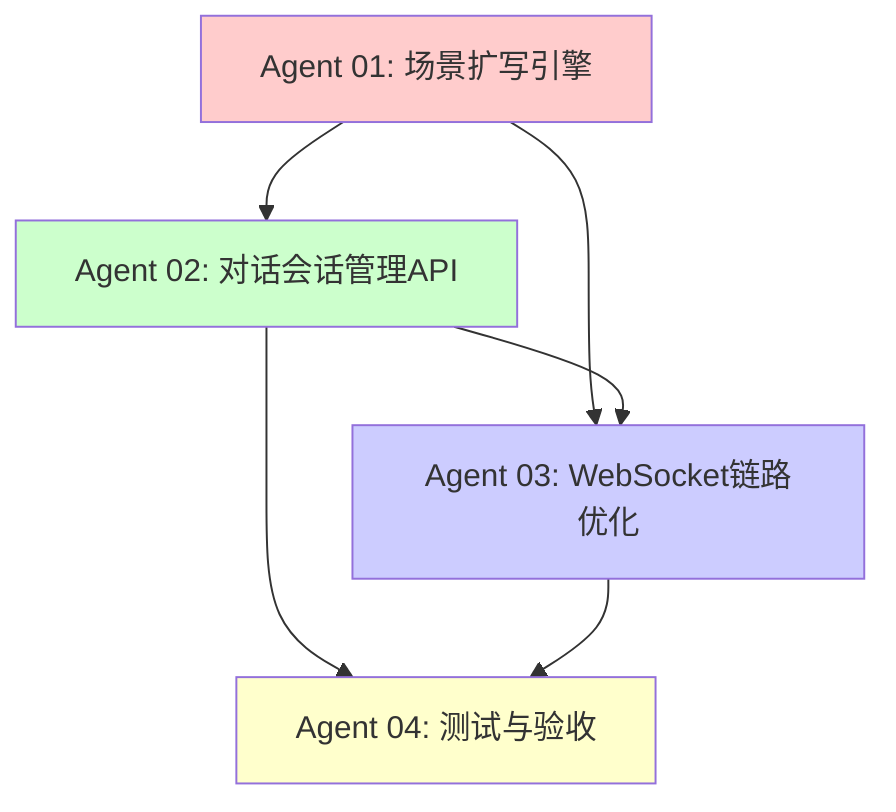

# Orchestrator: 对话模块开发统筹

## 当前状态

**日期**: 2026年4月14日  
**负责成员**: 对话模块开发者  
**前置条件**: Phase 3 基础设施加固已完成，测试全绿（`pytest tests/ -m "not integration"` = 97 passed）

---

## 任务总览

根据交接文档和代码基座分析，对话模块需要完成以下4大工作包：

| 序号 | 工作包 | 优先级 | 负责Agent | 状态 |
|-----|--------|-------|----------|------|
| 1 | 场景扩写引擎 | P0 | Agent 01 | 未开始 |
| 2 | 对话会话管理API | P0 | Agent 02 | 未开始 |
| 3 | WebSocket语音对话链路优化 | P0 | Agent 03 | 未开始 |
| 4 | 测试覆盖与验收 | P0 | Agent 04 | 未开始 |

---

## 代码基座分析结论

### 已就绪（可直接复用）
- ✅ `backend_fastapi/app/models.py` — `ConversationEvent` 模型
- ✅ `backend_fastapi/app/llm.py` — `chat_complete()`, `stream_chat()`
- ✅ `backend_fastapi/app/tts.py` — `synthesize_tts_wav()`
- ✅ `backend_fastapi/app/voice_stream.py` — `VoiceStream`, ASR适配器
- ✅ `backend_fastapi/app/context_store.py` — `SQLiteContextStore`
- ✅ `backend_fastapi/app/main.py` — `/ws/v1` WebSocket端点（含打断、重连、流式）
- ✅ `backend_fastapi/app/routers/voice.py` — 现有语音HTTP路由
- ✅ `backend_fastapi/app/routers/learning.py` — 学习统计路由

### 缺失（需要新建/修改）
- ❌ `backend_fastapi/app/domain/dialogue/` 目录及模块
- ❌ `backend_fastapi/app/routers/dialogue.py` 对话管理路由
- ❌ `backend_fastapi/tests/test_dialogue_module.py` 等测试文件
- ⚠️ `backend_fastapi/app/main.py` — 需补充场景注入和事件持久化

---

## Agent分工与执行顺序

### 执行顺序图



### 各Agent详细说明

#### Agent 01: 场景扩写引擎开发者
- **文件**: `01_agent_scene_engine.md`
- **产出**:
  - `backend_fastapi/app/domain/dialogue/scene_engine.py`
  - `backend_fastapi/app/domain/dialogue/prompts/scene_expansion.j2`
- **验收**:
  - [ ] `expand_scene()` 接口可用
  - [ ] JSON解析容错正确
  - [ ] 难度调整参数注入正确

#### Agent 02: 对话会话管理API开发者
- **文件**: `02_agent_dialogue_api.md`
- **产出**:
  - `backend_fastapi/app/routers/dialogue.py`
  - `backend_fastapi/app/domain/dialogue/feedback_generator.py`
- **依赖**: Agent 01 完成后启动
- **验收**:
  - [ ] `POST /api/v1/dialogues/start` 可用
  - [ ] `GET /api/v1/dialogues/{id}` 可用
  - [ ] `POST /api/v1/dialogues/{id}/end` 可用
  - [ ] 路由已在 `main.py` 注册

#### Agent 03: WebSocket语音对话链路开发者
- **文件**: `03_agent_websocket_dialogue.md`
- **产出**:
  - 修改 `backend_fastapi/app/main.py`
  - `backend_fastapi/app/domain/dialogue/context_builder.py`
  - `backend_fastapi/app/domain/dialogue/difficulty.py`
- **依赖**: Agent 01 和 Agent 02 完成后启动
- **验收**:
  - [ ] WebSocket注入场景设定
  - [ ] USER_MESSAGE/AI_MESSAGE 事件持久化
  - [ ] 动态难度调整生效
  - [ ] 打断和重连保持正常

#### Agent 04: 对话模块测试开发者
- **文件**: `04_agent_dialogue_tester.md`
- **产出**:
  - `backend_fastapi/tests/test_scene_engine.py`
  - `backend_fastapi/tests/test_dialogue_api.py`
  - `backend_fastapi/tests/test_websocket_dialogue.py`
  - `backend_fastapi/tests/test_dialogue_feedback.py`
  - `backend_fastapi/tests/test_dialogue_integration.py`
- **依赖**: Agent 01/02/03 完成后启动
- **验收**:
  - [ ] 单元测试覆盖率 > 80%
  - [ ] `pytest tests/ -m "not integration"` 全绿

---

## 接口契约汇总

### HTTP API

#### POST /api/v1/dialogues/start
```json
// Request
{
  "scene": "我想练习餐厅点餐",
  "language": "en",
  "user_level": "intermediate"
}

// Response
{
  "success": true,
  "data": {
    "conversation_id": "conv-uuid-123",
    "scene_setting": { /* 结构化场景设定 */ },
    "opening_line": "Hi, welcome...",
    "opening_audio": "base64..."
  }
}
```

#### GET /api/v1/dialogues/{conversation_id}
```json
// Response
{
  "success": true,
  "data": {
    "conversation_id": "conv-uuid-123",
    "status": "active|ended",
    "events": [
      {"seq": 1, "type": "SCENE_SET", "payload": {...}},
      {"seq": 2, "type": "AI_MESSAGE", "payload": {"text": "..."}},
      {"seq": 3, "type": "USER_MESSAGE", "payload": {"text": "..."}}
    ]
  }
}
```

#### POST /api/v1/dialogues/{conversation_id}/end
```json
// Response
{
  "success": true,
  "data": {
    "conversation_id": "conv-uuid-123",
    "feedback": {
      "overall_score": 85,
      "strengths": ["..."],
      "weaknesses": ["..."],
      "suggestions": ["..."],
      "key_vocabulary_mastery": {...}
    }
  }
}
```

### WebSocket 消息类型

| 类型 | 方向 | 说明 |
|-----|------|------|
| `AUDIO_START` | C→S | 开始音频输入 |
| `AUDIO_CHUNK` | C→S | 音频数据块 |
| `AUDIO_STOP` | C→S | 结束音频输入 |
| `ASR_PARTIAL` | S→C | ASR中间结果 |
| `ASR_FINAL` | S→C | ASR最终结果 |
| `LLM_TOKEN` | S→C | LLM流式Token |
| `LLM_RESULT` | S→C | LLM完整结果 |
| `TTS_CHUNK` | S→C | TTS音频块 |
| `TTS_RESULT` | S→C | TTS完整结果 |
| `USER_MESSAGE` | S→C | 用户消息已记录 |
| `AI_MESSAGE` | S→C | AI消息已记录 |
| `TASK_ABORTED` | S→C | 任务被打断 |
| `TASK_FINISHED` | S→C | 任务完成 |

---

## 风险与应对

| 风险 | 影响 | 应对策略 |
|-----|------|---------|
| LLM JSON输出不稳定 | 场景扩写失败 | 实现多层JSON解析容错；尝试 `response_format={"type": "json_object"}` |
| WebSocket修改破坏现有功能 | 语音对话不可用 | 保持向后兼容；修改前充分阅读现有 `main.py` 中的 `ws_v1` 实现 |
| 并发事件写入seq冲突 | 数据不一致 | 使用数据库自增或原子操作分配seq |
| 长对话超出LLM上下文 | 响应质量下降 | 保留最近10轮，更早的做摘要 |
| TTS延迟高 | 用户体验差 | 先按句子切分，后续迭代真正流式TTS |
| ASR首次加载慢 | 前端等待 | 应用启动时预热，或前端显示"准备中" |

---

## 验收标准总览

- [ ] `POST /api/v1/dialogues/start` 能根据用户场景输入返回结构化场景设定和开场白
- [ ] 场景扩写输出为合法 JSON，包含所有必需字段
- [ ] WebSocket `/ws/v1` 支持完整的 ASR → LLM → TTS 闭环对话
- [ ] 每轮对话的 `USER_MESSAGE` 和 `AI_MESSAGE` 正确写入 `ConversationEvent`
- [ ] `GET /api/v1/dialogues/{id}` 能按顺序返回完整对话历史
- [ ] `POST /api/v1/dialogues/{id}/end` 能生成学习反馈报告
- [ ] 对话难度根据用户 `StudentProfile.level` 动态调整
- [ ] 新增测试文件覆盖场景扩写、历史查询、WebSocket 基础消息流
- [ ] `pytest tests/ -m "not integration"` 仍然全绿

---

## 沟通汇报机制

1. **每个Agent完成后**，请在Copilot会话中汇报：
   - 完成了哪些文件
   - 是否遇到阻塞
   - 是否需要修改接口契约
   - 测试是否通过

2. **Orchestrator（我）会根据汇报**：
   - 更新本统筹文档中的状态
   - 协调下一个Agent的启动
   - 处理跨Agent的依赖冲突
   - 调整接口契约（如有必要）

---

## 快速参考

### 相关文件路径
```
backend_fastapi/app/models.py
backend_fastapi/app/llm.py
backend_fastapi/app/tts.py
backend_fastapi/app/voice_stream.py
backend_fastapi/app/context_store.py
backend_fastapi/app/main.py
backend_fastapi/app/routers/voice.py
backend_fastapi/app/routers/learning.py
backend_fastapi/tests/
docs/Detailed_System_Architecture.md
```

### 常用命令
```bash
cd backend_fastapi
.venv\Scripts\activate
pytest tests/ -m "not integration" -v
uvicorn app.main:app --reload --port 8011
```
