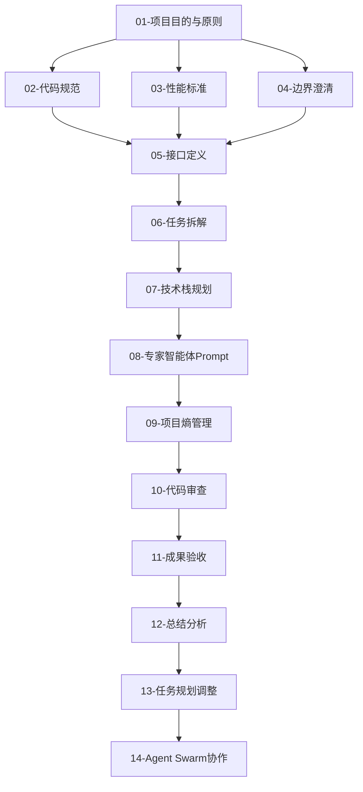

# 01 - 项目目的与原则

> **开发方法论**: Agentic Engineering + BMAD-METHOD + SDD  
> **版本**: v1.0  
> **最后更新**: 2026-03-30

---

## 一、项目目的 (Project Purpose)

### 1.1 愿景声明

构建一个**AI驱动的外语学习平台**，利用本地高性能计算资源（AMD 9950X3D + RTX 5080）与云端大模型（Kimi API）的协同，为学习者提供个性化、沉浸式的语言学习体验，同时为教师提供智能教学辅助工具。

### 1.2 核心价值主张

| 维度 | 价值描述 |
|------|----------|
| **学习者** | 24/7可用的AI口语陪练、个性化作文批改、智能词汇推荐 |
| **教师** | 实时课堂助教、学生数据分析、自动化教学辅助 |
| **机构** | 降低师资成本、提升教学效率、数据驱动的教学决策 |

### 1.3 成功指标 (Success Metrics)

| 指标类别 | 具体指标 | 目标值 |
|----------|----------|--------|
| **技术性能** | 端到端响应延迟 | < 800ms |
| **技术性能** | 系统可用性 | 99.9% |
| **用户体验** | 发音评估准确率 | > 90% |
| **用户体验** | 作文批改满意度 | > 85% |
| **业务价值** | 学习者留存率 | > 70% (7日) |
| **业务价值** | 教师工作效率提升 | > 30% |

---

## 二、项目原则 (Project Principles)

### 2.1 Agentic Engineering 原则

#### 2.1.1 自主Agent设计
- **原则**: 每个核心功能模块应设计为可独立运行的Agent
- **实践**: 
  - 发音评估Agent、作文批改Agent、对话Agent各自独立
  - Agent间通过标准化接口通信
  - 支持Agent的动态加载和卸载

#### 2.1.2 人机协作优先
- **原则**: AI辅助而非替代人类判断
- **实践**:
  - 所有AI输出需经过可解释性包装
  - 关键决策点保留人工确认机制
  - 教师/学习者拥有最终控制权

#### 2.1.3 持续学习闭环
- **原则**: 系统从每次交互中学习并优化
- **实践**:
  - 用户反馈自动收集和分析
  - 模型性能持续监控和迭代
  - A/B测试驱动功能优化

### 2.2 BMAD-METHOD (突破性敏捷AI驱动开发)

#### 2.2.1 突破性思维 (Breakthrough Thinking)
- **原则**: 不拘泥于传统方案，寻求AI原生解决方案
- **实践**:
  - 优先考虑LLM/VLM的能力边界，而非传统算法
  - 利用多模态能力创造新的交互方式
  - 边云协同架构最大化利用硬件资源

#### 2.2.2 敏捷迭代 (Agile Iteration)
- **原则**: 快速原型、快速验证、快速迭代
- **实践**:
  - 2周为一个Sprint周期
  - 每个Sprint交付可演示的功能增量
  - 技术债务在每个Sprint中控制<20%

#### 2.2.3 AI驱动 (AI-Driven)
- **原则**: 以AI能力为核心驱动力设计功能
- **实践**:
  - 功能设计先考虑AI能做什么，再考虑用户需求
  - Prompt Engineering作为一等公民
  - 模型路由策略动态优化成本与质量

### 2.3 SDD (Spec-Driven Development 规范驱动开发)

#### 2.3.1 规范先行
- **原则**: 编码前必须有明确的规范文档
- **实践**:
  - 接口规范使用OpenAPI 3.0+
  - 数据模型使用Pydantic Schema
  - 业务逻辑使用状态机或流程图描述

#### 2.3.2 规范即代码
- **原则**: 规范文档与代码同步演进
- **实践**:
  - 从规范自动生成类型定义
  - 从规范自动生成测试用例
  - 规范变更触发代码审查

#### 2.3.3 规范验证
- **原则**: 所有实现必须通过规范验证
- **实践**:
  - 自动化契约测试
  - API兼容性检查
  - 端到端场景验证

---

## 三、开发优先级矩阵

### 3.1 模块优先级

| 优先级 | 模块 | 说明 |
|--------|------|------|
| **P0** | 基础架构 | 登录、API网关、数据库、消息队列 |
| **P1** | 单词模块 | 查词、词库生成、推荐算法 |
| **P1** | 作文模块 | OCR、GEC纠错、LLM评分 |
| **P1** | 对话模块 | 双LLM架构、场景扩写、TTS |
| **P2** | 教师端 | 数据分析、学习档案 |
| **P3** | 实时助教 | **最后开发，最亮点，最难** |

### 3.2 技术债务管理

| 等级 | 定义 | 处理策略 |
|------|------|----------|
| **Critical** | 阻塞发布的问题 | 立即修复 |
| **High** | 影响性能或安全 | 当前Sprint修复 |
| **Medium** | 代码质量问题 | 下个Sprint规划 |
| **Low** | 重构建议 | 技术债务池排队 |

---

## 四、决策框架

### 4.1 技术选型决策树

```
是否需要实时响应?
├── 是 (< 500ms) → 本地模型 (RTX 5080)
│   ├── 生成任务 → XTTS / Qwen3.5-9B INT4
│   └── 理解任务 → Faster-Whisper / PaddleOCR
└── 否 → 云端API (Kimi)
    ├── 复杂推理 → Kimi K2.5
    └── 简单任务 → 本地模型优先
```

### 4.2 成本-质量权衡

| 场景 | 成本优先方案 | 质量优先方案 |
|------|--------------|--------------|
| 单词查询 | 本地ES + 缓存 | Kimi API生成 |
| 作文批改 | OCR + 规则评分 | VLM深度分析 |
| 口语对话 | 本地9B模型 | Kimi K2.5 |
| 实时助教 | 三级筛选触发 | 每帧分析 |

### 4.3 否决项 (Non-Negotiables)

以下决策无需讨论，直接执行：

1. **安全**: 用户数据必须加密存储和传输
2. **隐私**: 语音数据本地处理优先
3. **可用性**: 核心功能在无网络时可用
4. **性能**: 关键路径延迟必须达标
5. **可维护性**: 代码必须有单元测试覆盖

---

## 五、协作原则

### 5.1 Agent Swarm 协作模式

```
┌─────────────────────────────────────────────────────────────┐
│                    Agent Swarm 协作架构                      │
├─────────────────────────────────────────────────────────────┤
│                                                             │
│   ┌──────────────┐    ┌──────────────┐    ┌──────────────┐  │
│   │ Architecture │◄──►│   Product    │◄──►│   Frontend   │  │
│   │    Agent     │    │    Agent     │    │    Agent     │  │
│   └──────┬───────┘    └──────┬───────┘    └──────┬───────┘  │
│          │                   │                   │          │
│          └───────────────────┼───────────────────┘          │
│                              │                              │
│                              ▼                              │
│                    ┌──────────────────┐                     │
│                    │  Integration     │                     │
│                    │     Agent        │                     │
│                    │  (协调中心)       │                     │
│                    └────────┬─────────┘                     │
│                             │                               │
│          ┌──────────────────┼──────────────────┐            │
│          │                  │                  │            │
│          ▼                  ▼                  ▼            │
│   ┌──────────────┐   ┌──────────────┐   ┌──────────────┐    │
│   │  Backend     │   │   DevOps     │   │   QA         │    │
│   │    Agent     │   │    Agent     │   │    Agent     │    │
│   └──────────────┘   └──────────────┘   └──────────────┘    │
│                                                             │
└─────────────────────────────────────────────────────────────┘
```

### 5.2 异步协作规则

| 规则 | 说明 |
|------|------|
| **文档优先** | 所有决策必须记录在文档中 |
| **接口契约** | Agent间通过接口文档协作 |
| **版本锁定** | 依赖的Agent输出需版本锁定 |
| **回退机制** | 每个Agent必须有回退方案 |

### 5.3 冲突解决

1. **技术冲突**: 性能基准测试结果为准
2. **设计冲突**: 用户体验测试数据为准
3. **优先级冲突**: 产品负责人决策为准
4. **资源冲突**: 项目目标对齐为准

---

## 六、文档规范

### 6.1 文档命名规范

```
XX-descriptive-name.md
├── XX: 两位数字序号
├── descriptive-name: 小写，连字符分隔
└── .md: Markdown格式
```

### 6.2 文档模板要求

每个文档必须包含：
- 标题和版本信息
- 最后更新日期
- 目录结构
- 变更日志

### 6.3 文档关联



---

## 七、变更日志

| 版本 | 日期 | 变更内容 | 作者 |
|------|------|----------|------|
| v1.0 | 2026-03-30 | 初始版本 | GitHub Copilot |
