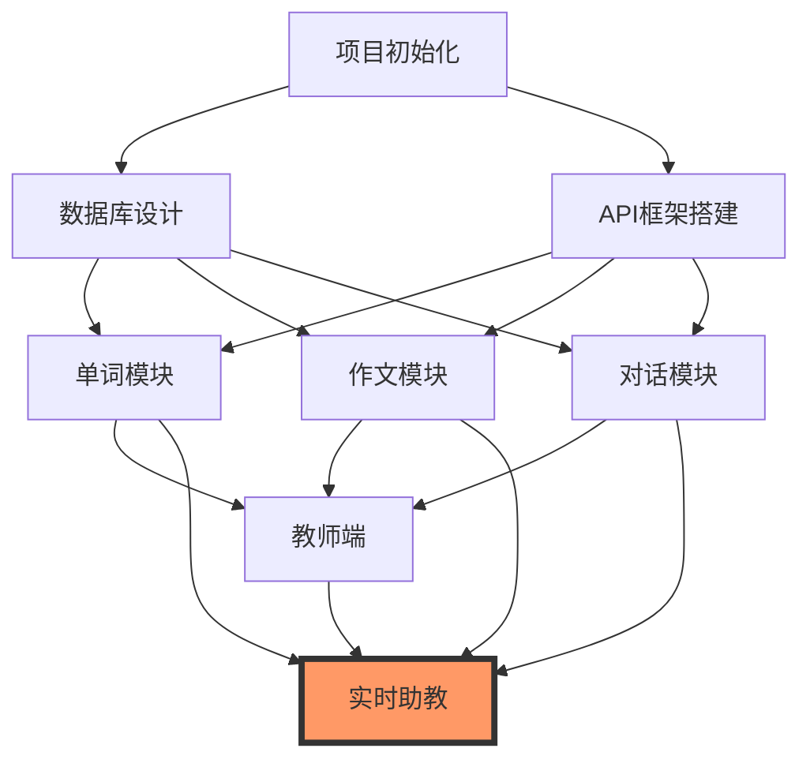

# 06 - 任务拆解

> **开发方法论**: Agentic Engineering + BMAD-METHOD + SDD  
> **版本**: v1.0  
> **最后更新**: 2026-03-30

---

## 一、任务拆解原则

### 1.1 拆解粒度

| 层级 | 粒度 | 交付物 | 工期 |
|------|------|--------|------|
| **史诗 (Epic)** | 模块级 | 可演示功能 | 2-4周 |
| **故事 (Story)** | 功能级 | 可测试代码 | 2-3天 |
| **任务 (Task)** | 函数级 | 可审查PR | 2-4小时 |

### 1.2 依赖管理

```
基础架构 (Sprint 1-2)
    │
    ├── 单词模块 (Sprint 3-4)
    │
    ├── 作文模块 (Sprint 5-6)
    │
    ├── 对话模块 (Sprint 7-8)
    │
    ├── 教师端 (Sprint 9-10)
    │
    └── 实时助教 (Sprint 11-14) [最后开发]
```

---

## 二、Sprint 规划

### Sprint 1-2: 基础架构

| 故事 | 优先级 | 验收标准 |
|------|--------|----------|
| 搭建 FastAPI 项目结构 | P0 | 可运行 Hello World |
| 配置 PostgreSQL + Redis | P0 | 连接池正常工作 |
| 实现 JWT 认证 | P0 | 登录/刷新/登出可用 |
| 配置日志和监控 | P1 | 可查看日志和指标 |
| 搭建 Docker 环境 | P1 | 一键启动所有服务 |

### Sprint 3-4: 单词模块

| 故事 | 优先级 | 验收标准 | 技术细节 |
|------|--------|----------|----------|
| 设计词汇数据模型 | P0 | 表结构评审通过 | PostgreSQL + Neo4j |
| 集成 Elasticsearch | P0 | 模糊/语义搜索可用 | 拼音、同根词、近义词搜索 |
| 实现查词流程 | P0 | ES检索<50ms, LLM生成<2s | ES优先，未找到则Kimi生成 |
| 实现关联词汇匹配 | P0 | 准确率>85% | 近义词/反义词/同根词/形近词/音近词 |
| 实现词库生成 | P1 | 异步任务可用 | Kimi API批量生成 |
| 实现标签系统 | P1 | 自动标签准确率 > 80% | LLM+规则校验 |
| 实现推荐算法 | P2 | 推荐相关性 > 70% | LightFM + FAISS |

### Sprint 5-6: 作文模块

| 故事 | 优先级 | 验收标准 | 技术细节 |
|------|--------|----------|----------|
| 集成 PaddleOCR | P0 | OCR 准确率 > 95% | 文本提取 |
| 集成 LanguageTool API | P0 | 语料库检查可用 | 拼写/基础语法/标点/搭配 |
| 集成 GECToR | P0 | 语法纠错可用 | 深层语法纠错 |
| 实现语料库结果聚合 | P0 | 错误合并准确率>90% | 去重、分类、优先级排序 |
| 集成 Kimi API | P1 | LLM分析可用 | 输入包含OCR+语料库+GEC结果 |
| 实现多维度评分 | P1 | 评分算法可用 | 内容30%+结构25%+语言25%+语法20% |
| 实现批改结果展示 | P1 | 前端可查看结果 | 错误标注+改进建议+范文对比 |
| 实现异步任务队列 | P1 | 大文件异步处理 | RabbitMQ/Celery |

### Sprint 7-8: 对话模块

| 故事 | 优先级 | 验收标准 |
|------|--------|----------|
| 实现场景扩写服务 | P0 | Kimi-thinking扩写可用 |
| 集成 Qwen3.5-9B | P0 | 本地对话LLM可用 |
| 集成 Faster-Whisper | P0 | ASR 延迟 < 400ms |
| 集成 XTTS | P0 | TTS 延迟 < 500ms |
| 实现 WebSocket 通信 | P0 | 实时对话可用 |
| 实现对话状态管理 | P1 | 多轮对话可用 |

### Sprint 9-10: 教师端

| 故事 | 优先级 | 验收标准 |
|------|--------|----------|
| 实现学习数据收集 | P0 | 行为数据入库 |
| 实现用户画像 | P0 | 画像数据可用 |
| 实现班级分析 | P1 | 班级报表可用 |
| 实现个人进度追踪 | P1 | 进度曲线可用 |
| 实现数据可视化 | P2 | 图表展示可用 |

### Sprint 11-14: 实时助教 **[最后开发，最亮点，最难]**

#### Phase 1: 前端超轻量处理 (Sprint 11)

| 故事 | 优先级 | 验收标准 | 技术细节 |
|------|--------|----------|----------|
| L0: 输入事件捕获 | P0 | 零延迟事件监听 | PageUp/PageDown/鼠标/滚轮事件 |
| L1: 前端行为识别 | P0 | <10ms, 准确率>90% | WebGL/ONNX Runtime, YOLOv8n 6MB模型 |
| L2: 哈希去重 | P0 | <5ms, 过滤>80% | pHash/dHash, 720P下采样保留鼠标轨迹 |
| 屏幕捕获优化 | P0 | 5fps, 带宽<1Mbps | 720P JPEG编码, 保留鼠标轨迹(非ROI裁剪) |

#### Phase 2: 后端智能处理 (Sprint 12)

| 故事 | 优先级 | 验收标准 | 技术细节 |
|------|--------|----------|----------|
| L3: 注意力Mask生成 | P0 | <20ms | 半透明高亮Mask, OCR提取框选区域 |
| L4: 智能触发引擎 | P0 | 准确率>85% | 框选+停顿=高优先级, 翻页=中优先级 |
| ASR+关键词唤醒 | P0 | 唤醒准确率>90% | 显式唤醒词+隐式信号(犹豫/重复/纠错) |
| 课件结构解析 | P1 | 翻页定位准确 | 结合PPT结构理解上下文 |

#### Phase 3: AI服务与建议 (Sprint 13)

| 故事 | 优先级 | 验收标准 | 技术细节 |
|------|--------|----------|----------|
| 集成 Kimi VLM | P0 | <500ms | 720P截图+Mask+ASR文本+上下文 |
| 被动服务 | P0 | 教师提问即时响应 | 显式唤醒词触发, 语音回答 |
| 主动服务建议 | P1 | 不打断教学节奏 | 轻量提示(视觉), 主动辅助(等待停顿), 重要提醒(立即) |
| 无感投递机制 | P1 | 时机判断准确率>80% | 停顿检测/翻页检测/句子结束检测 |

#### Phase 4: 端到端优化 (Sprint 14)

| 故事 | 优先级 | 验收标准 | 技术细节 |
|------|--------|----------|----------|
| 全流程优化 | P0 | 端到端<800ms | L0-L4总<50ms + VLM<500ms + TTS<200ms |
| Token成本优化 | P1 | 节省>95% | 五级筛选后~15次/45分钟课程 |
| 教师体验优化 | P1 | 满意度>80% | 音量自适应, 语速控制, 打断处理 |
| 稳定性测试 | P1 | 连续运行>2小时 | 内存无泄漏, GPU无溢出 |

---

## 三、任务依赖图



---

## 四、风险任务

### 4.1 高风险任务

| 任务 | 风险 | 缓解措施 |
|------|------|----------|
| 实时助教延迟优化 | 可能无法达标 | 提前做POC验证 |
| 前端行为识别 | 准确率不确定 | 准备规则引擎回退 |
| 模型路由策略 | 复杂度较高 | 先实现简单版本 |

### 4.2 技术债务任务

| 任务 | 说明 | 计划 Sprint |
|------|------|-------------|
| 单元测试覆盖 | 达到 80% 覆盖 | 每 Sprint |
| 性能基准测试 | 建立性能基线 | Sprint 4 |
| 安全审计 | 代码安全扫描 | Sprint 8 |

---

## 五、变更日志

| 版本 | 日期 | 变更内容 | 作者 |
|------|------|----------|------|
| v1.0 | 2026-03-30 | 初始版本 | GitHub Copilot |
