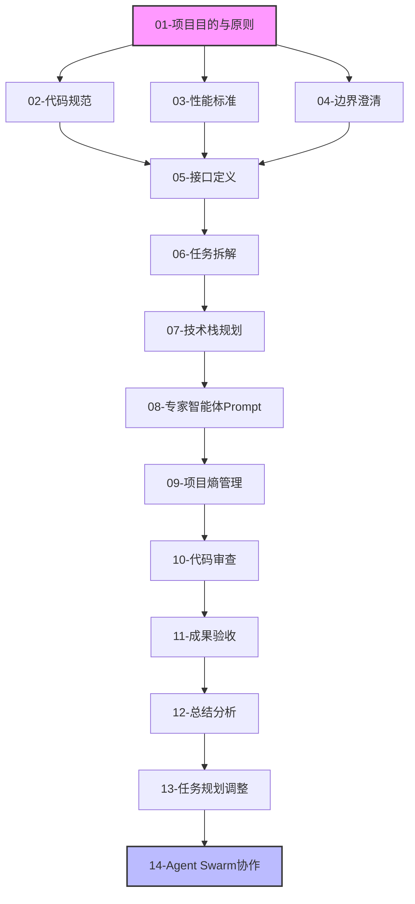

# AI外语学习系统 - 开发指导文档

> **开发方法论**: Agentic Engineering + BMAD-METHOD + SDD  
> **版本**: v1.0  
> **最后更新**: 2026-03-30

---

## 文档导航

本开发指导文档包含以下14个核心文档，涵盖项目开发的各个方面：

### 核心指导文档

| 序号 | 文档 | 说明 |
|------|------|------|
| 01 | [项目目的与原则](./01-project-purpose-and-principles.md) | 项目愿景、核心原则、决策框架 |
| 02 | [代码规范](./02-coding-standards.md) | Python/TypeScript编码规范、Git规范 |
| 03 | [性能标准](./03-performance-standards.md) | 性能指标、优化策略、测试标准 |
| 04 | [边界澄清](./04-boundary-clarification.md) | 功能边界、模块边界、数据边界 |
| 05 | [接口定义](./05-interface-definition.md) | REST API、WebSocket、数据模型 |
| 06 | [任务拆解](./06-task-breakdown.md) | Sprint规划、任务依赖、风险任务 |
| 07 | [技术栈规划](./07-tech-stack.md) | 前端/后端/AI/基础设施技术选型 |
| 08 | [专家智能体Prompt](./08-agent-prompts.md) | Agent角色定义、任务Prompt模板 |
| 09 | [项目熵管理](./09-entropy-management.md) | 代码/文档/架构熵的度量与控制 |
| 10 | [代码审查](./10-code-review.md) | 审查流程、评论规范、工具配置 |
| 11 | [成果验收](./11-acceptance-criteria.md) | 功能/质量/性能/安全验收标准 |
| 12 | [总结分析](./12-summary-analysis.md) | Sprint回顾、质量分析、经验总结 |
| 13 | [任务规划和调整](./13-task-planning.md) | 规划原则、调整机制、进度跟踪 |
| 14 | [Agent Swarm协作方案](./14-agent-swarm.md) | Agent架构、协作协议、会话管理 |

---

## 关键技术要点

### 实时助教模块 (最后开发，最亮点，最难)

| 技术点 | 实现方案 | 目标 |
|--------|----------|------|
| **屏幕处理** | 720P下采样，保留鼠标轨迹 | 节省75%带宽 |
| **五级筛选** | L0事件→L1行为识别→L2哈希→L3 Mask→L4触发 | 节省97% Token |
| **行为识别** | 前端WebGL/ONNX，YOLOv8n 6MB模型 | <10ms延迟 |
| **ASR唤醒** | 显式唤醒词+隐式信号(犹豫/重复/纠错) | 精准触发 |
| **服务形式** | 被动+主动(轻量提示/主动辅助/重要提醒) | 不打断教学 |
| **无感投递** | 停顿/翻页/句子结束检测 | 时机精准 |
| **端到端** | L0-L4<50ms + VLM<500ms + TTS<200ms | <800ms |

### 硬件配置
- **CPU**: AMD 9950X3D (16C/32T, 128MB 3D V-Cache)
- **GPU**: RTX 5080 16GB (1801 FP4 TFLOPS)
- **内存**: 64GB+ DDR5-5600

### 开发优先级
1. **P0**: 基础架构 → 单词模块 → 作文模块 → 对话模块
2. **P1**: 教师端
3. **P2**: 实时助教 **[最后开发]**

---

## 快速开始

### 新成员入职

1. 阅读 [01-项目目的与原则](./01-project-purpose-and-principles.md) 了解项目背景
2. 阅读 [02-代码规范](./02-coding-standards.md) 熟悉开发规范
3. 阅读 [07-技术栈规划](./07-tech-stack.md) 了解技术架构
4. 阅读 [14-Agent Swarm协作方案](./14-agent-swarm.md) 了解协作方式

### 日常开发

1. 领取任务前查看 [06-任务拆解](./06-task-breakdown.md)
2. 开发时遵循 [02-代码规范](./02-coding-standards.md)
3. 提交代码前查看 [10-代码审查](./10-code-review.md)
4. 完成后参考 [11-成果验收](./11-acceptance-criteria.md) 自测

### Sprint周期

1. **规划阶段**: 参考 [13-任务规划和调整](./13-task-planning.md)
2. **执行阶段**: 遵循各模块规范文档
3. **审查阶段**: 执行 [10-代码审查](./10-code-review.md)
4. **回顾阶段**: 使用 [12-总结分析](./12-summary-analysis.md) 模板

---

## 文档关系图



---

## 开发方法论

### Agentic Engineering

- 自主Agent设计
- 人机协作优先
- 持续学习闭环

### BMAD-METHOD (突破性敏捷AI驱动开发)

- **B**reakthrough: 突破性思维
- **M**ethod: 敏捷迭代
- **A**I-**D**riven: AI驱动

### SDD (Spec-Driven Development)

- 规范先行
- 规范即代码
- 规范验证

---

## 项目结构

```
docs/development_guide/
├── README.md                          # 本文件
├── 01-project-purpose-and-principles.md
├── 02-coding-standards.md
├── 03-performance-standards.md
├── 04-boundary-clarification.md
├── 05-interface-definition.md
├── 06-task-breakdown.md
├── 07-tech-stack.md
├── 08-agent-prompts.md
├── 09-entropy-management.md
├── 10-code-review.md
├── 11-acceptance-criteria.md
├── 12-summary-analysis.md
├── 13-task-planning.md
└── 14-agent-swarm.md
```

---

## 变更日志

| 版本 | 日期 | 变更内容 | 作者 |
|------|------|----------|------|
| v1.0 | 2026-03-30 | 初始版本，创建14个核心指导文档 | GitHub Copilot |

---

## 贡献指南

如需更新本文档：

1. 在对应文档中进行修改
2. 更新本文档的变更日志
3. 提交PR并经过审查
4. 合并后通知团队成员

---

**注意**: 本文档是活文档，会根据项目进展持续更新。请确保使用最新版本。
